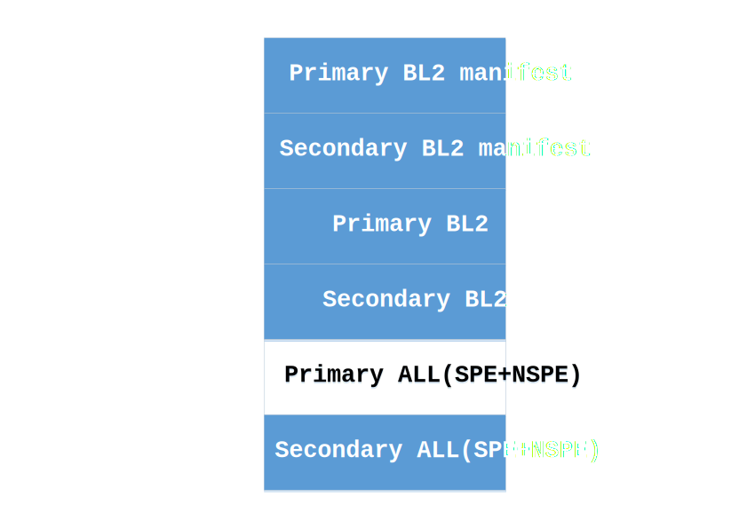
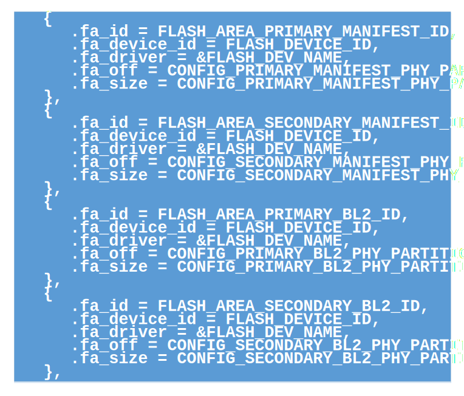
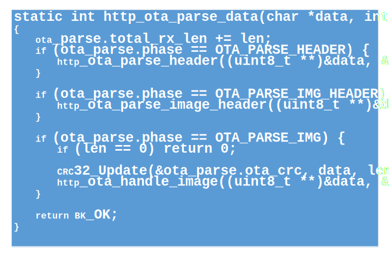

security upgrade
=====================

:link_to_translation:`zh_CN:[中文]`

1 Introduction
------------------------

The security upgrade is to use the FWU module of TF-M to upgrade other executable firmware except BOOTROM.
FWU is an image firmware update function provided by TF-M. It provides a standard firmware update interface and is platform-independent.
In NSPE, upgrade firmware is downloaded and written into flash temporary storage area using FWU's interface. The FWU interface is used to check the safety of the firmware in the staging area. When the system is restarted, the authenticity of the firmware in the staging area is checked.

2 Design
------------------------

 - 1 - BL2 is upgraded by A/B partition
 - 2 - SPE and NSPE are packaged as one upgrade firmware and upgraded by single address handling.

3 Flash layout
------------------------

The dark area above is the download area to be used for device upgrades.
Since BL2 uses A/B area upgrade mode, it needs to download to the corresponding flash partition according to the actual situation each time. For example, the current running is Primary BL2, then download Secondary BL2 manifest + Secondary BL2 these two partitions. Otherwise, it is downloaded to the two partitions of Primary BL2 manifest + Primary BL2.
Subsequent ALL(SPE+NSPE) downloads are fixed to the Secondary ALL partition each time. BL2 is responsible for authenticity check and handling.

4 Package format to upgrade firmware
--------------------------------------

The global header of the upgrade firmware bundle is 32 bytes long. Each upgraded firmware has only one global header.

Above is the head of a single image, which is 32 bytes long. Each upgraded firmware can have multiple image headers depending on the number of Images to be upgraded.

Above is the format of the packaged upgrade firmware. The image headers need to be in the same order as the images to be upgraded later.

5 Security check
------------------------
During the download process, check the integrity of the upgraded firmware. After downloading, use the FWU interface to check the image to be upgraded in the staging area. After restart, the BOOTROM verifies BL2; Subsequent images are verified by BL2.

5.1 Integrity check
------------------------
When a firmware upgrade is packaged, the CRC32 value is calculated and recorded in the global header. When downloading, the CRC32 will be calculated as it downloads. After the download is complete, the calculated CRC32 value is compared with the CRC32 value of the head. If not, the upgraded firmware is considered incomplete and the upgrade failed.

5.2 Check using the interface provided by TF-M
-----------------------------------------------
After downloading, call the interface of FWU to check the image in the staging area. Restart the system after the check is successful.

5.3 Authenticity check
------------------------
For BL2 upgrades, BOOTROM will check the authenticity of the downloaded manifest and BL2. For the upgrade of SPE and NSPE, the authenticity check is done by BL2.

5.4 Check against rollback
---------------------------
After the authenticity check is done, BOOTROM or BL2 needs to version check the image to be upgraded. The image version to be installed must be higher than the image version being executed for installation to complete. Prevent upgrading to older versions.

6 FWU module adaptation
------------------------
Enables the TFM_PARTITION_FIRMWARE_UPDATE function of TF-M. And according to the needs, adapt to change the function.

6.1 The interface provided by FWU
----------------------------------
TFM provides mandatory and unmandatory functions, while bk7236 uses only mandatory functions.

6.1.1 psa_fwu_query
------------------------
The psa_fwu_query function is used to obtain the image information of the scratchpad area of the device, and the image is checked using hash.

6.1.2 psa_fwu_write
------------------------
Use the psa_fwu_write function to write the downloaded upgraded image data to the flash staging area.

6.1.3 psa_fwu_abort
------------------------
Use the psa_fwu_abort function to erase the flash scratchpad.

6.1.4 psa_fwu_install
------------------------
The psa_fwu_install function is used to check the image in the staging area. The implementation returns a value indicating whether a restart is required to complete the installation.

6.1.5 psa_fwu_request_reboot
-----------------------------
Restart the system using the psa_fwu_request_reboot function.

6.2 Add FWU functionality
--------------------------
The FWU function of TF-M is enabled and the relevant interface functions are called during the OTA process of NSPE.

6.2.1 Enable the FWU function of TF-M
---------------------------------------
In the configuration file of the bk7236, open TFM_PARTITION_FIRMWARE_UPDATE. Since FWU and MCUBOOT share the same flash interface, it is necessary to open MCUBOOT_DATA_SHARING and enable BL2 at the same time.
Other configurations include setting MCUBOOT_IMAGE_NUMBER to 1, PSA_FWU_MAX_BLOCK_SIZE to 2048, and a larger stack size for the fwu task.

6.2.2 Open the NSPE call interface of the FWU
-------------------------------------------------
In armino's TFM component, add tfm_firmware_update_ipc_api.c, tfm_psa_ns_api.c. And adapt to the interface of NS.
Add TF-M's library libtfm_s_veneers.a.

7 HTTP download and OTA demo
-----------------------------------
OTA images were generated using OTA bundler, downloaded and split over HTTP, and written to their respective flash staging area.

7.1 Increase TF-M staging area configuration
------------------------------------------------
Since TF-M has only one staging area by default, it cannot meet the needs of bk7236 to upgrade BL2. Increase the four staging areas in TF-M as follows.

.. figure:: picture/code1.svg
    :align: center
    :alt: 8                                                                                           
    :figclass: align-center

Upgrade staging area for BL2.

Add the corresponding partition to the TF-M flash map:

7.2 HTTP download and split
----------------------------
During the HTTP download, all the headers are parsed in turn, along with the corresponding headers for each image. According to the flash offset address of the head, the FWU ID of the image is determined. The respective staging areas are written by means of the tfm_fwu_write interface.

The above code shows the function of parsing the global header, each image header, and the subsequent image to be upgraded during the HTTP download process.

Once the download is complete, check that CRC32 is consistent with the header. Each downloaded staging area is then checked through the interface of the FWU. The psa_fwu_request_reboot function is called to restart the system if the check passes and a reboot is confirmed.

.. figure:: picture/code4.svg
    :align: center
    :alt: 8                                                                                           
    :figclass: align-center

