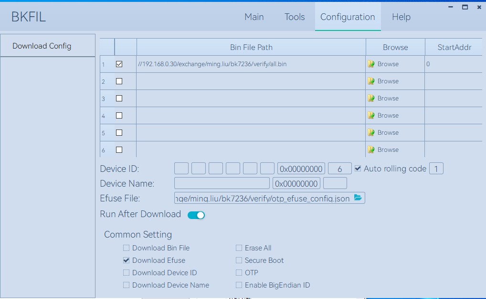
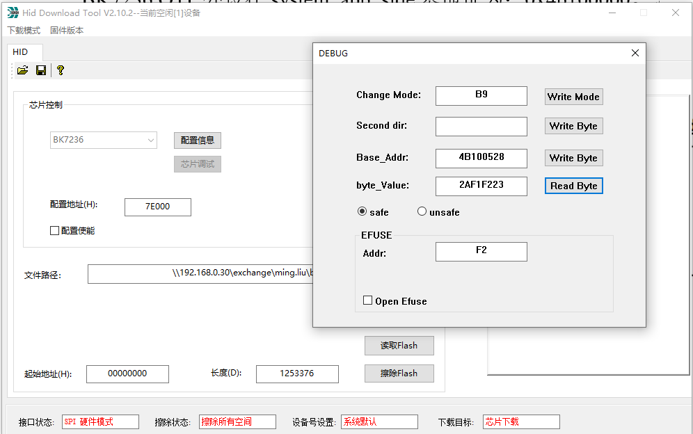

.. _bk_config_otp_efuse:

OTP/EFUSE Configuration
=============================

:link_to_translation:`zh_CN:[中文]`

.. important::

  Misconfiguration of OTP/EFUSE may cause the board to be bricked, so please make sure you understand:

    - Once OTP/EFUSE is configured, it cannot be changed.
    - :ref:`SPI to AHB, EFUSE BIT21<efuse_bit21>` After enabling, OTP/EFUSE can no longer be configured through HID Download Tool.
    - :ref:`SPI Flash Download, EFUSE BIT30<efuse_bit30>` is enabled, it is no longer possible to download the version through the HID Download Tool.
    - Understand the meaning and impact of other :ref:`EFUSE<bk_securify_efuse>` and :ref:`OTP<security_otp>` items.

Overview
------------------------------

There are three ways to configure OTP/EFUSE:

  - Configure via :ref:`JSON scripts <bk_config_otp_efuse_scripts>` using :ref:`BKFIL <bk_tool_bkfil>`, which is the recommended configuration. This should be used especially when deploying in batches.
    :ref: `UART download <efuse_bit3>` was disabled before it was available.
  - Configuration via SPI interface via HID Download Tool, available before :ref:`SPI to AHB, EFUSE BIT21 <efuse_bit21>` disabled. This is generally only used when BKFIL cannot be deployed.
  - Configuration via CLI commands. This is usually used when BKFIL is disabled, or both BKFIL and HID Download Tool are disabled.

Configure OTP/EFUSE with BKFIL
---------------------------------------------

.. _bk_config_otp_efuse_scripts:

Configure Script
++++++++++++++++++++++++++++++++++

:ref:`BKFIL <bk_tool_bkfil>` deploys OTP/EFUSE via a JSON configuration script.

.. note::

  In order to simplify the configuration, the build system will automatically generate the OTP/EFUSE JSON configuration script otp_efuse_config.json based on :ref:`system security configuration<bk_config_security>` when building,
  It is strongly recommended that you base your configuration on the automatically generated scripts.

script example
$$$$$$$$$$$$$$$$$$$$$$$$$$$$$$$$$$$$$

.. code::

  {
     "User_Operate_Enable": "false",
     "Security_Ctrl_Enable": "false",
     "Security_data_Enable": "true",
     "eFuse_Enable": "false",

     "User_Operate": [],

     "Security_Ctrl": [
         {
             "secure_boot_enable": "0,0,1",
             "secure_boot_debug_disable": "0,3,1",
             "fast_boot_disable": "0,2,0",
             "boot_mode": "0,3,0",
             "secure_boot_clock_select": "0,4,1",
             "random_delay_enable": "0,5,0",
             "direct_jump_enable": "0,6,0",
             "security_boot_critical_error": "0,7,0",
             "attack_nmi_enable": "2,4,0",
             "spi_to_ahb_disable": "2,5,0",
             "auto_reset_enable[0]": "2,6,0",
             "auto_reset_enable[1]": "2,7,0",
             "flash_aes_enable": "3,5,0",
             "spi_download_disable": "3,6,0",
             "swd_disable": "3,7,0",
             "enable_flash_aes": "3,5,0"
         }
     ],

     "Security_data": [
         {
             "name": "flash_aes_key",
             "mode": "write",
             "permission": "WR",
             "start_addr": "0x4B1000460",
             "byte_len": "0x20",
             "data": "3183fb18814ffb4039c2d69ce0645df0b965dc5c4e7403a77f2ad6bf73c7bf39",
             "data_type": "hex",
             "status": "false"
         },
         {
             "name": "bl1_rotpk_hash",
             "mode": "write",
             "permission": "WR",
             "start_addr": "0x4B100528",
             "byte_len": "0x20",
             "data": "2af1f2236872981bdf2f17975fb3029fad171de61741a383ef2c621fd5f5cf62",
             "data_type": "hex",
             "status": "false"
         },
         {
             "name": "bl2_rotpk_hash",
             "mode": "write",
             "permission": "WR",
             "start_addr": "0x4B100548",
             "byte_len": "0x20",
             "data": "ca68e9b3e991433ca9a6a2d6a74fc9dd5ccf559a4ae179537bde2772e0393ccf",
             "data_type": "hex",
             "status": "false"
         }
     ]
  }

The script is divided into four logical configuration areas:

  - User configuration area - configured by ``User_Operate_Enable`` and ``User_Operate``, user-defined OTP configuration is usually placed in this area, in the automatically generated configuration script, this area is empty.
  - Security control area - configured by ``Security_Ctrl_Enable`` and ``Security_Ctrl``, which refers to EFUSE configuration in BK7236.
  - Security data area - configured by ``Security_Data_Enable`` and ``Security_Data``, which refers to OTP configuration in BK7236.
  - EFUSE field - configured by ``eFuse_Enable`` and ``eFuse``, this field is deprecated in BK7236.

Global Fields
$$$$$$$$$$$$$$$$$$$$$$$$$$$$$$$$$$$$$

Global fields specifically refer to the first-level fields in the configuration table:

  - ``User_Operate_Enable`` - true/false, indicating whether to deploy the data in User_Operate to the board through BKFIL.
  - ``Security_Ctrl_Enable`` - true/false, indicating whether to deploy the data in Security_Ctrl to the board through BKFIL.
  - ``Security_data_Enable`` - true/false, indicating whether to deploy the data in Security_data to the board through BKFIL.
  - ``eFuse_Enable`` - Obsolete in BK7236.
  - ``User_Operate`` - Userland configuration data.
  - ``Security_Ctrl`` - Security control area configuration data.
  - ``Security_data`` - Security data area configuration data.
  - ``eFuse`` - Obsolete in BK7236.

.. note::

   All global field names cannot be modified or missing, otherwise BKFIL will report an error.

Security Control/EFUSE Area Configuration
$$$$$$$$$$$$$$$$$$$$$$$$$$$$$$$$$$$$$$$$$$$$$$$$$

The security control area is used to configure each BIT of EFUSE, the format is as follows::

   "flash_aes_enable": "3,5,0",

The meaning is as follows:

  - flash_aes_enable indicates the description of the EFUSE control bit, defined by the user.
  - "3,5,0" means the specific configuration, which means to set the BIT(5) of the third byte of EFUSE to 0, or to set :ref:`EFUSE BIT29<efuse_bit29>` to 0.

For the meaning of each BIT in EFUSE, please refer to :ref:`EFUSE<bk_securify_efuse>`.

User Area and Security Data Area Configuration
$$$$$$$$$$$$$$$$$$$$$$$$$$$$$$$$$$$$$$$$$$$$$$$$$$

The configuration of the user area is the same as that of the security data area, and the specific meanings of each field are as follows:

  - ``name`` - Required, give a name to the configuration item.
  - ``mode`` - Required, can be write or read, write means write OTP, read means read.
  - ``permission`` - only valid when the mode is write, the value is:
 
    - WR - After the operation is completed, configure the operation unit permissions to be readable and writable.
    - RO - After the operation, configure the operation unit permission as read-only.
    - NA - Configure the operating unit permissions to be inaccessible after the operation is complete.
  - ``start_addr`` - Required, indicating the starting address of the hive, which is an absolute address. The calculation method of OTP absolute value address is: 0x4b100000 + OTP internal offset address.  The internal offset of each field of OTP can refer to :ref:`OTP layout <security_otp>`. Taking FLASH AES KEY as an example, the offset is0x460, so start_addr is 0x4b100460.
  - ``byte_len`` - Required, indicating the configuration length in hexadecimal.
  - ``data`` - Required, indicating configuration data.
  - ``data_type`` - Required, indicating the configuration data format, the possible values are hex and ascii.
  - ``status`` - Mandatory, indicating whether to deploy the configuration to the board, deploy to the board when true, and not deploy when false.

.. _bk_config_otp_efuse_tools:

Deploy Configuration File
++++++++++++++++++++++++++++++++++++++++

After setting up the configuration file, the configuration table file can be deployed to the development board by using :ref:`BKFIL <bk_tool_bkfil>`. Or use the --safe-json option when deploying in BKFIL command line mode.

Deploy screenshots using the BKFIL interface:

Configure OTP/EFUSE using HID Download Tool
--------------------------------------------------

Use HID Download Tool configuration when SPI to AHB is not disabled.

.. important::

   The premise of HID Download Tool is that :ref:`SPI to AHB, EFUSE BIT21<efuse_bit29>` is not set to 1, so when using HID Download Tool for configuration,
   :ref: `SPI to AHB, EFUSE BIT21<efuse_bit29>` should be configured last.

HID Download Tool Version
++++++++++++++++++++++++++++++++++++++++++++++++++

Please make sure you use the latest HID Download Tool V2.10.2 or later.

Configuration
++++++++++++++++++++++++++++++++++++++++++++++++++

HID Download Tool reads and writes in units of four bytes, and the operation interface is as shown in the figure below:

Configure OTP/EFUSE via CLI
--------------------------------------------------

When the development board has downloaded IMAGE that supports OTP/EFUSE, if both BKFIL and HID Download Tool are disabled, use the CLI command on IMAGE to configure OTP/EFUSE.
This is generally not recommended for deployment and is only used for internal debugging.
