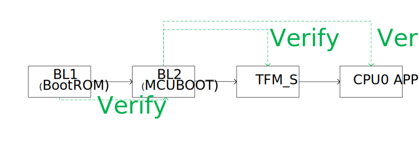
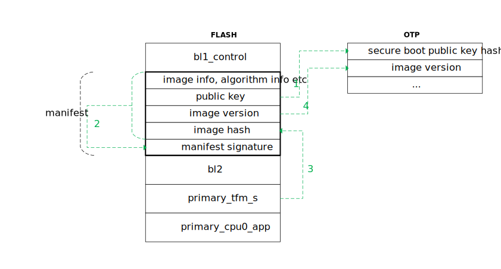
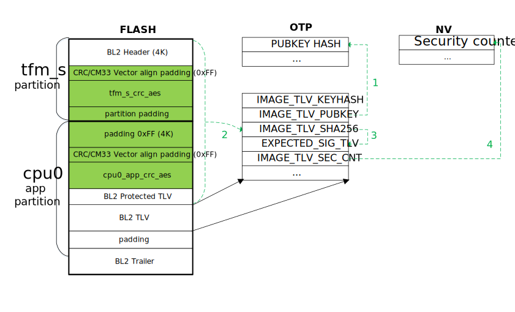

Secure Boot
========================

:link_to_translation:`zh_CN:[中文]`

Secure boot is used to verify the program to be executed, and the system is allowed to start only when the program is legal and complete, otherwise the startup fails.
Secure boot is the security foundation of the system.

Overview
----------------------

BK7236 supports legacy download mode and secure boot mode. When EFUSE BIT(3) is 0, it is legacy download mode, when it is 1, it is secure boot mode.

As shown in the figure above, BK7236 secure boot is divided into two stages. After the system is powered on, BL1 solidified in the chip first verifies the signature of BL2, and jumps to BL2 after the verification is passed;
Then BL2 performs signature verification on all other programs.

BL1 Startup
----------------------

The figure above describes the process of BL1 verifying the signature of a single BL2 (taking Primary BL2 as an example):

  - 1 - BL1 first reads the manifest from the FLASH fixed location, the manifest is placed in the manifest partition,
    It packs all the information needed by BL1 for signature verification, including signature algorithm, image HASH algorithm, image version, public key, etc. BL1 first
    Read out the secure boot public key, calculate the public key HASH, and compare it with the public key HASH solidified in the OTP, if they are the same, continue, otherwise,
    Signature verification failed.
  - 2 - BL1 uses the legal public key verified in step 1 to verify the manifest. where the manifest signature is for the
    Signature of all information in manifest except manifest signature. If the signature verification is passed, continue; otherwise, the signature verification fails.
  - 3 - BL1 uses the HASH algorithm (SHA256) specified in manifest to calculate HASH for bl2, and then compares it with manifest
    Compare the image hash in , if they are the same, continue, otherwise, the signature verification fails.
  - 4 - If the image version in the manifest is not less than the image version in the OTP, the signature verification is successful, otherwise, the signature verification fails.

BL2 Startup
----------------------

BK7236 BL2 is an open source MCUBOOT 1.9.0, so the signature verification process is consistent with the official MCUBOOT. This section only configures special points for BK7236 and
An overview of the MCUBOOT signature verification process, if you want to know the detailed verification process of MCUBOOT, or other functions of MCUBOOT, such as upgrade, anti-backup
Please refer to `MCUBOOT official website <https://docs.mcuboot.com>`_.

As shown in the figure above, the objects to be verified by BL2 are tfm_s.bin and app.bin (that is, CPU0 APP), which are placed in tfm_s and cpu0_app respectively.
In the FLASH partition, the steps to sign the build system are:

  - First encrypt tfm_s.bin/app.bin with AES and add CRC to form tfm_s_crc_aes.bin/cpu0_app_crc_aes.bin.
  - Then place tfm_s_crc_aes.bin/cpu0_app_crc_aes.bin in the partition and increase the corresponding padding.
  - Then use the MCUBOOT signing tool to sign the merged and padding image (see the light green part in the above picture).

.. note::

  The special feature of BK7236 MCUBOOT signature is that you cannot simply merge two BINs and then add the signature, you must first add padding, and then
  Merge, this is because the FLASH CRC needs to be considered, and the purpose of adding padding is to ensure that the start address of the BIN falls within the FLASH
  CRC block alignment, and BIN Vector Table 512 byte alignment.

The signature verification process of MCUBOOT can be summarized as follows:

  - 1 - First read IMAGE_TLV_PUBKEY or IMAGE_TLV_KEYHASH in BL2 TLV, compare with PUBKEY_HASH in OTP, if they are the same
    continue, otherwise the signature verification fails.
  - 2 - Calculate the HASH of the merged IMAGE and compare it with IMAGE_TLV_SHA256 in the TLV. If they are the same, continue, otherwise the signature verification will fail.
  - 3 - Use the public key in step 1 to verify the signature of EXPECTED_SIG_TLV in the TLV. If the signature verification is passed, continue, otherwise it fails.
  - 4 - If IMAGE_TLV_SEC_CNT in TLV is not smaller than the security counter in NV, the signature verification is successful, otherwise it fails.

Secure Boot Configuration
-----------------------------------------

S1 - Generate Key
++++++++++++++++++++++

.. important::

   FLASH AES KEY, BL1/BL2 private key is the guarantee of system security, please keep it safe!

.. _bk_security_boot_bl1_key:

BL1 Key
*********************************

BL1 key pairs can be generated via openssl.

EC256 private key generation method::

   openssl ecparam -name secp256r1 -genkey -out ec256_privkey.pem

EC256 public key generation method::

   openssl ec -in ec256_privkey.pem -inform PEM -out ec256_pubkey.pem -pubout

EC521 is similar to EC256, just change the name parameter from secp256r1 to secp521r1.

.. note::

  The signature verification time of BL1 using EC521 is more than twice that of EC256, and it is generally recommended to use EC256.

RSA1024 private key generation method::

   openssl genrsa -out rsa1024_privkey.pem 1024

RSA1024 public key generation method::

   openssl rsa -in rsa1024_privkey.pem -inform PEM -out rsa1024_pubkey.pem -pubout

RSA2048 is similar to RSA1024, just change the length of the public key pair from 1024 to 2048.

The public key pair generated in this step needs to be configured in the secure boot configuration table and OTP.

.. _bk_security_boot_bl2_key:

BL2 Key
*********************************

BL2 keys are generated via ./tools/env_tools/mcuboot_tools/imgtool.py:

.. code::

   ./tools/env_tools/mcuboot_tools/imgtool.py keygen -k filename.pem -t rsa-2048

The key type can also choose rsa-3072, ecdsa-p256, or ed25519. BL2 keys can also be protected with the -p option,
The -p option prompts for a password. A BL2 key generated in this way will require a passphrase for each subsequent use.

Learn more about MCUBOOT imgtool at `MCUBOOT imgtool <https://docs.mcuboot.com/imgtool.html>`_.

After generating the key, you also need to configure the key into the partition table and OTP. Can be configured via `verify_algorithm` in the `primary_bl2` partition
To configure the signature type, configure `pubkey` and `privkey` in the `primary_bl2` partition to specify the generated public/private key file.

The public key pair generated in this step needs to be configured in the secure boot configuration table and OTP.

**TODO: Describe how to integrate public key into MCUBOOT or public key HASH into OTP**.

.. _bk_security_boot_flash_key:

FLASH Key
*********************************

Please use Armino beken_aes to generate FLASH AES key:

.. code::

   ./tools/env_tools/beken_packager/beken_aes 64 -outfile key.txt

The FLASH AES KEY generated in this step needs to be configured in the secure boot configuration table and OTP.

.. important::

  The key generated by beken_aes is encrypted key, BKFIL will decrypt the encrypted key when configuring it to OTP.

S2 - Configure Partition Table
++++++++++++++++++++++++++++++++++++++

Configure secure boot partitions in the partition table partitions.csv, please refer to :ref:`Secure boot mode partition configuration <bk_config_partitions_secureboot>`.

S3 - Security Configuration
++++++++++++++++++++++++++++++++++++++

Configure secure boot options in the security configuration table security.csv:

  - Set ``secureboot`` to TRUE
  - If enable FLASH AES encryption, configure ``flash_aes_en`` to TRUE,
    and :ref:`step S1The AES KEY generated in <bk_security_boot_flash_key>` is configured to ``flash_aes_key``.
  - Configure the public/private key files generated in :ref:`step S1 <bk_security_boot_bl1_key>` to ``root_pubkey`` and ``root_privkey``.

For details, please refer to :ref:`Security Configuration <bk_config_security>`.

S4 - Configure OTP/EFUSE
++++++++++++++++++++++++++++++++++++++

Based on the otp_efuse_config.json file generated when Armino was built, deploy the following keys into OTP via BKFIL:

  - FLASH AES KEY.
  - BL1 secure boot public key HASH.
  - BL2 Secure Boot public key HASH.

Please refer to :ref:`OTP EFUSE configuration <bk_config_otp_efuse>` to configure the above OTP items.

S5 - Burning Version
++++++++++++++++++++++

Burn secure boot code via BKFIL.

S6 - Enable Secure Boot
++++++++++++++++++++++++++++++++++++++

After the version is successfully burned, you can enable secure boot and FLASH encryption. Please refer to :ref:`OTP EFUSE configuration <bk_config_otp_efuse>` to configure the above OTP items.

.. important::

   Before enabling secure boot, please make sure that the burned version supports OTA.

S7 - Enable More Security Features
++++++++++++++++++++++++++++++++++++++++

After deploying S1~S5, you can turn on more security switches, such as turning off BL1 debug mode, disabling SPI, etc.

.. important::

   Before successfully deploying a secure boot version on any board, it is recommended not to turn off the BL1 debugging mode.
   BL1 prints information to more quickly locate the cause of a secure boot failure. At the same time, it is also recommended not to disable the SPI, because once the secure boot is enabled, we cannot be downloaded BL2 through BKFIL. If the secure boot deployment fails, then BL2 can also be programmed through SPI.
   After confirming that S1~S6 are correct, turn off the BL1 debugging mode, disable SPI, etc.

.. note::

   After using the above steps to successfully configure secure boot on a certain board, steps S4~S6 can be combined into one step, through
   BKFIL deploys the secure boot version, OTP key configuration, and EFUSE security switch enablement to the board at one time. Usually work
   When deploying a production version to the factory, it is recommended to use the merge step to simplify the deployment process.
