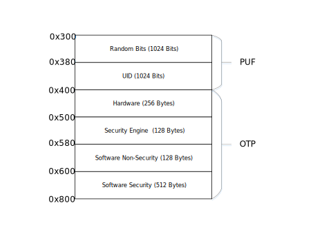

.. _security_otp:

OTP
=======================

:link_to_translation:`zh_CN:[中文]`

overview
------------------------------------

The BK7236 on-chip OTP is based on PUF (Physical-Unclonable-Function) technology, which provides on-chip keys, secure storage and true random numbers for the system.
OTP can be configured through :ref:`BKFIL<bk_tool_bkfil>`, please refer to :ref:`OTP Configuration <bk_config_otp_efuse>` for details.

.. figure:: picture/otp_region.png
     :align: center
     :alt: 8
     :figclass: align-center

OTP mainly has three areas: OTP, PUF, and OTP2:

  - PUF - size 64x32 Bits (2KB):
 
    - The first 1Kbits are UID (Unique Identification Numbers). When the PUF is registered, the UID is determined, and each board is unique. UID in PUF is used as :ref:`BK7236 unique ID<security_uid>`, random key, etc.
    - The last 1Kbits is the entropy pool of random numbers, :ref:`Security Engine <security_enginee>` uses the entropy pool to generate true random numbers.
  - OTP - size 256x32 Bits (8KB), which mainly stores information related to system security. The :ref:`Security Engine <security_enginee>` OTP access API can be called in the code for indirect access, and it can be configured through the System APB interface through SPI.
  - OTP2 - Size 768x32 Bits (24KB). Mainly used by applications.

This section only focuses on the storage space related to system security, namely PUF and OTP.

.. note::

   PUF/OTP is usually used for system and should not be used by applications, OTP2 is recommended for applications.

OTP layout
-----------------------------------

The OTP/PUF layout is shown in the figure below:

PUF/entropy pool area
++++++++++++++++++++++++++++++++

The offset 0x300~0x380 is 1 Kbits. The entropy pool area (Random Bits) is mainly used to continuously generate random bit streams, and is used for :ref:`Security Engine <security_enginee>` to generate true random numbers.

PUF/UID area
++++++++++++++++++++++++++++++++

Offset 0x380~0x400 is 1 Kbits UID area, the purpose is as follows:

+-----------+----------------+------------------------------------------------------------------------------------------------------------+
| Offset    | Length (bytes) | Description                                                                                                |
+===========+================+============================================================================================================+
| 0x380     | 16             | Generate system unique ID, 128 Bits in total                                                               |
+-----------+----------------+------------------------------------------------------------------------------------------------------------+
| 0x390     | 32             | Generate the unique FLASH AES KEY of the board (temporarily unused, reserved for future expansion)         |
+-----------+----------------+------------------------------------------------------------------------------------------------------------+
| 0x3b0     | 80             | Reserved                                                                                                   |
+-----------+----------------+------------------------------------------------------------------------------------------------------------+

.. _otp_flash_aes_key:

OTP/hardware area
++++++++++++++++++++++++++++++++

The address planning of the OTP hardware area is as follows:

+-----------+----------------+------------------------------------------------------------------------------------------------------------+
| offset    | length (bytes) | purpose                                                                                                    |
+===========+================+============================================================================================================+
| 0x400     | 96             | Store memcheck error correction information, each error correction address occupies 2 bytes, and can store |
|           |                | 48 error correction addresses.                                                                             |
+-----------+----------------+------------------------------------------------------------------------------------------------------------+
| 0x460     | 32             | Store FLASH AES KEY.                                                                                       |
+-----------+----------------+------------------------------------------------------------------------------------------------------------+
| 0x480     | 128            | Reserved for hardware expansion.                                                                           |
+-----------+----------------+------------------------------------------------------------------------------------------------------------+

.. _otp_bl1_rotpk_hash:

.. _otp_bl2_rotpk_hash:

OTP/Security Engine Area
++++++++++++++++++++++++++++++++

The address planning of the OTP security engine area is as follows:

+-----------+----------------+------------------------------------------------------------------------------------------------------------+
| offset    | length (bytes) | purpose                                                                                                    |
+===========+================+============================================================================================================+
| 0x500     | 40             | Reserved for security engine, other modules cannot be used                                                 |
+-----------+----------------+------------------------------------------------------------------------------------------------------------+
| 0x528     | 32             | Store BL1 ROTPK HASH.                                                                                      |
+-----------+----------------+------------------------------------------------------------------------------------------------------------+
| 0x548     | 32             | Deposit BL2 ROTPK HASH.                                                                                    |
+-----------+----------------+------------------------------------------------------------------------------------------------------------+
| 0x568     | 4              | Storage lifetime.                                                                                          |
+-----------+----------------+------------------------------------------------------------------------------------------------------------+
| 0x56c     | 20             | Reserved by the security engine, other modules cannot be used.                                             |
+-----------+----------------+------------------------------------------------------------------------------------------------------------+

OTP/software non-secure area
+++++++++++++++++++++++++++++++++++++++++

The address planning of the OTP software non-safe area is as follows:

+-----------+----------------+------------------------------------------------------------------------------------------------------------+
| offset    | length (bytes) | purpose                                                                                                    |
+===========+================+============================================================================================================+
| 0x580     | 8              | Reserved, other modules cannot use                                                                         |
+-----------+----------------+------------------------------------------------------------------------------------------------------------+
| 0x588     | 4              | BL2 Security counter, storing counters to prevent version rollback.                                        |
+-----------+----------------+------------------------------------------------------------------------------------------------------------+
| 0x58c     | 116            | Not used.                                                                                                  |
+-----------+----------------+------------------------------------------------------------------------------------------------------------+

OTP/Software Security Area
++++++++++++++++++++++++++++++++

The address planning of the OTP software security zone is as follows:

+-----------+----------------+------------------------------------------------------------------------------------------------------------+
| offset    | length (bytes) | purpose                                                                                                    |
+===========+================+============================================================================================================+
| 0x600     | 64             | Application security counter, which stores the counter for preventing version rollback.                    |
+-----------+----------------+------------------------------------------------------------------------------------------------------------+
| 0x640     | 448            | Not used.                                                                                                  |
+-----------+----------------+------------------------------------------------------------------------------------------------------------+
