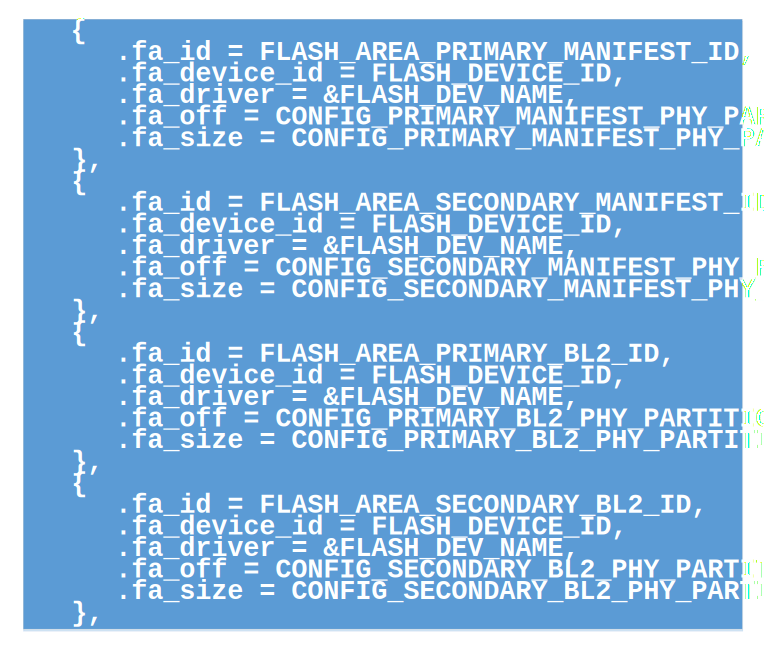

安全升级
=====================

:link_to_translation:`en:[English]`

1 概述
------------------------

安全升级是使用TF-M的FWU模块，对除BOOTROM之外的其他可执行固件升级。
FWU是TF-M提供的镜像固件更新功能。它提供了一个标准的固件更新接口，并具有平台无关性。
在NSPE中，下载升级固件，使用FWU的接口写入flash暂存区。并利用FWU接口对于暂存区的固件做安全检查。成功后重启系统，在重启时，对于暂存区的固件做真实性检查。

2 设计
------------------------

 - 1 - BL2采用A/B分区方式升级
 - 2 - SPE与NSPE打包成一个升级固件，并采用单地址搬运方式升级。

3 flash 分区
------------------------

.. figure:: picture/flash.svg
    :align: center
    :alt: 8                                                                                           
    :figclass: align-center

上图深色区域为设备升级要使用的下载区域。
由于BL2采用A/B区升级方式，每次需要根据实际情况，下载到对应的flash分区。比如当前运行的是Primary BL2，则下载Secondary BL2 manifest + Secondary BL2这两个分区。反之则下载到Primary BL2 manifest + Primary BL2这两个分区。
后续的ALL(SPE+NSPE)则每次固定下载到Secondary ALL分区。由BL2负责真实性检查以及搬运。

4 升级固件的打包格式
------------------------

上图是升级固件打包的全局头部，长度为32字节。每个升级固件只有一个全局头部。

上图是单个image的头部，长度为32字节。每个升级固件可以根据要升级的image数量，有多个image头部。

上图是打包后的升级固件格式。其中待升级的image头部次序，需要与后面待升级的image次序一致。

5 安全检查
------------------------
下载过程中，检查升级固件的完整性。下载完成后，使用FWU接口，检查暂存区的待升级image。重启后，由BOOTROM验证BL2；由BL2验证后续的image。

5.1 完整性检查
------------------------
在打包升级固件时候，计算CRC32的值，并记录在全局头部中。下载的时候，会一边下载，一边计算CRC32。在下载完成后，计算出来的CRC32值与头部的CRC32值比较。如果不相同，则认为该升级固件不完整，升级失败。

5.2 使用TF-M提供的接口检查
---------------------------
下载完成后，调用FWU的接口，对暂存区的image做检查。检查成功后重启系统。

5.3 真实性检查
------------------------
对于BL2的升级，BOOTROM会对于下载后的manifest以及BL2做真实性检查。对于SPE与NSPE的升级，由BL2做真实性检查。

5.4 防回滚检查
------------------------
完成真实性检查后，BOOTROM或者BL2需要对待升级的image做版本检查。要安装的image版本必须比正在执行的image版本高，才能完成安装。防止升级到旧的版本。

6 FWU模块适配
------------------------
使能TF-M的TFM_PARTITION_FIRMWARE_UPDATE功能。并根据需要，适配改功能。

6.1 FWU提供的接口
------------------------
TFM提供强制函数与非强制函数，bk7236只用到了强制函数。

6.1.1 psa_fwu_query
------------------------
使用psa_fwu_query函数来获取设备暂存区的image信息，并使用hash检查image。

6.1.2 psa_fwu_write
------------------------
使用psa_fwu_write函数，将下载的升级image数据，写入flash暂存区。

6.1.3 psa_fwu_abort
------------------------
使用psa_fwu_abort函数，擦除flash暂存区。

6.1.4 psa_fwu_install
------------------------
使用psa_fwu_install函数对暂存区的image做检查。改实现通过返回值，指示是否需要重新启动才能完成安装。

6.1.5 psa_fwu_request_reboot
-----------------------------
使用psa_fwu_request_reboot函数重启系统。

6.2 加入FWU功能
------------------------
使能TF-M的FWU功能，并在NSPE的OTA过程中调用相关的接口函数。

6.2.1 打开TF-M的FWU功能
------------------------
在bk7236的配置文件中，打开TFM_PARTITION_FIRMWARE_UPDATE。由于FWU跟MCUBOOT共用一套flash接口，需要同时打开MCUBOOT_DATA_SHARING，并使能BL2。
其他配置包括，MCUBOOT_IMAGE_NUMBER设置为1，PSA_FWU_MAX_BLOCK_SIZE设置为2048，fwu task的栈空间调大一些。

6.2.2 打开FWU的NSPE调用接口
----------------------------
在armino的TFM组件中，加入tfm_firmware_update_ipc_api.c，tfm_psa_ns_api.c。并适配NS的接口。
加入TFM的库libtfm_s_veneers.a。

7 HTTP下载与OTA demo
------------------------
使用OTA打包工具生成OTA image，HTTP下载并拆分，写入到各自的flash暂存区。

7.1 增加TF-M的暂存区配置
------------------------
由于TF-M默认只有一个暂存区，无法满足bk7236升级BL2的需求。增加TF-M中4个暂存区为：

用于BL2的升级暂存区。

在TF-M的flash map中增加对应的分区：

7.2 HTTP下载与拆分
------------------------
HTTP下载过程中，依次解析出全部头部，以及各个image的对应头部。根据头部的flash偏移地址，确定image的FWU ID。通过tfm_fwu_write接口写入各自的暂存区。

.. figure:: picture/code3.svg
    :align: center
    :alt: 8                                                                                           
    :figclass: align-center

上图代码为HTTP下载过程中，依次解析出全局头部，各个image头部，以及后续待升级image的函数。

下载完成后，检查CRC32是否与头部一致。然后通过FWU的接口检查每个下载过的暂存区。检查通过，确认需要重启，调用psa_fwu_request_reboot函数重启系统。

