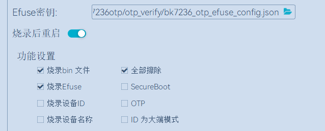
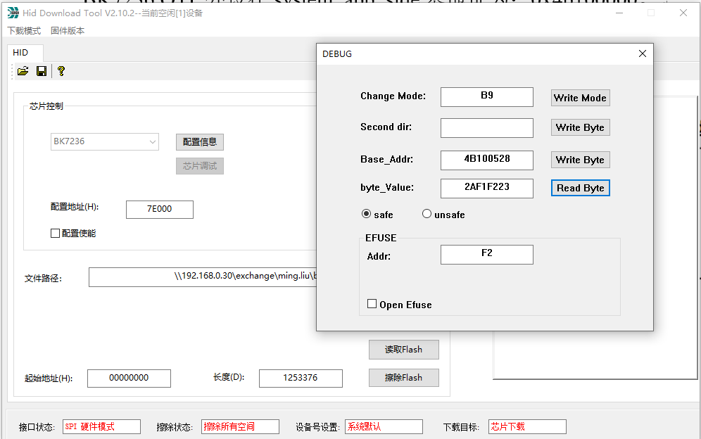

.. _bk_config_otp_efuse:

OTP/EFUSE 配置
===========================

:link_to_translation:`en:[English]`

.. important::

  OTP/EFUSE 配置出错可能导致板子变砖，因此，在正式部署之前请确保您了解:
 
   - OTP/EFUSE 一经配置，就无法更改。
   - :ref:`SPI to AHB，EFUSE BIT21<efuse_bit21>` 使能后，无法再通过 HID Download Tool 配置 OTP/EFUSE。
   - :ref:`SPI Flash Download，EFUSE BIT30<efuse_bit30>` 使能后，无法再通过 HID Download Tool 进行版本下载。
  
  理解其他 :ref:`EFUSE<bk_securify_efuse>` 与 :ref:`OTP<security_otp>` 项的含义及影响。

概述
------------------------------

有三种方式来配置 OTP/EFUSE:

 - 通过 :ref:`JSON 脚本<bk_config_otp_efuse_scripts>` 使用 :ref:`BKFIL <bk_tool_bkfil>` 进行配置，这是推荐配置方式。特别是在批量部署时，应该使用这种方式。
   :ref:`UART 下载<efuse_bit3>` 禁用之前可用。
 - 通过 HID Download Tool 经由 SPI 接口配置，在 :ref:`SPI to AHB，EFUSE BIT21 <efuse_bit21>` 禁用前可用。一般仅在 BKFIL 无法部署时才选用这种方式。
 - 通过 CLI 命令进行配置。通常是在 BKFIL 被禁用，或者 BKFIL 与 HID Download Tool 都被禁用时，才使用这种方式。

使用 BKFIL 配置 OTP/EFUSE
---------------------------------------------

.. _bk_config_otp_efuse_scripts:

配置脚本
++++++++++++++++++++++++++++++++++

:ref:`BKFIL <bk_tool_bkfil>` 通过一个 JSON 配置脚本来部署 OTP/EFUSE。

.. note::

 为简化配置，构建系统在构建时会基于 :ref:`系统安全配置<bk_config_security>` 自动生成 OTP/EFUSE JSON 配置脚本 otp_efuse_config.json，
 强烈建议您以自动生成的脚本为基础进行配置。

脚本示例
$$$$$$$$$$$$$$$$$$$$$$$$$$$$$$$$$$$$$$$

.. code::

 {
    "User_Operate_Enable": "false",
    "Security_Ctrl_Enable": "false",
    "Security_data_Enable": "true",
    "eFuse_Enable": "false",

    "User_Operate": [],

    "Security_Ctrl": [
        {
            "secure_boot_enable": "0,0,1",
            "secure_boot_debug_disable": "0,3,1",
            "fast_boot_disable": "0,2,0",
            "boot_mode": "0,3,0",
            "secure_boot_clock_select": "0,4,1",
            "random_delay_enable": "0,5,0",
            "direct_jump_enable": "0,6,0",
            "security_boot_critical_error": "0,7,0",
            "attack_nmi_enable": "2,4,0",
            "spi_to_ahb_disable": "2,5,0",
            "auto_reset_enable[0]": "2,6,0",
            "auto_reset_enable[1]": "2,7,0",
            "flash_aes_enable": "3,5,0",
            "spi_download_disable": "3,6,0",
            "swd_disable": "3,7,0",
            "enable_flash_aes": "3,5,0"
        }
    ],

    "Security_data": [
        {
            "name": "flash_aes_key",
            "mode": "write",
            "permission": "WR",
            "start_addr": "0x4B1000460",
            "byte_len": "0x20",
            "data": "3183fb18814ffb4039c2d69ce0645df0b965dc5c4e7403a77f2ad6bf73c7bf39",
            "data_type": "hex",
            "status": "false"
        },
        {
            "name": "bl1_rotpk_hash",
            "mode": "write",
            "permission": "WR",
            "start_addr": "0x4B100528",
            "byte_len": "0x20",
            "data": "2af1f2236872981bdf2f17975fb3029fad171de61741a383ef2c621fd5f5cf62",
            "data_type": "hex",
            "status": "false"
        },
        {
            "name": "bl2_rotpk_hash",
            "mode": "write",
            "permission": "WR",
            "start_addr": "0x4B100548",
            "byte_len": "0x20",
            "data": "ca68e9b3e991433ca9a6a2d6a74fc9dd5ccf559a4ae179537bde2772e0393ccf",
            "data_type": "hex",
            "status": "false"
        }
    ]
 }

脚本分四个逻辑配置区：

 - 用户配置区 - 由 ``User_Operate_Enable`` 与 ``User_Operate`` 配置，用户定义的 OTP 配置通常放在这个区，在自动生成的配置脚本中，这个区为空。
 - 安全控制区 - 由 ``Security_Ctrl_Enable`` 与 ``Security_Ctrl`` 配置，在 BK7236 中指 EFUSE 配置。
 - 安全数据区 - 由 ``Security_Data_Enable`` 与 ``Security_Data`` 配置，在 BK7236 中指 OTP 配置。
 - EFUSE 区 - 由 ``eFuse_Enable`` 与 ``eFuse`` 配置，在 BK7236 中该字段已废弃。

全局字段
$$$$$$$$$$$$$$$$$$$$$$$$$$$$$$$$$$$$$$$

全局字段特指配置表中第一级字段:

 - ``User_Operate_Enable`` - true/false，表示是否通过 BKFIL 部署 User_Operate 中的数据到板子上。
 - ``Security_Ctrl_Enable`` - true/false，表示是否通过 BKFIL 部署 Security_Ctrl 中的数据到板子上。
 - ``Security_data_Enable`` - true/false，表示是否通过 BKFIL 部署 Security_data 中的数据到板子上。
 - ``eFuse_Enable`` - BK7236 中已废弃。
 - ``User_Operate`` - 用户区配置数据。
 - ``Security_Ctrl`` - 安全控制区配置数据。
 - ``Security_data`` - 安全数据区配置数据。
 - ``eFuse`` - BK7236 中已废弃。

.. note::

  所有全局字段名不能修改，也不能缺少，否则 BKFIL 会报告出错。

安全控制/EFUSE 区配置
$$$$$$$$$$$$$$$$$$$$$$$$$$$$$$$$$$$$$$$

安全控制区用于配置 EFUSE 各 BIT，格式如下::

  "flash_aes_enable": "3,5,0",

含义如下:

 - flash_aes_enable 表示 EFUSE 控制位的描述，由用户定义。
 - "3,5,0" 表示具体配置，含义为将 EFUSE 第三字节的 BIT(5) 配置成 0，或者说，将 :ref:`EFUSE BIT29<efuse_bit29>` 配置成 0。

EFUSE 中各 BIT 含义请参考 :ref:`EFUSE<bk_securify_efuse>`。

用户区与安全数据区配置
$$$$$$$$$$$$$$$$$$$$$$$$$$$$$$$$$$$$$$$

用户区与安全数据区配置相同，各字段具体含义如下:

 - ``name`` - 必选项，为配置项取一个名字。
 - ``mode`` - 必选项，可取 write 或 read，write 表示写 OTP，read 表示读。
 - ``permission`` - 仅针对 mode 为 write 时有效，取值为:
 
   - WR - 操作完之后，将操作单元权限配置成可读，可写。
   - RO - 操作完之后，将操作单元权限配置成只读。
   - NA - 操作完之后，将操作单元权限配置成不可访问。
 - ``start_addr`` - 必选项，表示配置单元起始地址，为绝对地址。OTP 绝对值地址计算方式为: 0x4b100000 + OTP 内部偏移地址。
   OTP 各字段内部偏移可参考 :ref:`OTP 布局<security_otp>`。以 FLASH AES KEY 为例，偏移为 0x460，因此 start_addr 为 0x4b100460。
 - ``byte_len`` - 必选项，表示配置长度，为十六进制度。
 - ``data`` - 必选项，表示配置数据。
 - ``data_type`` - 必选项，表示配置数据格式，可取值为 hex 与 ascii。
 - ``status`` - 必选项，表示是否将该配置部署到板子上，true 时部署到板子上，false 时不部署。

.. _bk_config_otp_efuse_tools:

部署配置文件
++++++++++++++++++++++++++++++

设置好配置文件之后，可通过使用 :ref:`BKFIL <bk_tool_bkfil>` 将配置表文件部署到开发板上。或者在 BKFIL 命令行模式时使用 --safe-json 选项进行部署。

使用 BKFIL 界面部署截图:

使用 HID Download Tool 配置 OTP/EFUSE
--------------------------------------------------

SPI to AHB 未被禁用时使用 HID Download Tool 配置。

.. important::

  HID Download Tool 使用的前提是 :ref:`SPI to AHB，EFUSE BIT21<efuse_bit29>` 未置 1，因此，使用 HID Download Tool 进行配置时，
  :ref:`SPI to AHB，EFUSE BIT21<efuse_bit29>` 应该最后配置。

HID Download Tool 版本
+++++++++++++++++++++++++++++++++++++++++++++++++

请确保您使用最新 HID Download Tool V2.10.2 或者之后的版本。

配置方法
+++++++++++++++++++++++++++++++++++++++++++++++++

HID Download Tool 按四字节为单位进行读写，操作界面如下图所示:

应用场景示例
+++++++++++++++++++++++++++++++++++++++++++++++++

使用 HID Download Tool 一个可能场景如下:

 - 使能了安全启动，同时烧录了不支持安全下载的 BL2，但 :ref:`SPI to AHB, EFUSE BIT30<efuse_bit30>` 接口未禁用。
 - 当确认安全启动版本升级功能无误之后，将通过 HID Download Tool 将 :ref:`Secure boot debug EFUSE BIT1<efuse_bit1>`/:ref:`Secure boot critical error, EFUSE BIT7<efuse_bit7>` 以及
   :ref:`SPI 下载 EFUSE BIT30<efuse_bit30>` 禁用。
 - 通过 HID Download Tool 最后禁用 :ref:`SPI to AHB, EFUSE BIT30<efuse_bit30>`。

通过 CLI 配置 OTP/EFUSE
--------------------------------------------------

当开发板了已经下载了支持 OTP/EFUSE 的 IMAGE 时，如果 BKFIL 与 HID Download Tool 均被禁用了，则使用 IMAGE 上的 CLI 命令进行 OTP/EFUSE 配置。
通常不推荐使用这种试进行部署，仅在内部调试时使用。
