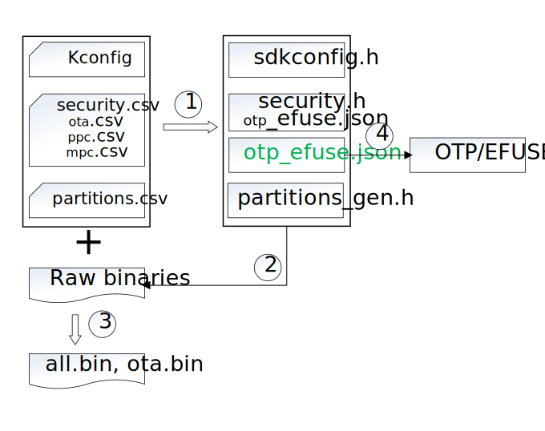

.. _bk_config_overview:

系统配置
========================

:link_to_translation:`en:[English]`

Armino 系统配置主要指 Kconfig 配置，分区配置，安全配置等，处理过程如下图所示：

图中标号所对应的处理为：

 - 1. 代码生成，编译前构建系统先扫描配置文件，生成编译所需的头文件或者配置文件。
 - 2. 生成 BIN - 编译，链接并生成原始二进制文件。
 - 3. 再次扫描配置文件，依据配置项打包，包括加 CRC，加密，加签等，最终生成 all-app.bin，all-app-no-bl.bin, ota.bin。
 - 4. 将生成的 OTP/EFUSE 配置文件部署到板子上。

配置文件
------------------------

Armino 支持下述几种配置文件：

 - Kconfig - 组件配置，生成 sdkconfig.h。详情请参考 :ref:`Kconfig 配置 <bk_config_kconfig>`。
 - csv - CSV 格式配置文件，包括:

   - partitions.csv - 分区配置表，用于生成 partitions_gen.h。详情请参考 :ref:`分区配置 <bk_config_partitions>`。
   - mpc.csv - 安全块外设配置表，用于生成 security.h。详情请参考 :ref:`安全配置 <bk_config_security>`。
   - ppc.csv - 安全外设配置表，用于生成 security.h。详情请参考 :ref:`安全配置 <bk_config_security>`。
   - gpio.csv - 外设与 GPIO 映射表，结合 ppc.csv 一起生成 GPIO 安全属性。详情请参考 :ref:`安全配置 <bk_config_security>`。
   - security.csv - 安全配置，用于生成 security.h 与 otp_efuse_otp.json，也用于打包处理。详情请参考 :ref:`安全配置 <bk_config_security>`。。
   - ota.csv - 安全 OTA 配置，用于配置 OTA 策略，版本安全计数器等。详情请参考 :ref:`安全配置 <bk_config_ota>`。
 - key - 配置安全相关的 KEY，如 FLASH AES KEY，安全启动公钥对等。详情请参考 :ref:`安全配置 <bk_config_security>`。

文件部署
-----------------------

配置文件在 Armino 中部署如下图所示：

::

    - armino/
        - components/
            - c1/
                - Kconfig
        - middleware/
            - boards/
                - bk7236/
                    - csv
                        - mpc.csv
                        - ppc.csv
                        - ota.csv
                        - partitions.csv
                        - security.csv
                    - key
                        - root_ec256_pubkey.pem
                        - root_ec256_privkey.pem
            - soc/
                - bk7236/
                    - bk7236.defconfig
        - projects/
            - my_project/
                - config/
                    - common
                        - config
                    - bk7236
                        - config
                        - mpc.csv
                        - ppc.csv
                        - ota.csv
                        - partitions.csv
                        - security.csv
                        - root_ec256_pubkey.pem
                        - root_ec256_privkey.pem
                    - bk7258
                        - config
                        - partitions.csv
                - Kconfig.projbuild
                - main/
                    - Kconfig
                - components/
                    - c1/
                        - Kconfig

对于同名配置文件或者配置项，优先级规则为：

 - 工程配置 > Middleware 配置 > 组件配置。
 - 对于同目录下配置文件：特定芯片配置项 > 通用配置项。

.. note::

  Kconfig 是使用高优先级文件中配置项取代低优先级配置文件中配置项；
  其他配置文件是使用优先级高的配置文件取代优先级低的文件。
