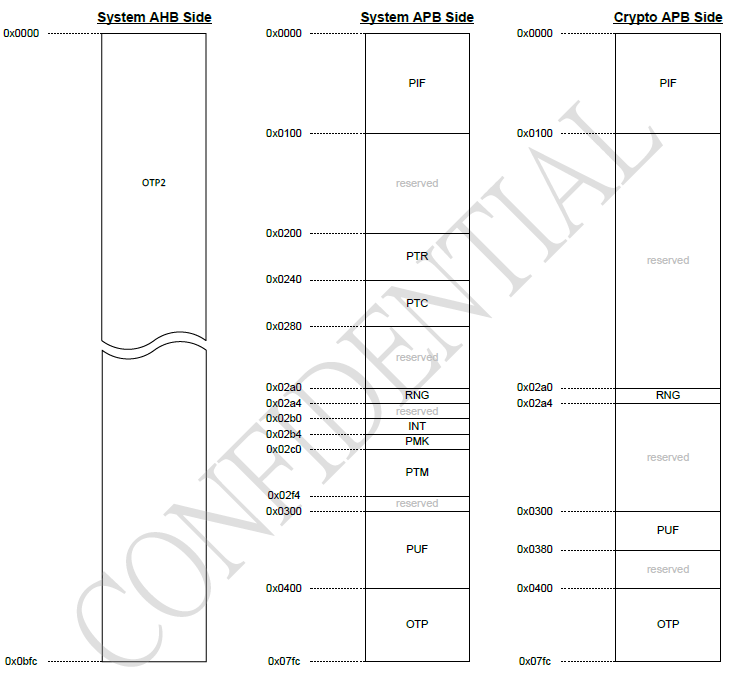
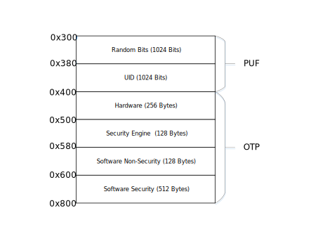

.. _security_otp:

OTP
=====================

:link_to_translation:`en:[English]`

概述
-----------------------------------------------------------

BK7236 片内 OTP 基于 PUF（Physical-Unclonable-Function，物理不可克隆）技术，为系统提供片内密钥，安全存储及真随机数。
可以通过 :ref:`BKFIL<bk_tool_bkfil>` 配置 OTP，详情请参考 :ref:`OTP 配置 <bk_config_otp_efuse>`。

OTP 主要有 OTP，PUF，OTP2 三块区域：

 - PUF - 大小 64x32 Bits (2KB):
 
   - 前 1Kbits 为 UID (Unique Identification Numbers)，当 PUF 注册之后，UID 即确定，每块板子唯五。PUF 中 UID 用作 :ref:`BK7236 唯一 ID<security_uid>`，随机密钥等。
   - 后 1Kbits 为随机数的熵池，:ref:`安全引擎<security_enginee>` 使用熵池产生真随机数。
 - OTP - 大小 256x32 Bits (8KB)，其中主要存放与系统安全相关的信息。在代码中可调用 :ref:`安全引擎<security_enginee>` OTP 访问 API 间接访问，同时可通过 SPI 经由 System APB 接口进行配置。
 - OTP2 - 大小 768x32 Bits (24KB)。主用供应用程序使用。

本节仅关注与系统安全相关的存储空间，即 PUF 与 OTP。

.. note::

  PUF/OTP 通常用于系统，应用程序不应该使用，应用程序建议使用 OTP2。

OTP 布局
-----------------------------------------------------------

OTP/PUF 布局如下图所示：

PUF/熵池区
++++++++++++++++++++++++++++++++

偏移 0x300~0x380 为 1 Kbits 熵池区(Random Bits) 主要用于持续不断产生随机比特流，用于 :ref:`安全引擎<security_enginee>` 产生真随机数。

PUF/UID 区
++++++++++++++++++++++++++++++++

偏移 0x380~0x400 为 1 Kbits UID 区，用途如下：

+-----------+-------------+----------------------------------------------------------------------------------------------------------+
| 偏移      | 长度(字节)  | 用途                                                                                                     |
+===========+=============+==========================================================================================================+
| 0x380     | 16          | 产生系统唯一 ID，共 128 Bits                                                                             |
+-----------+-------------+----------------------------------------------------------------------------------------------------------+
| 0x390     | 32          | 产生板子唯一 FLASH AES KEY (暂时未被使用，预留为未来扩展用)                                              |
+-----------+-------------+----------------------------------------------------------------------------------------------------------+
| 0x3b0     | 80          | 未使用                                                                                                   |
+-----------+-------------+----------------------------------------------------------------------------------------------------------+

.. _otp_flash_aes_key:

OTP/硬件区
++++++++++++++++++++++++++++++++

OTP 硬件区地址规划如下：

+-----------+-------------+----------------------------------------------------------------------------------------------------------+
| 偏移      | 长度(字节)  | 用途                                                                                                     |
+===========+=============+==========================================================================================================+
| 0x400     | 96          | 存放 memcheck 纠错信息，每个纠错地址占用 2 字节，可存放 48 个纠错地址。                                  |
+-----------+-------------+----------------------------------------------------------------------------------------------------------+
| 0x460     | 32          | 存放 FLASH AES KEY。                                                                                     |
+-----------+-------------+----------------------------------------------------------------------------------------------------------+
| 0x480     | 128         | 预留给硬件扩展。                                                                                         |
+-----------+-------------+----------------------------------------------------------------------------------------------------------+

.. _otp_bl1_rotpk_hash:

.. _otp_bl2_rotpk_hash:

OTP/安全引擎区
++++++++++++++++++++++++++++++++

OTP 安全引擎区地址规划如下：

+-----------+-------------+----------------------------------------------------------------------------------------------------------+
| 偏移      | 长度(字节)  | 用途                                                                                                     |
+===========+=============+==========================================================================================================+
| 0x500     | 40          | 安全引擎预留，其他模块不能使用                                                                           |
+-----------+-------------+----------------------------------------------------------------------------------------------------------+
| 0x528     | 32          | 存放 BL1 ROTPK HASH。                                                                                    |
+-----------+-------------+----------------------------------------------------------------------------------------------------------+
| 0x548     | 32          | 存放 BL2 ROTPK HASH。                                                                                    |
+-----------+-------------+----------------------------------------------------------------------------------------------------------+
| 0x568     | 4           | 存放生命周期。                                                                                           |
+-----------+-------------+----------------------------------------------------------------------------------------------------------+
| 0x56c     | 20          | 安全引擎预留，其他模块不能使用。                                                                         |
+-----------+-------------+----------------------------------------------------------------------------------------------------------+

OTP/软件非安全区
~~~~~~~~~~~~~~~~~~~~~~

OTP 软件非安全区地址规划如下：

+-----------+-------------+----------------------------------------------------------------------------------------------------------+
| 偏移      | 长度(字节)  | 用途                                                                                                     |
+===========+=============+==========================================================================================================+
| 0x580     | 8           | 预留，其他模块不能使用                                                                                   |
+-----------+-------------+----------------------------------------------------------------------------------------------------------+
| 0x588     | 4           | BL2 安全计数器，存放防止版本回滚的计数器。                                                               |
+-----------+-------------+----------------------------------------------------------------------------------------------------------+
| 0x58c     | 116         | 未使用。                                                                                                 |
+-----------+-------------+----------------------------------------------------------------------------------------------------------+

OTP/软件安全区
++++++++++++++++++++++++++++++++

OTP 软件安全区地址规划如下：

+-----------+-------------+----------------------------------------------------------------------------------------------------------+
| 偏移      | 长度(字节)  | 用途                                                                                                     |
+===========+=============+==========================================================================================================+
| 0x600     | 64          | 应用程序安全计数器，存放防止版本回滚的计数器。                                                           |
+-----------+-------------+----------------------------------------------------------------------------------------------------------+
| 0x640     | 448         | 未使用。                                                                                                 |
+-----------+-------------+----------------------------------------------------------------------------------------------------------+

