.. _bk_tool_bkfil:

Burning tool BKFIL
==========================

BKFIL is the abbreviation of Beken FLASH Image Loader, which is the official programming and configuration tool of Armino.

Preparatory work
-------------------

Software and hardware resources required by Beken wifi chip for Flash downloading and downloading are shown in the figure below:

Hardware device：

 - 1 x uart serial cable；
 - 1 x beken chip；
 - 1 x PC （The operating system supports Windows7 and Windows10, and is compatible with various Linux versions；

Software device：

 - Download Tool：BKFIL.exe
 - Commandline Tool: bk_loader.exe

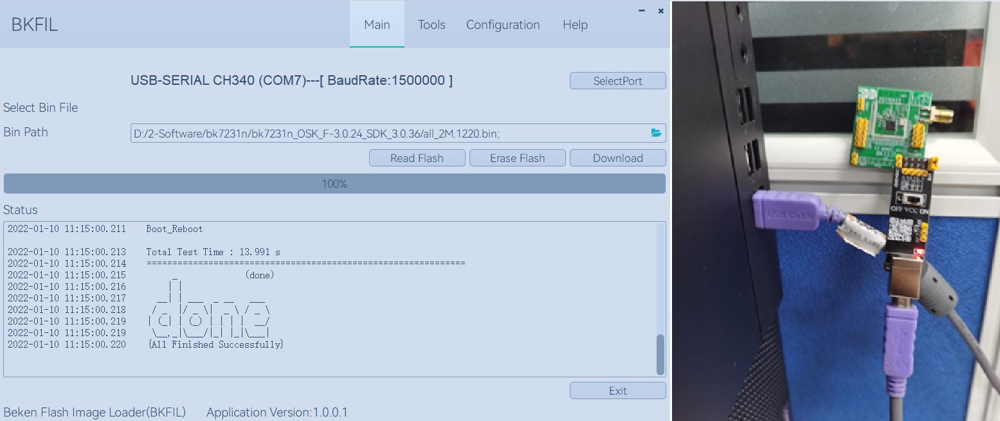

Hardware description
----------------------

Uart Serial port baseplate
++++++++++++++++++++++++++++++++++

In this guide, we use the Beken wifi chip and related modules (as shown in the figure) as the USB to serial board,
the core part of which is the USB to UART chip. Customers can also automatically prepare other USB to UART chips 
or baseboards for connecting the chip to the PC and then downloading the firmware into the device。

Uart Serial port baseplate:

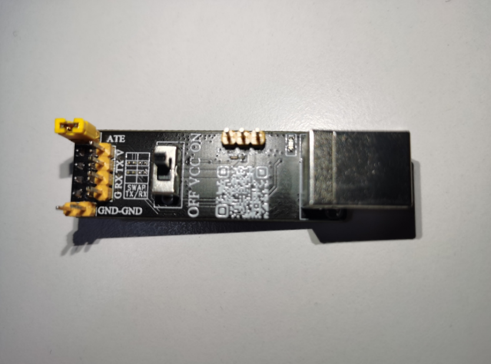

Serial port baseplate prepared by the user:

.. figure:: picture/bkfil_hw_uart1.png
     :align: center
     :alt: 8
     :figclass: align-center

Prepare to download
++++++++++++++++++++++++++++++++++

Connect to device
**********************************

Schematic diagram of device connection - BK7231N series:

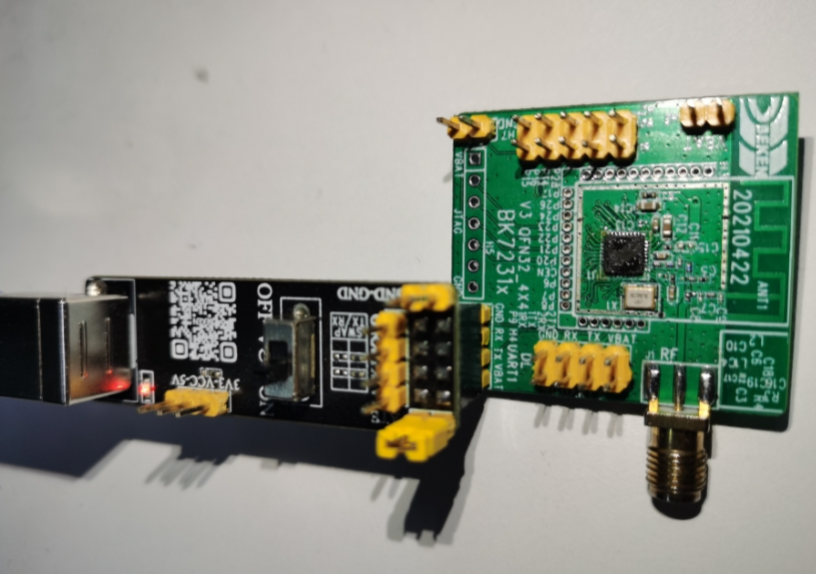

Software description
-----------------------

UI introduction
++++++++++++++++++++++++++++

Following figure shows the main window of the BK Flash Image Loader Tool. On the main window, you can select the firmware to be downloaded。

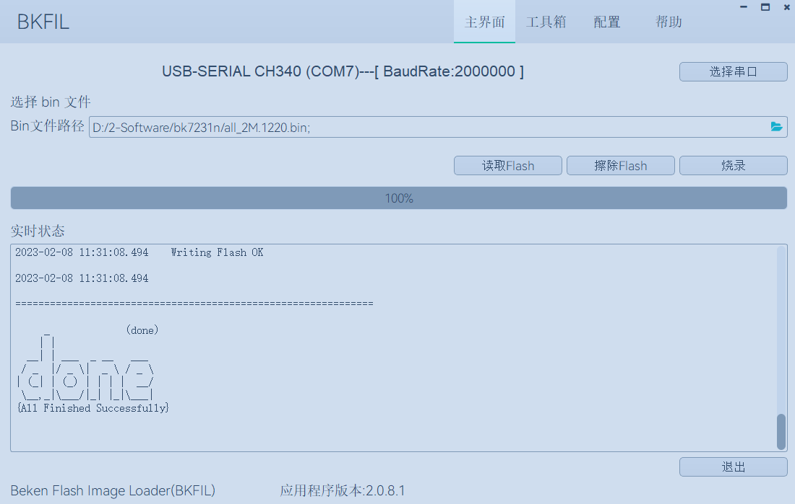

Function introduction
********************************

.. figure:: ../../../_static/bkfil_ui_main_introduction.png
     :align: center
     :alt: 8
     :figclass: align-center

As shown in above picture，”BK_Flash_Image_Loader_Tool” UI functions are divided into：

 - Serial port information
 - select serial port、select baudrate 
 - select firmware
 - read flash
 - erase flash
 - download flash
 - show log

Configuration introduction
+++++++++++++++++++++++++++++++++++++

Common configuration
***********************************

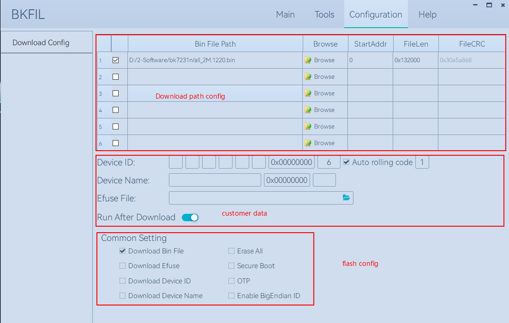

As shown in above picture，”BK_Flash_Image_Loader_Tool” UI functions are divided into：

Download path config

 - Firmware path;
 - Select path;
 - Start address,include in read / erase / download，in Hex;
 - Length of firmware;
 - CRC of firmware;

Customer data

 - Device ID ,MAC information，include in MAC name，start address，length of MAC，auto rolling code，length of rolling code；
 - DeviceName，include in device name,start address,length of device name；
 - Efuse key file，path of efuse file,include in efusekey,secure boot,OTP,and other data；
 - Reboot after download;

Flash Config

 - Download firmware；
 - Erase all；
 - Download efuse data；
 - Download secureboot data；
 - Download OTP data;
 - Download DeviceID；
 - Download DeviceName；
 - Enable bigendien；

Help introduction
++++++++++++++++++++++++++++++++

Language and Theme
********************************

This function is based on the user's usage habits, customize the usage environment, currently supports switching between Simplified Chinese and English, as well as different UI theme colors；

Upgrade online
********************************

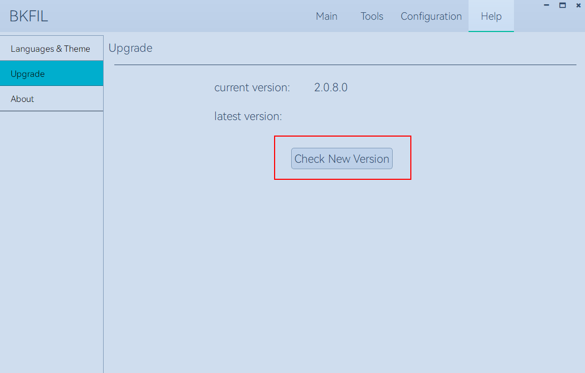

Important function；

 - Click button “Check New Version”，find the new version，select it as required；
 - To select the historical version, click "latest version" on the interface continuously，
   Figure3 – 3 – 2 – 2, Follow the steps: ①->②->③；

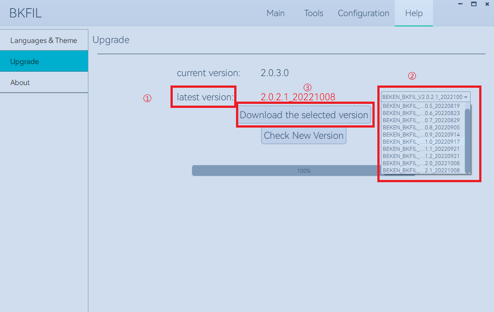

About introduction
********************************

This page shows the information of beken；

Download
---------------------------

Configure parameters before download
++++++++++++++++++++++++++++++++++++++++++++++++

click on the toolbar at the top of the Configuration button, switch to download Configuration interface;

click Browse button, select need to download the firmware;

.. figure:: picture/bkfil_download_select_firmware.png
     :align: center
     :alt: 8
     :figclass: align-center

According to the requirements of write/read/erase, fill out the start address of the corresponding. The default is 0, the start address of the part of the chip is: 0 x11000 (bk7231 and download bk7271 safe mode, etc.), pay attention to the need to input hexadecimal data;

According to the requirement, choose corresponding EfuseKey files, used for download Efuse encrypted information;

According to the requirement，choose corresponding functions in the Common Setting:

 - download the main program, the default download condition is need to select this checkbox button;
 - erase all, mainly for downoad and erase, whether to enable the whole piece of erasure;
 - download efuse data，Select as required based on the current chip type and requirements;
 - download secureboot data，Select as required based on the current chip type and requirements;
 - download OTP data，Select as required based on the current chip type and requirements;

After the configuration is complete, click the Main/ Home button to return to the home screen and perform related requirement;

In the main interface will provide a set of the current default insert PC USB device and the default baudrate, 
if not satisfied, then click on the "SelectPort" button, choose according to needs precise need serial port 
information, click OK to save the Settings，See Figures below：

Serial port information:
 
.. figure:: picture/bkfil_download_select_baudrate.png
     :align: center
     :alt: 8
     :figclass: align-center

Interface for selecting serialport information:

.. figure:: picture/bkfil_download_select_baudrate.png
     :align: center
     :alt: 8
     :figclass: align-center

Download
****************************

Enter the configuration interface, fill in the bin file to be downloaded and the corresponding download address, 
and fill in Erase ALL, Download Efuse, SecureBoot, Run After Download, COM and BaudRate information according to 
your actual requirements. Following figure shows the configuration page；

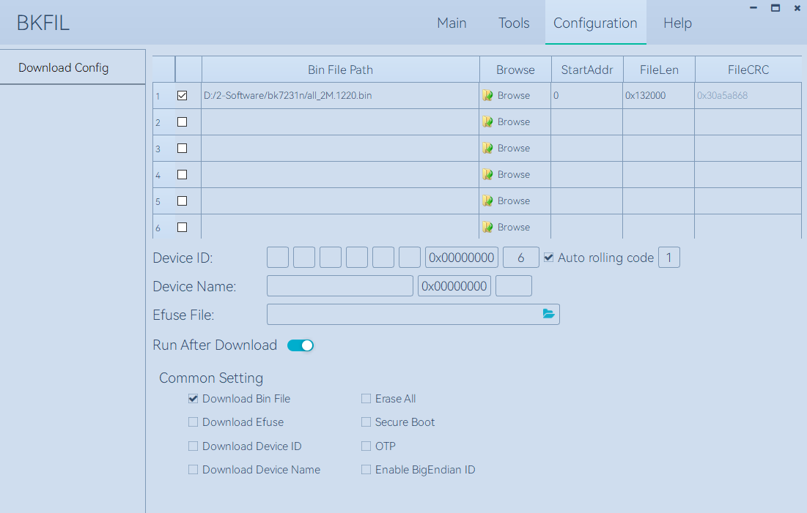

Click Download on the home screen to download the file. During the download, the bin file and Efuse information are downloaded according to the information configured by the user；

After download, the tool interface is shown in the figure below.

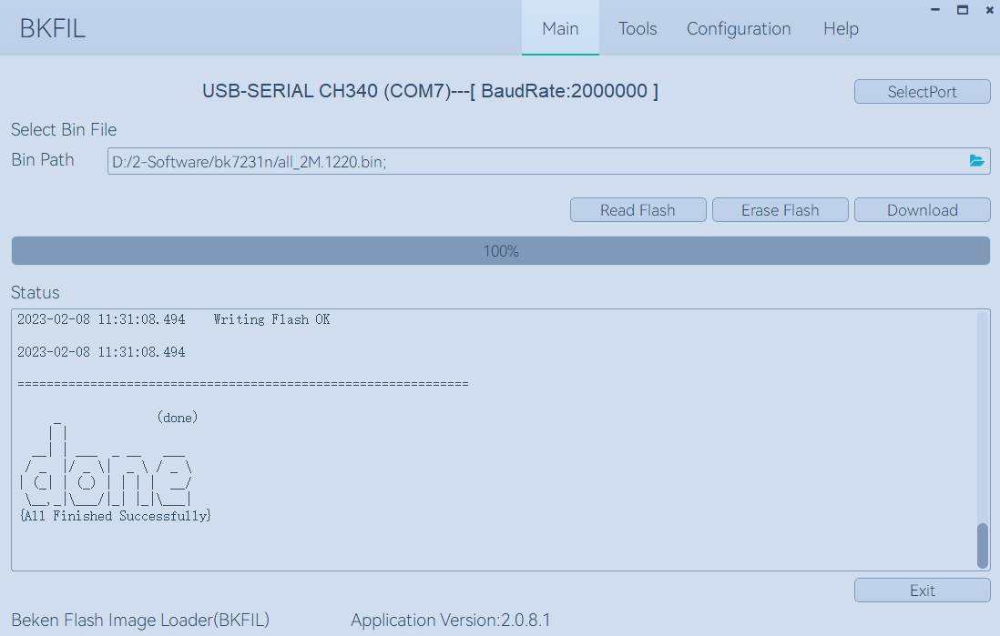

Erase
*******************

The user can choose erase all or partial erasure according to the demand;

 - Erase all: Erase the whole piece, according to the current model of Flash, erase the length of a fixed size, that is, erase the whole piece;
 - Partial erase: Determines the start address and length of the erase based on the start address entered by the user and the length of the bin file.

As shown following Figure：

.. figure:: picture/bkfil_erasing.png
     :align: center
     :alt: 8
     :figclass: align-center

Important configuration：
If you need to perform operations, perform the following operations：

.. figure:: picture/bkfil_erase_important.png
     :align: center
     :alt: 8
     :figclass: align-center

Scenario 1: You need to customize the range of erasure，If the length of erase from address 0x00 is 0x1000, as shown in the red box in the above figure, double-click in a blank area in the StartAddr column and enter the start address of erasure 0. Then double-click in a blank area in FileLen column ②, enter the erase length: 1000, and press enter. Then click the check box at ③, and an x-1 string is generated in the BinFilePath column, indicating that a custom task created has been generated；

Scenario 2: Multi-segment erasure is required，On the basis of scenario 1, generate multiple x-n tasks in the same way. Check the checkbox in the list according to your requirements. If it is checked, it indicates that you want to use this task for operation；

Read
*********************

According to the demand, the user selects the bin file content downloaded in the wifi chip;

According to the start address entered by the user and the length of the bin file, confirm the start address and read length of the Flash.

As shown in below Figure：

.. figure:: picture/bkfil_read.png
     :align: center
     :alt: 8
     :figclass: align-center

Important configuration:
If you need to perform operations, perform the following operations：
For details, see Erase；

Download from the command line
------------------------------------------

Instruction manual
+++++++++++++++++++++++++++++

Command line need to use bk_loader. exe program；

In the command line window, input "--help" to view all command sets. Each command has instructions. For illegal commands, an error message will be displayed, as shown in the following figure：

Help manual:

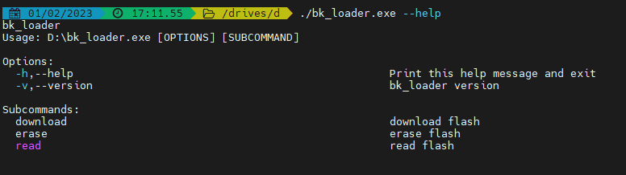

You can see the current version number and the three subfunctions in Subcommands。

Help manual-download:

.. figure:: picture/bkfil_command_download.png
     :align: center
     :alt: 8
     :figclass: align-center

Help manual-erase:

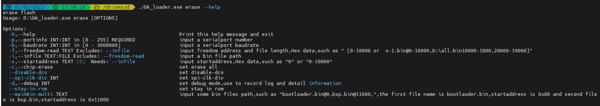

Help manual-read:

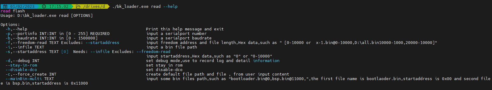

Examples of common command lines
++++++++++++++++++++++++++++++++++++++++++

Download:

 - bk_loader download –p 7 –i all.bin	General default download
 - bk_loader download –p 7 –b 2000000 –i all.bin	Set the baud rate of the serial port to 2M (1.5M by default)
 - bk_loader download –p 7 –i all.bin –s 11000	Set the start address to start downloading from 0x11000
 - bk_loader download –p 7 --mainBin-multi all_2M.1220.bin@0x0-0x1000, all_2M.1220-4k.bin@0x132000-0x1000	Multi-file downloading, using the --mainBin-multi parameter, according to the format, enter the path name + @ + "start address" + "file length"
 - bk_loader –h	For other customer data writes, see BKFIL -h for more information on writing

Read:

 - bk_loader read –p 7 –i all.bin	The general default value is read from the start address 0 and the length is all.bin
 - bk_loader read –p 7 –i all.bin –s 0-1000	The start address is 0 and the length is 0x1000
 - bk_loader read –p 7 –f 10-1000	The starting address is 10 and the length is 0x1000
 - bk_loader read –p 7 –f 10-1000, 1000-1000, 10000-1000	In the example, three pieces of content are to be read:

   - 1: The start address is 0 and the length is 0x1000.
   - 2: The start address is 0x1000 and the length is 0x1000.
   - 3: The start address is 0x10000 and the length is 0x1000；
 - bk_loader read –p 7 –f all_2M.1220.bin@0x0-0x132000,x-1@0x0-0x1000,x-2@0x2000-0x2000	In the example, three pieces of content are to be read:

   - 1: indicates the file name all_2M.1220.bin, the start address is 0, and the length is 0x132000.
   - 2: indicates the file name x-1.bin. The start address is 0 and the length is 0x1000.
   - 3: indicates the file name x-2.bin. The start address is 0x2000 and the length is 0x2000；

Erase:

 - bk_loader erase –p 7 –i all.bin	The normal default value is deleted. The value is deleted based on the length of all.bin and the start address is 0
 - bk_loader erase –p 7 –i all.bin –s 0-1000	The start address is 0 and the length is 0x1000
 - bk_loader erase –p 7 –f 10-1000	The starting address is 10 and the length is 0x1000
 - bk_loader erase –p 7 –f all_2M.1220.bin@0x0-0x132000,x-1@0x0-0x1000,x-2@0x2000-0x2000	In the example, you want to erase three pieces of content, namely:

   - 1: indicates the file name all_2M.1220.bin, the start address is 0, and the length is 0x132000.
   - 2: indicates the file name x-1.bin. The start address is 0 and the length is 0x1000.
   - 3: indicates the file name x-2.bin. The start address is 0x2000 and the length is 0x2000；

Others:

 - bk_loader –h	For other features, see bk_loader -h for more

Common Errors
----------------------

COM Serialport related Errors
++++++++++++++++++++++++++++++++++++++++++++++++

Q: You cannot find the corresponding serial port in the COM/ttyUSB drop-down list after opening the tool?

A: Check the device manager and ensure that the serial port is successfully installed.
If not, check whether the driver is faulty。

Efuse-related Errors
++++++++++++++++++++++++++++++++++++++++++++++++

After starting downloading, if the message "BEKEN_SWDL_LinkCheck timeout" is displayed, the chip may have done Efuse and cannot be downloaded again. In this case, it is necessary to contact beken to obtain the corresponding solution；

Downloading related errors
++++++++++++++++++++++++++++++++++++++++++++++++

There is an error in the process of downloading, what reason?

A: Please confirm the downloading problem first：

 - select the correct serial port;
 - baud rate conform to the requirements of the Uart board protocol;
 - firmware bin file size no greater than the size of the Flash chip;

Command Line Parameters are Incorrect
++++++++++++++++++++++++++++++++++++++++++++++++

Possible reasons:

 - The baudrate is incorrectly set. The baudrate limit ranges from 0 to 3000000；
 - The input file does not exist;
