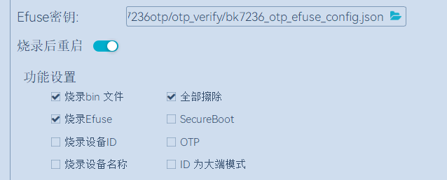

.. _bk_config_otp_efuse:

OTP/EFUSE configuration
=============================

:link_to_translation:`zh_CN:[中文]`

OTP
------------------

overview
++++++++++++++++++++++++++++++

The OTP module has three groups of interfaces, which are AHB and APB on the system side, and APB on the encryption side. The system side is connected to the bus, and the encrypted side is accessed through the shanhai security engine. The base address of AHB is 0x4B010000, and the base address of APB is 0x4B100000.

OTP mainly has three areas, which are OTP, OTP2, and PUF areas.

- The OTP has 256\*32bit, a total of 8Kb storage space, the permissions of the system side are read and write/read only/no access, and the permissions of the encryption side are read and write.
- OTP2 has 768\*32 total 24Kb storage space, the permissions of the system side are read/write/read/no access, and the encryption side has no access to OTP2.
- PUF has 64\*32 total 2Kb storage space. The first 1K is used to store the UID, and the last 1K is used to store the entropy pool for generating random numbers. The permission of the system side for UID is read-only or inaccessible, and the permission for the entropy pool is read-only/inaccessible. The authority of the encryption side to the UID is read-only/no access. PUF needs to be registered to take effect.

There are four types of OTP operations on areas: security scope division, rights management, shielding and clearing.

- The division of security range can divide the area into safe and non-safe, and the non-safe access to the safe area on the system side will get all F data after being shielded. The encryption side is not affected. The security range can be divided multiple times, but the OTP2 area cannot be divided.
- Permission management can configure the permission of each otp8bit, changing the access permission from read-only to inaccessible. The configuration of rights management is one-time.
- Masking can also make the read-only permission of the area inaccessible, but a power cycle can restore the masking. There is also a lock to control the shielding operation. If the lock is set, together with the lock, the shielding can no longer be changed, but it will be restored after power on again.
- The clearing operation can clear the OTP and PUF areas, can read the indication to know whether a certain area is cleared, and can restrict non-safe clearing operations. The clear operation can only operate the OTP and PUF areas.

OTP layout
++++++++++++++++++++++++++++++++

AHB Side
~~~~~~~~~~~~~~~~
0x000~0x2FF OTP2: storage area 2
The readable and programmable OTP2 area is divided into 767 small partitions. Each partition can change the permissions by changing the LOCK OTP2 CELL: read-write -> read-only -> inaccessible.

APB Side
~~~~~~~~~~~~~~~~~~~~
0x000~0x100 PIF: area for configuring PUF and OTP permissions
0x200~0x240 PTR: Test Row
0x240~0x280 PTC: Test Column
0x2A0~0x2A4 RNG: random number generation area
0x2B0~0x2B4 INT
0x2B4~0x2C0 PMK: Mask area
0x2C0~0x2F4 PTM: state representation area
0x300~0x400 PUF: random number registration area
0x400~0x7FC OTP: main storage area

The areas accessible by the three groups of interfaces are shown in the figure above, where the permissions on the system side can be NA, but the shanhai encryption side cannot be NA. In addition, shanhai needs to use the information in the OTP part as its own configuration. But shanhai does not support offset addresses, and the storage area of OTP has an offset address of 0x0400. Therefore, in the design, the address where shanhai accesses the OTP is offset accordingly, and the offset is 0x500.

OTP hardware area
~~~~~~~~~~~~~~~~~~~~~~~
1.0x400~0x45F: store memcheck result
2.0x460~0x47F: store flash_key
3.0x480~0x47F: Reserved for hardware use

OTP software area
~~~~~~~~~~~~~~~~~~~~~~~

BL1 OTP entry
++++++++++++++++++++++++++++++++

It is necessary to enable bit 0 and bit 3 of efuse to perform secure boot (this operation cannot be rolled back! Once secure boot is enabled, it cannot be turned off, please be careful.)

BL2 OTP item
++++++++++++++++++++++++++++++++

**TODO**

FLASH AES KEY
++++++++++++++++++++++++++++++++

The key used for AES encryption, the address range is 0x4B100460~0x4B100480, a total of 32Bytes. The currently used AES KEY is: (high) 73c7bf39|7f2ad6bf|4e7403a7|b965dc5c|e0645df0|39c2d69c|814ffb40|3183fb18 (low)
Therefore, when writing to OTP, pay attention to write the low address first, reverse according to the word, and get (low)3183fb18|814ffb40|39c2d69c|e0645df0|b965dc5c|4e7403a7|7f2ad6bf|73c7bf39(high)

Other OTP items
++++++++++++++++++++++++++++++++

EFUSE
-----------------------------------------------------------

EFUSE has a total of 4x8 32 Bits, and each Bit has a different meaning. Can be configured via total BKFIL.

+-------+------------------------------+------------------------------------------------------------------------------------------------------------------------------+
| Index | Name                         |  Description                                                                                                                 |
+=======+==============================+==============================================================================================================================+
| 0     | security boot enable         | 0: Disable secure boot. 1: Enable Secure Boot.                                                                               |
+-------+------------------------------+------------------------------------------------------------------------------------------------------------------------------+
| 1     | security boot debug mode     | 0: Enable secure boot debug information. 1: Disable secure boot debug information.                                           |
+-------+------------------------------+------------------------------------------------------------------------------------------------------------------------------+
| 2     | fast boot disable            | 0: enable fast boot; 1: disable fast boot.                                                                                   |
+-------+------------------------------+------------------------------------------------------------------------------------------------------------------------------+
| 3     | boot mode                    | 0: traditional download mode; 1: secure boot mode.                                                                           |
+-------+------------------------------+------------------------------------------------------------------------------------------------------------------------------+
| 4     | security boot clock select   | 0: use XTAL clock for secure boot; 1: enable PLL for secure boot.                                                            |
+-------+------------------------------+------------------------------------------------------------------------------------------------------------------------------+
| 5     | random delay enable          | 0: Disable random delay; 1: Enable random delay.                                                                             |
+-------+------------------------------+------------------------------------------------------------------------------------------------------------------------------+
| 6     | direct jump enable           | 0: disable direct jump of secure boot; 1: enable direct jump of secure boot.                                                 |
+-------+------------------------------+------------------------------------------------------------------------------------------------------------------------------+
| 7     | security boot critical error | 0: Do not turn off printing of serious errors during secure boot; 1: Turn off printing of serious errors during secure boot. |
+-------+------------------------------+------------------------------------------------------------------------------------------------------------------------------+
| 8~19  | reserved                     | Reserved                                                                                                                     |
+-------+------------------------------+------------------------------------------------------------------------------------------------------------------------------+
| 20    | attack_nmi_enable            | 0: No NMI is generated when an injection attack is detected; 1: NMI is generated when an injection attack is detected.       |
+-------+------------------------------+------------------------------------------------------------------------------------------------------------------------------+
| 21    | spi_to_ahb_disable           | 0: SPI to AHB channel is not disabled; 1: SPI to AHB channel is disabled.                                                    |
+-------+------------------------------+------------------------------------------------------------------------------------------------------------------------------+
| 22    | auto_reset_enable[0]         | Temperature and voltage abnormal reset                                                                                       |
+-------+------------------------------+------------------------------------------------------------------------------------------------------------------------------+
| 23    | auto_reset_enable[1]         | Temperature and voltage abnormal reset                                                                                       |
+-------+------------------------------+------------------------------------------------------------------------------------------------------------------------------+
| 24~28 | reserved                     | Reserved                                                                                                                     |
+-------+------------------------------+------------------------------------------------------------------------------------------------------------------------------+
| 29    | flash aes enable             | 0: FLASH AES encryption is disabled; 1: FLASH AES encryption is enabled.                                                     |
+-------+------------------------------+------------------------------------------------------------------------------------------------------------------------------+
| 30    | spi_dld_disable              | 0: SPI download enabled; 1: SPI download disabled.                                                                           |
+-------+------------------------------+------------------------------------------------------------------------------------------------------------------------------+
| 31    | reserved                     | reserved bits                                                                                                                |
+-------+------------------------------+------------------------------------------------------------------------------------------------------------------------------+

.. _BIT0_REF:

BIT(0) - security boot enable
++++++++++++++++++++++++++++++++++++++++++++++++

Two bits of EFUSE are related to secure boot enable:

  - BIT(3) - boot mode is used to set the boot mode. 0 means traditional download mode, and the version can be downloaded through UART at this time; 1 means secure boot mode, after setting to secure boot mode, you need to enable secure boot through BIT(3).
  - BIT(0) - Enable Secure Boot. It is only valid when BIT(3) is set to 1 (secure boot mode), indicating whether to enable secure boot.

When BIT(0) is set to 0, it means that secure boot is not enabled. At this time, BL1 considers the public key in IMAGE to be legal, that is, it will not use the public key in IMAGE and the public key in OTP to HASH
For comparison, only IMAGE integrity verification is done. Therefore, even if the public key HASH system is not configured in OTP at this time, the system can still start.

When BIT(0) is set to 1, it means that the secure boot is enabled, and the public key HASH must be configured in the OTP, otherwise the boot will fail.

.. _BIT1_REF:

BIT(1) - security boot debug mode
++++++++++++++++++++++++++++++++++++++++++++++++

BL1 defines two levels of debugging information for users to locate problems, which are controlled by EFUSE BIT(1)/BIT(7) respectively, where BIT(1) controls general debugging information, and BIT(7) controls severe errors.

In addition to errors, general debugging information also includes some process log printing.

Serious errors usually refer to errors that will cause BL1 to fail to start. Currently, BL1 supports the following serious errors:

+------------+--------------------------------------------------+
| Error code | Meaning                                          |
+============+==================================================+
| 0x1        | Error reading EFUSE 1                            |
+------------+--------------------------------------------------+
| 0x2        | Error reading EFUSE 2                            |
+------------+--------------------------------------------------+
| 0x3        | Error reading FLASH 1                            |
+------------+--------------------------------------------------+
| 0x11       | CPU exception NMI                                |
+------------+--------------------------------------------------+
| 0x12       | CPU exception MemMange                           |
+------------+--------------------------------------------------+
| 0x13       | CPU exception HardFault                          |
+------------+--------------------------------------------------+
| 0x14       | CPU exception BusFault                           |
+------------+--------------------------------------------------+
| 0x15       | CPU exception UserFault                          |
+------------+--------------------------------------------------+
| 0x16       | CPU exception SecurityFault                      |
+------------+--------------------------------------------------+
| 0x21       | OTP is empty                                     |
+------------+--------------------------------------------------+
| 0x22       | public key is empty                              |
+------------+--------------------------------------------------+
| 0x23       | Jump BIN verification failed                     |
+------------+--------------------------------------------------+
| 0x1xxx     | OTP read failure                                 |
+------------+--------------------------------------------------+
| 0x8yyyyyyy | Signature verification failed                    |
+------------+--------------------------------------------------+

Among them, xxx refers to the OFFSET of OTP, and yyyyyyy refers to the specific failure point of signature verification.

For serious errors, only the error code is displayed when printing, such as "E16" means that the CPU is abnormal SecurityFault.

.. note::

  When critical errors are enabled, the BL1 will not initialize the UART during safe boot, and will only initialize the UART for printing when an unrecoverable serious error  occurs.  Therefore, critical errors do not affect normal boot functionality and do not pose security issues.

.. important::

   Generally during the development stage, especially before secure boot has been successfully configured on any board, it is recommended to enable the normal log, so that you can see more debugging information; Normal logging should be turned off after getting familiar with the secure boot configuration, or during mass production. For serious errors, it is recommended not to close it in the mass production version.

BIT(2) - fast boot disable
++++++++++++++++++++++++++++++++++++++++++++++++

BIT(2) is used to disable Fast Boot startup. 0 means Fast Boot is enabled, 1 means it is disabled.

Fast Boot is used to control the process of waking up the system from Deep Sleep. When Fast Boot is enabled, Deep Sleep will skip the safe boot after waking up and jump directly to the application;
When Fast Boot is turned off, it will do a complete safe boot similar to power-on restart.

.. important::

   When Fast Boot is enabled, the startup speed is faster, but it is not safe; when Fast Boot is disabled, the startup speed is slower, but it is safe and reliable.
   The application should decide whether to enable or disable Fast Boot based on actual needs.

BIT(3) - boot mode
++++++++++++++++++++++++++++++++++++++++++++++++

Please refer to :ref:`BIT0 <BIT0_REF>`.

BIT(4) - sb clock select
++++++++++++++++++++++++++++++++++++++++++++++++

BIT(4) is used to enable safe boot high frequency mode. 0 means CPU and FLASH use XTAL as clock, usually 26Mhz, 1 means enable PLL, CPU and FLASH configuration
in high frequency mode. In the high-frequency mode, the safe boot speed is faster, and it is generally recommended to enable the high-frequency mode for applications that require boot performance.

BIT(5) - random delay enable
++++++++++++++++++++++++++++++++++++++++++++++++

BIT(5) is used to enable random delay, 0 means random delay off, 1 means on. When the random delay is turned on, BL1 will do a random delay before calling the key function,
The impact of fault injection attacks is mitigated through this mechanism.

.. note::

  Enabling the random delay will increase the secure boot time, and it is generally not recommended to enable the random delay function unless the application has a particularly high defense against injection attacks.

BIT(6) - Direct Jump
++++++++++++++++++++++++++++++++++++++++++++++++

BIT(6) is used to configure the jump method after BL1 signature verification, 0 means indirect jump, 1 means direct jump.

When using indirect jump, BL1 does not directly jump to the verified IMAGE after the signature verification, but jumps to an intermediate BIN first, and then jumps to the target IMAGE from the intermediate BIN.
When using direct jump, BL1 jumps directly to the verified IMAGE after the signature verification is completed.

.. note::

   When using an indirect jump, the intermediate BIN will also be included in the IMAGE for signature verification, so it is safe.

BIT(7) - security boot critical error
++++++++++++++++++++++++++++++++++++++++++++++++

Please refer to :ref:`BIT1 <BIT1_REF>`.

BIT(20) - attack NMI
++++++++++++++++++++++++++++++++++++++++++++++++

BIT(20) is used to configure whether an NMI exception is generated after a fault injection attack is detected. When it is 0, BL1 will not perform fault injection attack detection at the hardware level.
When it is 1, BL1 will perform fault injection attack detection at the hardware level, and an NMI exception will be generated when an attack is detected.

.. note::

   For applications that are particularly concerned about fault injection attacks, it is recommended to enable this switch.

BIT(29) - flash aes enable
++++++++++++++++++++++++++++++++++++++++++++++++

BIT(29) is used to enable FLASH AES encryption, 0 indicates that FLASH AES encryption is not enabled, and 1 indicates that FLASH AES encryption is enabled.

BIT(30) - spi download disable
++++++++++++++++++++++++++++++++++++++++++++++++

Disable SPI download function. When set to 0, SPI download is supported; when set to 1, SPI download is disabled.

.. important::

   To avoid potential security risks, SPI downloads should be disabled in production builds. However, do not disable SPI downloads until Secure Boot has been successfully deployed,
   In this way, when the secure boot deployment fails, the version can still be downloaded to FLASH through SPI download. Otherwise, once the secure boot deployment fails, try again
   Also unable to download the version, the board becomes bricked.

OTP/EFUSE configuration
-----------------------------

Use BKFIL
++++++++++++++++++++++++++++++++++++

Use the BKFIL tool to configure OTP and EFUSE with the content of the configuration table file, and use the --safe-json option on the BKFIL command line to configure OTP and EFUSE according to the configuration table.json file.
Or use the BKFIL interface to configure, as shown in the figure

The format of the configuration file is as follows:

Data Format:

.. code::

     "name": "otp_ns_user_space", #name, only used to distinguish meaning, no other functions
     "mode": "write", #read or write operation, write/read
     "permission" "NA", #Configure the OTP area permission, only valid in write mode
     "start_addr": "0x4B100590", #The starting address of the operation
     "last_valid_addr": "0x4B100600", #The maximum legal operation position in the current area
     "byte_len": "0x8", #The length of the data to be operated
     "data": "123456789ABCDEF", #The content of the operation data, it is empty when reading, and it is not written when writing is empty
     "data_type": "hex", #The type of data to operate, there are two types of hex/ascii
     "status": "false" #Whether the operation takes effect, if it is true, it will be executed, if it is false, it will not be executed

Area switch: Control the switch of four areas, which are user-operable area, efuse area, safety control area, and safety data area. Among them, the efuse area and the security control area are used to configure efuse-related bits, while the user operation area and security data area are used to configure otp-related bits. The switch takes effect when it is set to "true", and becomes invalid when it is set to "false".

User operable area: When User_Operate_Status is set to true, this configuration area takes effect, and related areas can be configured according to the user's own needs. The user-configurable area is 0x4B100600~0x4B100700, and the corresponding OTP location is 128~192.

Efuse area: Read and write operations on efuse, because efuse takes effect by bit, the overall operation is prone to errors, generally write with a single bit in the security control area, and generally perform read operations in the efuse area.

Security control area: used to write a single bit into efuse, the data format is as follows:

.. code::

     "enable_security_boot": "0,0,1",
     "disable_fast_boot": "0,2,0",
     "enable_flash_aes": "3,5,1"

The front is the name, and the last three data represent the byte and bit, whether to write 1 or 0. The example writes 1 and 0 to bit 0 and bit 2 of byte 0 respectively, and writes 1 to bit 5 of byte 3.

Security data area: read and write operations on the otp area. Such as reading the key used for AES encryption.

.. code::

     "name": "flash_aes_key",
     "mode": "read",
     "start_addr": "0x4B100460",
     "last_valid_addr": "0x4B100480",
     "byte_len": "0x20",
     "data": "",
     "data_type": "hex",
     "status": "true"

Read and write registers by CPU
++++++++++++++++++++++++++++++++++++

The above four operations can be realized by reading and writing registers by the CPU, and OTP and Efuse can be operated as general peripherals.
Need to enter the Cli window of Armino. After the otp driver is initialized, enter the otp write/read location data command, such as otp write 156 0x1234, and the oWrite data 0x1234 in the tp area.
If you need to change permissions and other operations, you can refer to the help on the cli side.

Configure BL1 public key HASH
++++++++++++++++++++++++++++++++++++

The public key hash address is 0x4B100528~0x4B100548, and the content is (low)2af1f2236872981bdf2f17975fb3029fad171de61741a383ef2c621fd5f5cf62(high)
Add corresponding fields in the security data area of config as shown in the figure below.

Configure BL2 public key HASH
++++++++++++++++++++++++++++++++++++

Configure FLASH AES KEY
++++++++++++++++++++++++++++++++++++

Add corresponding fields in the security data area of config as shown in the figure below.

Configuration example
++++++++++++++++++++++++++++++++++++

As shown in the figure, add a field in the User_operate area, write 6 bytes BK7236, and parse it in ascii code,

