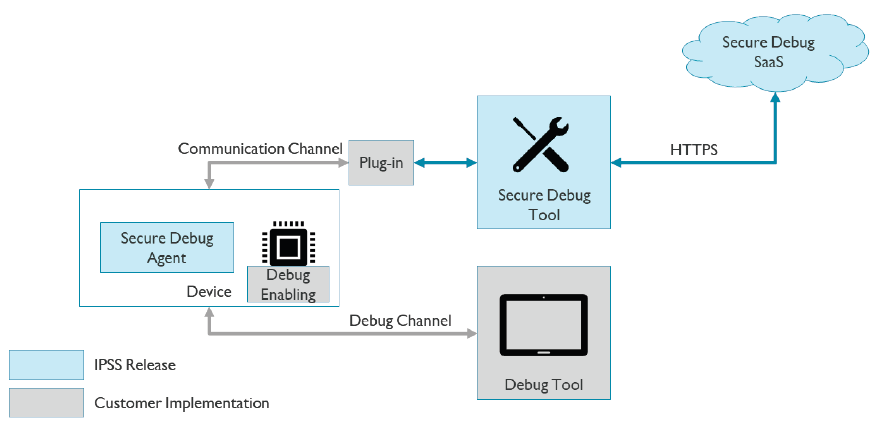

Secure Debug
=======================

:link_to_translation:`zh_CN:[中文]`

Secure Debug
-------------------------

Secure debug provides a reliable mechanism for enabling the debug feature of a device after the device deployment. 

Debug is one of the most commonly-used features in the device. With the debug feature, you can access all the device data, 
including the device firmware and the device root key. 

BK7236 compiles with the following rules on using the debug feature: 

 - In the device’s developing stage, always enable the debug feature. 
 - In the device’s manufacturing stage, always disable the debug feature, and re-enable the debug feature for some special usages, such as failure analysis. 

Secure debug provides a mechanism to set up the debug re-enabling mechanism with authentication and permission check. 
Through the mechanism, you can grant certain users specified permissions for certain devices. 

Secure debug does not cover the details of how to re-enable the debug feature on devices. You should implement the details 
for re-enabling the debug feature on devices. 

Secure debug includes the following three components: 

 - Secure debug agent on devices
 - Secure debug tool on host
 - Secure Debug Server

The following figure shows the top-level structure of a secure debug system. 

