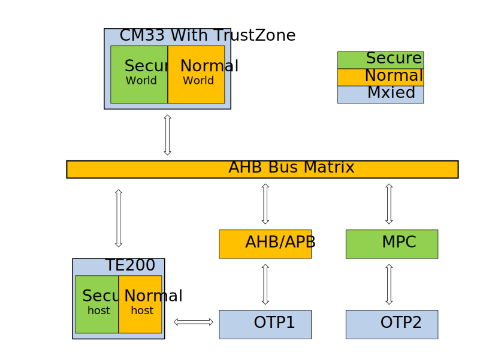
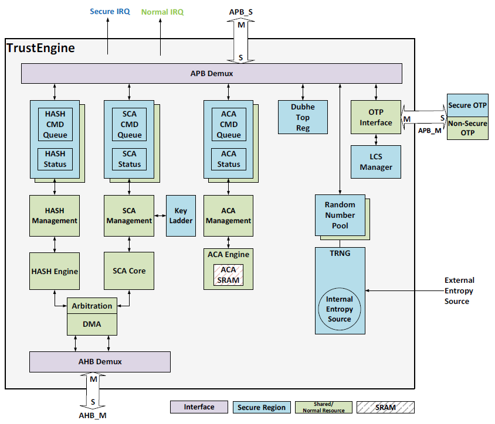

Secure Engine
==================================

:link_to_translation:`zh_CN:[中文]`

Overview
---------------------

BK7236 introduces TrustEngine as a secure component in the system. It provides the following features:

 - High security assurance. The crypto engine supports key ladders, lifecycle management and True Random Number Generator (TRNG) which enhance the system security.
 - High performance and low power for encryption/decryption operation. This is achieved by TrustEngine internal cryptography engines.
 - Reduction of software complicity in security. Some security functions are implemented in TrustEngine hardware such as
   LCS management and One-Time Programmable (OTP) access control, which can reduce the risk of sensitive information leakage
   to non-secure hosts.

BK7236 is also integrated with the TrustEngine driver in BootROM, Bootloader, TF-M and Armino.

TrustEngine In the System
------------------------------------------

The position of TrustEngine in the system is shown in the figure below.

In BK7236, TrustEngine is configured as a security host and a normal host, where:

  - Security host - mainly used for secure boot in BL1 and BL2, secure data encryption/decryption, signature/verification in TFM-S, etc.
  - Ordinary host - mainly used in the non-secure world, such as encryption/decryption, signature/verification, etc. in Wi-Fi, TCPIP communication and other applications.

The configuration information related to secure boot in OTP1 is also accessed through TrustEngine. For OTP1 access, TrustEngine implements
Based on the life cycle rights management.

TrustEngine Top-Level Architecture
------------------------------------------

The following figure shows the TrustEngine top-level architecture:

TrustEngine Features
---------------------

The TrustEngine supports the following features:

  - Symmetric encryption algorithm: AES-ECB/CBC/CTR/CBC-MAC/CMAC/CCM/GCM (key lengths are 128-bit, 192-bit and 256-bit).
  - Symmetric encryption algorithm: SM4-ECB/CBC/CTR/CBC-MAC/CMAC/CCM/GCM.
  - Hash algorithm: SHA1/224/256.
  - Hash Algorithm: SM3.
  - Asymmetric encryption algorithms: RSA 1024/2048/3072/4096 and ECCP 192/224/256/384/512/521.
  - Asymmetric encryption algorithm: SM2.
  - Key ladder for key management.
  - Life cycle management.
  - True random number generator.
  - One Time Programming (OTP).

Supported Standards and Specifications
-------------------------------------------------

TrustEngine is compliant with the following standards:

  - FIPS PUB 180-4: Secure Hash Standard (SHS)
  - FIPS PUB 197: Advanced Encryption Standard (AES)
  - NIST SP 800-38A: Recommended Methods and Techniques for Block Cipher Modes of Operation
  - NIST SP 800-38B: Block Cipher Mode of Operation Protocol - CMAC Mode for Authentication
  - NIST SP 800-38C: Block Cipher Mode of Operation Protocol - CCM Mode for Authentication and Privacy
  - NIST SP 800-38D: Block Cipher Operating Mode Protocols - Galois/Counter Mode (GCM) and GMAC
  - NIST SP 800-90B: Entropy Source Protocol for Random Bit Generation
  - GB/T 32918-2016: SM2 Elliptic Curve Public Key Cryptography Algorithm
  - GB/T 32905-2016: SM3 Password Hashing Algorithm
  - GB/T 32907-2016: SM4 block cipher algorithm

Among them: SM2 public key cryptography, SM3 cryptographic hash algorithm and SM4 block cipher algorithm are Chinese
national standards.

Components
-------------------------------------------------

TrustEngine consists of five major function blocks:

 - Symmetric Cryptography Accelerator (SCA)
 - Asymmetric Cryptography Accelerator (ACA)
 - HASH engine
 - One-time programmable storage access controller
 - True random number generator

Symmetric Cryptography Accelerator (SCA)
+++++++++++++++++++++++++++++++++++++++++++++++++++

SCA in TrustEngine is responsible for data encryption/decryption using the symmetric cryptography algorithm. The data encryption/decryption operations are performed through the SCA engine by sending special commands to TrustEngine.

Asymmetric Cryptography Accelerator (ACA)
+++++++++++++++++++++++++++++++++++++++++++++++++++

The ACA engine in TrustEngine is responsible for accelerating the asymmetric cryptography, such as:

 - Asymmetric encryption and decryption—RSA and ECC
 - Digital signature and verification—RSA signatures and ECDSA
 - Key exchange—DH (Diffie-Hellman) and ECDH

The ACA supports micro operations of arithmetic and logic for long integer, including:

 - Basic arithmetic operations—addition/subtraction/multiplication/division
 - Logic operations—and/or/xor/shift
 - Modular operations—addition/subtraction/multiplication/reduction/inversion/exponentiation

HASH Accelerator
+++++++++++++++++++++++++++++++++++++++++++++++++++

The HASH engine in TrustEngine is responsible for digest calculation. The digest of certain data can be calculated
through the HASH engine by sending special commands to TrustEngine.

OTP Storage Controller
+++++++++++++++++++++++++++++++++++++++++++++++++++

The OTP storage is used to store sensitive information for the security aware system. TrustEngine defines four Life Cycle
States (LCS) to represent different product stages. At different LCS, the OTP controller applies different authority check
strategies to protect the assets in OTP. In addition, the OTP controller is responsible for life cycle state maintenance
and OTP data preload for better access performance.

OTP memory layout
****************************************

The following table shows the contents stored in OTP that TrustEngine defines:

+-------------------------------------+------------------------+-----------------------------------------------+
|Offset                               | Name                   | Description                                   |
+=====================================+========================+===============================================+
|0x0000                               | model_id               | Model ID                                      |
+-------------------------------------+------------------------+-----------------------------------------------+
|0x0004                               | model_key              | Model key (16-byte)                           |
+-------------------------------------+------------------------+-----------------------------------------------+
|0x0014                               | device_id              | Device ID                                     |
+-------------------------------------+------------------------+-----------------------------------------------+
|0x0018                               | device_root_key        | Device root key (16-byte)                     |
+-------------------------------------+------------------------+-----------------------------------------------+
|0x0028                               | secure_boot_pk_hash    | Secure boot public key hash value (32-byte)   |
+-------------------------------------+------------------------+-----------------------------------------------+
|0x0048                               | secure_debug_pk_hash   | Secure debug public key hash value (32-byte)  |
+-------------------------------------+------------------------+-----------------------------------------------+
|0x0068                               | LCS                    | Life cycle state                              |
+-------------------------------------+------------------------+-----------------------------------------------+
|0x006c                               | reserved               | Reserved space                                |
+-------------------------------------+------------------------+-----------------------------------------------+
|0x007c                               | lock_ctrl              | Lock control bit                              |
+-------------------------------------+------------------------+-----------------------------------------------+
|0x0080                               | usr_non_sec_region     | User-defined non-secure region (nsecblk_size) |
+-------------------------------------+------------------------+-----------------------------------------------+
|0x0080 + nsecblk_size                | usr_sec_region         | User-defined secure region (secblk_size)      |
+-------------------------------------+------------------------+-----------------------------------------------+
|0x0080 + nsecblk_size + secblk_size  | test_region            | This region is used for test purpose.         |
+-------------------------------------+------------------------+-----------------------------------------------+

The size of usr_sec_region, usr_sec_region and test_region can be configured by users. Other regions are defined and fixed by
TrustEngine. The lock_ctrl region is used to lock the write operations to OTP contents.

OTP Control
****************************************

The following table shows each bit and its control region:

+---------+---------------------------+--------------------------------------------------------------------------------+
| Field   | Name                      | Description                                                                    |
+=========+===========================+================================================================================+
| 31:16   | usr_sec_region_lock       |                                                                                |
|         |                           | Each bit represents the lock attribute of the 128 bits in usr_sec_region.      |
|         |                           | If usr_sec_region is over 2048 bits, the lock attribute of the rest bits cannot|
|         |                           | be controlled.                                                                 |
|         |                           |                                                                                |
|         |                           | 0x1: Lock of writing operations to the 128-bit accordingly.                    |
|         |                           | 0x0: No lock of writing operations to the 128-bit accordingly.                 |
+---------+---------------------------+--------------------------------------------------------------------------------+
| 15:8    | usr_non_sec_region_lock   | Each bit represents a 128-bit block lock attribute in usr_non_sec_region.      |
|         |                           | If usr_non_sec_region is over 1024 bits, the lock attribute of the rest bits   |
|         |                           | cannot be controlled.                                                          |
+---------+---------------------------+--------------------------------------------------------------------------------+
| 7:6     | Reserved                  | Reserved                                                                       |
+---------+---------------------------+--------------------------------------------------------------------------------+
| 5       | secure_debug_pk_hash_lock | 0x1: Lock of writing operations to secure_debug_pk_hash accordingly.           |
|         |                           |                                                                                |
|         |                           | 0x0: No lock of writing| operations to secure_debug_pk_hash accordingly.       |
+---------+---------------------------+--------------------------------------------------------------------------------+
| 4       | secure_boot_pk_hash_lock  | 0x1: Lock of writing operations to secure_boot_pk_hash accordingly.            |
|         |                           |                                                                                |
|         |                           | 0x0: No lock of writing operations to secure_boot_pk hash accordingly.         |
+---------+---------------------------+--------------------------------------------------------------------------------+
| 3       | device_root_key_lock      | 0x1: Lock of writing operations to device_root_key accordingly.                |
|         |                           |                                                                                |
|         |                           | 0x0: No lock of writing operations to device_root_key accordingly.             |
+---------+---------------------------+--------------------------------------------------------------------------------+
| 2       | device_id_lock            | 0x1: Lock of writing operations to device_id accordingly.                      |
|         |                           |                                                                                |
|         |                           | 0x0: No lock of writing operations to device_id accordingly.                   |
+---------+---------------------------+--------------------------------------------------------------------------------+
| 1       | model_key_lock            | 0x1: Lock of writing operations to model_key accordingly.                      |
|         |                           |                                                                                |
|         |                           | 0x0: No lock of writing operations to model_key accordingly.                   |
+---------+---------------------------+--------------------------------------------------------------------------------+
| 0       | model_id_lock             | 0x1: Lock of writing operations to model_id accordingly.                       |
|         |                           |                                                                                |
|         |                           | 0x0: No lock of writing operations to model_id accordingly.                    |
+---------+---------------------------+--------------------------------------------------------------------------------+

Life Cycle States
****************************************

For LCS bits, not all 32 bits are used. The following table shows the detailed definition of the LCS region.

+----------+------------+------------------------------------------------------------------+
| Field    | Name       | Description                                                      |
+==========+============+==================================================================+
| 31:4     | Reserved   | Reserved                                                         |
+----------+------------+------------------------------------------------------------------+
| 3        | Reserved   | This bit is for hardware internal use only and cannot be written.|
+----------+------------+------------------------------------------------------------------+
| 2:0      | LCS        | Life cycle status                                                |
|          |            |                                                                  |
|          |            |   3’b000: CM status                                            |
|          |            |   3’b001: DM status                                            |
|          |            |   3’b011: DD status                                            |
|          |            |   3’b111: DR status                                            |
+----------+------------+------------------------------------------------------------------+

Life Cycle State

TrustEngine defines four life cycle states:

 - Chip Manufacturing (CM)
   This state indicates that the chip is in the chip manufacturers and is not transferred to the device manufacturers.
   All debug and test features are enabled, including the sensitive part of the chip.
 - Device Manufacturing (DM)
   In this state, the chip is on the OEM’s product line. Chip internal test features (internal scan, mbist) should be disabled.
   However, chip interface and external test features should be available to OEM. OEM is responsible for all secure information 
   provisioning, including secure boot public key hash, secure debug public key HASH value, device root key and model key. 
   Before the transition to the next stage, OEM should finish all the OEM information provisioning work (including Device ID, 
   Model ID, Model Key, Device Root Key and sensitive information stored in the secure region) and update the LCS to Device 
   Deployment. 
 - Device Deployment (DD) 
   During this state, the device is in the normal state. All security functions should be enabled. Fuse burning to the 
   Dubhe-defined OTP area is disabled. Secure boot and secure debug are mandatory. Limited debug capabilities are available. 
 - Device Revocation (DR) 
   This state indicates that the chip is sent back to the manufacturer for failure analysis. At this stage, secure boot and 
   secure debug are mandatory. To protect the device manufacturer information, model key and device key, user-defined secure 
   data in OTP must be erased and inaccessible to anyone. 

The LCS transition should be unidirectional and irrevocable. The following figure shows the valid LCS transition. 

OTP Access Control
****************************************

As the OTP access controller, TrustEngine uses two different ways for read and write operations. 

 - Read operation
   For read operations, TrustEngine maps the OTP contents to its memory map. The base address is listed in Table B1-1 OTP space. Users should use the base address and the offset in Table A2-12 to read the OTP device. To gain better performance for read, TrustEngine integrates internal shadow registers to preload some contents from the OTP device. Users can read these shadow registers instead of contents inside the OTP device to save access time. These shadow registers will also be updated if a write operation is detected. 
 - Write operation
   For write operations, TrustEngine uses indirect write registers to update OTP. Users program the write address and write data to TrustEngine registers and trigger the write operation to the OTP device. TrustEngine uses the otp_update_stat register to indicate the write operation status. The write address is the offset address in Table 4 3. The base address is not used in write operations. 
 - Access filter

In different LCS, TrustEngine applies different strategies to filter the access to the OTP device.

True Random Number Generator
+++++++++++++++++++++++++++++++++++++++++++++++++++

The True Random Number Generator (TRNG) generates the random bits using the internal entropy source 
(ring oscillator inverter chain) or the external entropy source. The random bits are required by both 
secure and non-secure hosts. 

The TRNG provides random numbers for both secure hosts and non-secure hosts. All hosts can use the data 
from the random number pool as the input of Deterministic Random Bit Generator (DRBG). 

The TRNG consists of five major blocks: 

 - Entropy source
 - Sampling block
 - Post processing
 - Evaluation & test
 - Random number pool

The basic idea of the TRNG is to use a low frequency clock to sample a fast toggling signal. Fast toggling signal refers 
to the entropy source. The TRNG uses some independent ring oscillators to generate the entropy source. The TRNG can also 
support the external entropy source by register configurations. Following the entropy source, the sampling block uses the 
synchronization circuit to latch the entropy output with a low frequency clock. To compensate the process variation, the 
TRNG block provides the configuration capability for secure #0 host to adjust the ring oscillators and the sampling clock rate. 

To obtain higher quality for the random bits, the TRNG block implements a post processing block to perform randomness improvement.
The post processing block has a von Neumann corrector to reduce bit bias, a LFSR block to adjust random bit distribution and a 
checker to conduct continuous random number generator test (FIPS.140-2). In addition, the TRNG has an evaluation & test block to 
perform complicated check on the random data output and to provide feedback to host#0 to decide whether to regenerate the random 
data. 

After passing the post processing block, the random bit stream will be stored in the random number pool. Each host has an 
independent random number pool.
