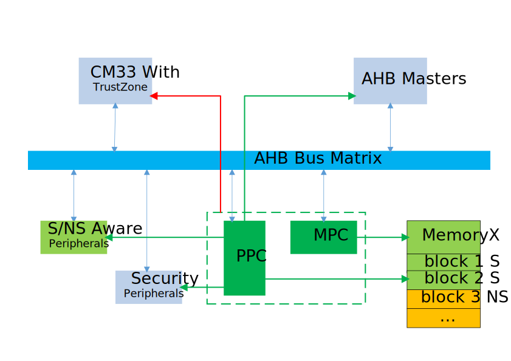
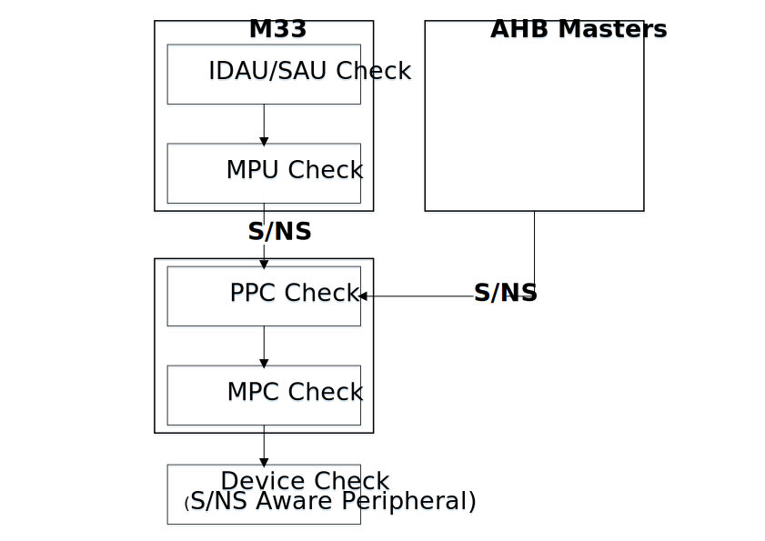
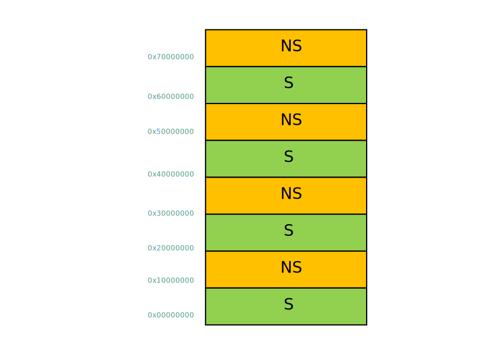
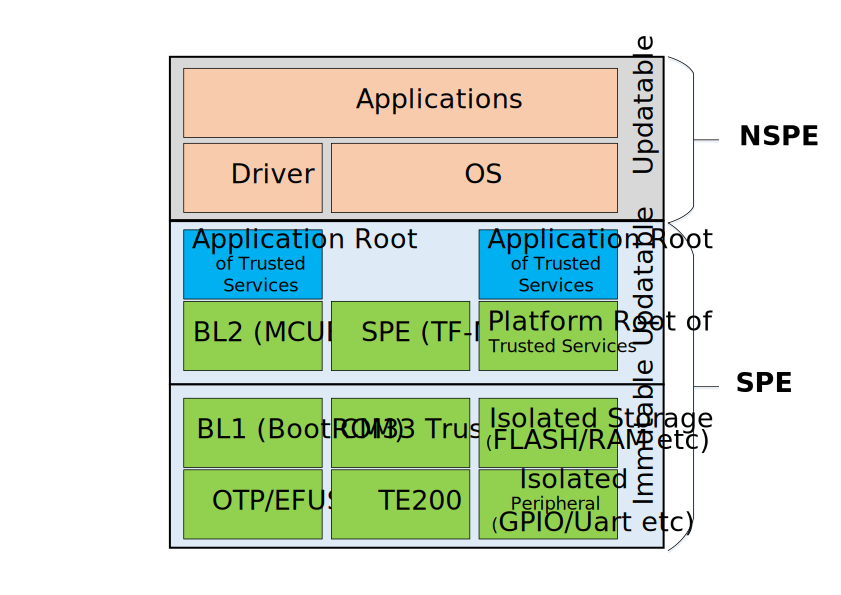

.._bk_security_overview:

Security Overview
=======================

:link_to_translation:`zh_CN:[中文]`

Hardware Security Architecture
-----------------------------------------------

As shown in the picture above, the BK7236 safety is based on the M33. M33 adds a new dimension through the TZ mechanism: secure (S) and non-secure (NS).
That is, two worlds are isolated on one CPU core: the secure world (S) and the non-secure world (NS). BK7236 through PPC and MPC module will
The concept of S/NS in M33 is extended to the whole SoC system. Among them, PPC is used to configure S/NS and P/NP of devices on the bus; MPC is used to configure
S/NS attributes of different blocks on the memory device.

The security access rules on BK7236 can be summarized by the following figure:

Security Access Rules:

  - After the AHB Master request passes the AHB Master's own security rule check, it carries the S/NS signal to the AHB bus:
 
   - When the Master is M33, the access address is checked by IDAU/SAU first, and then checked by MPU after passing the check, and finally goes to the bus.
   - When the Master is other devices, if the Master is configured as S by the PPC, then it is S access, otherwise it is NS access.

  - S/NS request from AHB Master, then checked by BK7236 security control:
 
   - First is the PPC review, the general rule is that NS can only access peripherals with PPC configured as NS, and S can access S/NS peripherals (or only S peripherals).
   - For block memory access, further review by MPC, the review rule is that S requests can access S/NS blocks, and NS requests can only access NS blocks.

  - After passing the PPC/MPC review, the access request comes to the target peripheral:
 
   - If the target peripheral itself does not recognize the S/NS signal, directly access the target peripheral.
   - If the target peripheral itself recognizes the S/NS signal (S/NS Aware peripheral), the target peripheral performs a final security check on the request.

If any of the security checks fails, the access will be terminated and a security exception will be generated (or no exception will be generated, only the access will be invalidated).

.. note::

   In BK7236, S/NS Aware peripherals include FLASH, DMA, TE200, etc.

M33 Security Access
++++++++++++++++++++++

In CM33, the CPU access address will go through the IDAU/SAU security check first, and if the check fails, a security exception will be generated.
If the check is passed, the MPU will perform a security check, and the MPU will carry the S/NS signal to the bus matrix after passing the check.

In BK7236, the IDAU settings are as shown in the figure below:

.._bk_security_overview_ppc:

PPC Control - Device Security Access
++++++++++++++++++++++++++++++++++++++++++

PPC is the BK7236 SoC peripheral security control center, which configures the S/NS and P/NP attributes of the peripheral.

The implementation overview is as follows:

  - Peripherals AON_WDT, AON_REG, AON_GPIO, and AON_RTC only have security attributes, no privilege attributes, and can only return RESP signals when accessed illegally, and cannot be configured.
  - The security attributes of AON_GPIO are configured per pin.
  - Security Illegal access can generate an abort.
  - Privileged illegal access will produce a silent failure operation.
  - Three sets of address/data value compare registers to support fault injection attacks, currently used in Secure Boot.

When the S/NS signal from the AHB bus accesses the peripheral, it first passes the PPC check, and the rules are as follows:

+------+---------+---------+
| AHB  | PPC     | Access  |
+======+=========+=========+
| S    | S       | **Y**   |
+------+---------+---------+
| S    | NS      | **Y**   |
+------+---------+---------+
| NS   | S       | N       |
+------+---------+---------+
| NS   | NS      | **Y**   |
+------+---------+---------+

Please refer to :ref:`PPC Peripheral Configuration <bk_config_security_ppc>` for PPC device security attribute configuration.

.. _bk_security_overview_mpc:

MPC Control - Block Memory Security Access
++++++++++++++++++++++++++++++++++++++++++++++

For block storage devices, in addition to configuring device-level security attributes through PPC, you can further use MPC to configure
block to configure the security properties of the block.

The MPC is a block-based gating unit that checks the correspondence between the security attributes of a storage device's access and the security mapping of addresses.
Each MPC body is divided into multiple blocks, and a table is used to look up the safe mapping of access addresses. It works as follows:

  - Provides the maximum index and block size for the table.
  - Use a table LUT (lookup table) to perform security mapping/query security mapping relationship for each block.
  - Failure of the gate will make the access operation RAZ/WI (Read-As-Zero/Write-Ignored), or generate a bus fault (BusFault).

BK7236 The following devices can configure their security attributes by block through MPC:

+---------+------------+---------+--------------------+------------------+
| Device  | block_size | blk_max | block0 1st bytes   | block0 last byte |
+=========+============+=========+====================+==================+
| PSRAM   | 256KB      | 7       | 0x60000000         | 0x6003ffff       |
+---------+------------+---------+--------------------+------------------+
| QSPI0   | 256KB      | 7       | 0x64000000         | 0x6403ffff       |
+---------+------------+---------+--------------------+------------------+
| QSPI1   | 256KB      | 7       | 0x68000000         | 0x6803ffff       |
+---------+------------+---------+--------------------+------------------+
| FLASH   | 64KB       | 7       | 0x60000000         | 0x6003ffff       |
+---------+------------+---------+--------------------+------------------+
| OTP2    | 256B       | 0       | 0x4b010000         | 0x4b0100ff       |
+---------+------------+---------+--------------------+------------------+

For block storage devices, the secure world can access blocks with the MPC security attribute configured as S or NS, but the non-secure world
Only blocks with MPC security configured as NS can be accessed. The specific access rules are shown in the following table:

+------+---------+-------+---------+
| CPU  | Address | Device| Access  |
+======+=========+=======+=========+
| S    | S       | S     | **Y**   |
+------+---------+-------+---------+
| S    | S       | NS    | N       |
+------+---------+-------+---------+
| S    | NS      | S     | N       |
+------+---------+-------+---------+
| S    | NS      | NS    | **Y**   |
+------+---------+-------+---------+
| NS   | S       | S     | N       |
+------+---------+-------+---------+
| NS   | S       | NS    | N       |
+------+---------+-------+---------+
| NS   | NS      | S     | N       |
+------+---------+-------+---------+
| NS   | NS      | NS    | **Y**   |
+------+---------+-------+---------+

For MPC device security attribute configuration, please refer to :ref:`MPC Peripheral Configuration <bk_config_security_mpc>`.

AHB Master Access Rules
++++++++++++++++++++++++++++++++++++++

There are two types of AHB master devices on the BK7236 AHB bus matrix:

  - Universal DMA - is the master device of S/NS Aware, please refer to DMA security access for access rules.
  - Other AHB masters - Other AHB masters whose security attributes are determined by the PPC.

The AHB master device access request comes out of the AHB, and before going to the slave device, it will go through the PPC first, and the PPC will do it.
After the security attributes are checked, it is decided whether to allow access to the slave device. For inspection rules, please refer to PPC Security Access.

SPI/QSPI Security Access
++++++++++++++++++++++++++++++++++++++

SPI/QSPI external off-chip device access is determined by SPI/QSPI security attributes.

.. bk_security_overview_flash:

FLASH Security Access
+++++++++++++++++++++++++++++++++++

As shown in the figure above, there are two ways for BK7236 to access the on-chip FLASH:

  - Command port - Access FLASH through the FLASH controller, at this time, the FLASH controller will add/remove CRC, and perform encryption/decryption processing.
  - Data port - direct access via internal SPI.

When accessing the FLASH through the data port, the FLASH acts as a S/NS Aware device, only when the signal from the AHB bus is safe
Access is only allowed when the attribute matches the security attribute of FLASH itself.

For the FLASH data port, the secure world can only access the address space of FLASH itself configured as S, but the non-secure world
It can only access the address space configured as S by FLASH itself. The specific access rules are shown in the following table:

+------+---------+-------+---------+
|  CPU | Address | FLASH | Access  |
+======+=========+=======+=========+
| S    | S       | S     | **Y**   |
+------+---------+-------+---------+
| S    | S       | NS    | N       |
+------+---------+-------+---------+
| S    | NS      | S     | N       |
+------+---------+-------+---------+
| S    | NS      | NS    | N       |
+------+---------+-------+---------+
| NS   | S       | S     | N       |
+------+---------+-------+---------+
| NS   | S       | NS    | N       |
+------+---------+-------+---------+
| NS   | NS      | S     | N       |
+------+---------+-------+---------+
| NS   | NS      | NS    | **Y**   |
+------+---------+-------+---------+

.. note::

  For the access rules of FLASH instruction port, please refer to the block device access rules.

Please refer to :ref:`FLASH Security Configuration <bk_config_security_flash>` for FLASH data port security attribute configuration.

.._bk_security_overview_dma:

DMA Security Access
++++++++++++++++++++++

DMA belongs to S/NS Aware, and its security access rules are as follows:

+------+---------+----------+---------+--------+
| DMA  | Channel | SRC      | DST     | Access |
+======+=========+==========+=========+========+
| S    | S       | S or NS  | S or NS | **Y**  |
+------+---------+----------+---------+--------+
| S    | NS      | S        | S or NS | N      |
+------+---------+----------+---------+--------+
| S    | NS      | S or NS  | S       | N      |
+------+---------+----------+---------+--------+
| S    | NS      | NS       | NS      | **Y**  |
+------+---------+----------+---------+--------+
| NS   | NS      | NS       | NS      | **Y**  |
+------+---------+----------+---------+--------+
| NS   | -       | -        | -       | N      |
+------+---------+----------+---------+--------+

Please refer to :ref:`DMA security configuration <bk_config_security_dma>` for DMA security attribute configuration.

Software Security Architecture
------------------------------------------

BK7236 is segregated into secure world (SPE) and non-secure world (NSPE).

The security world is divided into two parts: the non-upgradeable part and the upgradable part. The non-upgradeable part includes BL1 and security hardware.
Such as CM33, OTP, secure storage, secure peripherals, secure engine, etc. The upgradeable part is mainly composed of BL2, TFM and
Composition of security services.

The non-secure world includes drivers, OS, and various Armino components and applications.

BL1 - BootROM
++++++++++++++++++++++++++++++++

BK7236 BL1 is based on the BootROM in the Shanhai security suite of Arm Company, which is a closed-source software.

BL2 - MCUBOOT
++++++++++++++++++++++++++++++++

BL2 uses MCUBOOT. You can learn more about TF-M through `MCUBOOT official website <https://docs.mcuboot.com>`_.

SPE-TF-M
++++++++++++++++++++++++++++++++

SPE uses the open source software TF-M 1.6.0. Available through `TF-M official website <https://www.trustedfirmware.org/projects/tf-m/>`_
Learn more about TF-M.
