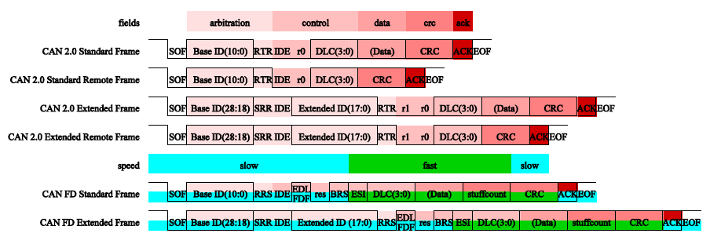

CAN
================

:link_to_translation:`en:[English]`

CAN 简介
------------------------------------------------------
控制器局域网 (CAN, Controller Area Network) 总线是一种强大的串行总线系统，可实现网络节点之间高效可靠的通信。它使用多主总线配置并在没有 CPU 干预的情况下管理错误检测和处理。

CAN 控制器特性
------------------------------------------------------------------------
1.支持 CAN 协议规范
	CAN 2.0B（最多 8 字节有效载荷，经 Bosch 参考模型验证）
	CAN FD（最多 64 字节有效载荷，符合 ISO 11898-1:2015 或非 ISO Bosch）

2.可编程数据速率
	CAN 2.0B 数据速率高达 1 Mbit/s
	CAN FD 数据速率高达 2 Mbit/s

3.可编程波特率预分频器，分频系数介于 1 到 256 之间
	详细信息需要查看寄存器文档及设计文档

4.两个发送缓冲器
	一个主发送缓冲器 (PTB)
	一个可选的可配置的辅助发送缓冲器 (STB)

5.通用参数选择缓冲区时隙的数量
	该部分使用默认配置，不建议进行修改。

6.可在 FIFO 或优先决策模式下运行
	默认使用FIFO模式，优先决策模式需要配置，参考API

7.独立和可编程的内部 29 位验收过滤器
	可通过通用参数在 1 至 16 范围内选择验收过滤器数量

8.扩展功能
	单发传输模式（用于 PTB 和/或 STB）
	只听模式
	环回模式（内部和外部）
	收发器待机模式

9.扩展的状态和错误报告
	捕获最后发生的错误类型和仲裁丢失的位置
	可编程错误警告限制

10.可配置的中断源
	默认只对用户支持TX和RX回调函数的注册使用

11.时间戳：
	具有部分硬件支持的 ISO 11898-4 时间触发 CAN (TTCAN)
	CiA 603 时间戳

12.安全相关功能
	具有附加地址保护的 ECC 内存保护
	内部逻辑核心的空间冗余

CAN 2.0 和 CAN FD 帧
------------------------------------
CAN FD 是 CAN 2.0 的协议扩展。主要区别是：

	数据有效载荷：CAN 2.0 最多 8 个字节，CAN FD 最多 64 个字节
	一种用于 CAN 2.0 的可配置比特率，但用于 CAN FD 的是 2 种：仲裁速度慢，数据阶段速度快

CAN 2.0 和 CAN FD 的所有类型的帧如下图所示。

    CAN 2.0 And CAN FD

Bosch 的 CAN FD 规范（非 ISO）使用名称 EDL，而 CAN FD ISO 规范使用名称 FDF 表示相同的位。两个名字都是同义词。本章节使用名称 FDF。
对于 CAN FD ISO 帧，填充计数作为 CRC 字段的一部分传输。对于 CAN FD 非 ISO 帧，填充计数不是帧的一部分。此外，CRC 校验器对非 ISO 和 ISO 帧有不同的初始化。因此 ISO 和非 ISO 帧是不兼容的。
CAN 控制器 核心中的 CAN 协议机器自动发送和接收帧并内置相应的控制和状态位。主机控制器需要选择所需的帧类型（IDE、RTR、FDF）、选择标识符并设置数据有效载荷。

缩写词在 CAN 规范在下表中进行了简要说明。对于经典 CAN 帧 (CAN 2.0)，一些位名称已使用 CAN FD ISO 规范重命名，但此处仍使用较旧的名称以便于向后引用。

+----------+---------------------------------------------+---------------------+    
|   缩写   | 描述                                        | 注释                |
+==========+=============================================+=====================+
|   ID     | 标识符 IDentifier                           | -                   |
+----------+---------------------------------------------+---------------------+
|   RTR    | 远程传输请求 Remote Transmission Request    | 远程或数据帧        |
+----------+---------------------------------------------+---------------------+
|   SRR    | 替代远程请求 Substitute Remote Request      | -                   |
+----------+---------------------------------------------+---------------------+
|   RRS    | 远程请求替换 Remote Request Substitution    | -                   |
+----------+---------------------------------------------+---------------------+
|   IDE    | 标识符扩展 IDentifier Extension             | 标准或扩展帧        |
+----------+---------------------------------------------+---------------------+
|   DLC    | 数据长度代码 Data Length Code               | 有效载荷字节数      |
+----------+---------------------------------------------+---------------------+
|   EDL    | 扩展数据长度 Extended Data Length           | CAN 2.0 或 CAN FD 帧|
+----------+---------------------------------------------+---------------------+
|   FDF    | FD 格式指示器 FD Format indicator (=EDL)    | CAN 2.0 或 CAN FD 帧|
+----------+---------------------------------------------+---------------------+
|   BRS    | 比特率开关 Bit Rate Switch                  | -                   |
+----------+---------------------------------------------+---------------------+
|   ESI    | 错误状态指示器 错误State Indicator          | -                   |
+----------+---------------------------------------------+---------------------+ 

CAN 驱动的宏定义开关
------------------------------------------------------
CONFIG_CAN CAN驱动的总开关， 默认只编译CAN驱动部分，及主要can_driver.c

CONFIG_CAN_TEST 在CONFIG_CAN打开的状态下，打开测试部分进行单步测试，主要can_test.c

CONFIG_CAN_DEMO 在CONFIG_CAN打开的状态下，打开示例部分进行用例演示，主要can_demo.c

1、只打开驱动部分时，CONFIG_CAN=y

2、进行API进行逐个测试时，CONFIG_CAN=y   CONFIG_CAN_TEST=y

3、进行实例进行测试验证时，CONFIG_CAN=y   CONFIG_CAN_DEMO=y

CAN API使用必要了解的结构体说明
------------------------------------------------------------------------
can_config_t:
    protocol
	需要选择协议CAN 2.0B或CAN FD

    s_speed
	S速度（Slow Speed）S速度是CAN总线的低速模式，其数据传输速率为125 kbps或更低。这种模式主要用于需要低成本、低功耗和低带宽的应用

    f_speed
	F速度（Fast Speed）F速度是CAN总线的标准速度模式，其数据传输速率为500 kbps。这种模式主要用于需要高实时性和低延迟的应用

    tx_size
	kfifo的深度，将要发送的数据暂存到软件FIFO中，用于对硬件tx fifo的扩展

    rx_size
	kfifo的深度，将接收到的数据暂存到软件FIFO中，便于对硬件rx fifo的扩展

can_frame_tag_t:
    id
	标识符 IDentifier

    ide
	标识符扩展 IDentifier Extension

    rtr
	远程传输请求 Remote Transmission Request，只有2.0可以使用

    fdf
	FD 格式指示器 FD Format indicator (=EDL)

    brs           
	比特率开关 Bit Rate Switch，只有FD可用

    esi         
	错误状态指示器 Error State Indicator，只有FD RX可用
	
	ttsen
	Time Triggered Switch，时间触发切换。它是一种用于CAN FD的技术，允许在特定时间触发切换位速率或其他参数

can_frame_s:
    tag
	详细信息查看can_frame_tag_t

    size
	发送数据的size

    data
	发送数据的buffer指针

can_acc_mask_ide_e:
    CAN_ACCEPT_BOTH
	标准和扩展帧都支持

    CAN_ACCEPT_STANDARD
	仅支持标准帧

    CAN_ACCEPT_EXTENDED
	仅支持扩展帧

drv_switch_e:
	DRIVER_DISABLE
	不同协议驱动切换关闭

	DRIVER_ENABLE
	不同协议驱动切换打开

can_acc_filter_cmd_s:
    aide
	参考can_acc_mask_ide_e描述

    code
	ID不要超过29 bits

    mask
	对应的bit置位标志接收该ID设备的数据 1 disable, 0 enable
	           
    seq
	0 to MAX_ACF_NUM, default 0 accept all

    onoff
	功能参考drv_switch_e描述

can_callback_des_t:
    cb
	回调函数指针(can_callback)

    ***param**
	私有参数

CAN API使用说明
------------------------------------------------------------------------

bk_err_t bk_can_init(can_dev_t ***can**);
	初始化配置，注意查看上述结构体的配置

bk_err_t bk_can_driver_init(void);
	加载驱动

bk_err_t bk_can_driver_deinit(void);
	卸载驱动

bk_err_t bk_can_deinit(void);
	卸载配置，释放资源

bk_err_t bk_can_receive(uint8_t ***data**, uint32_t expect_size, uint32_t ***recv_size**, uint32_t timeout);
	接收数据，data是接收的buffer， expect_size是接收的数据长度，recv_size是实际数据长度，timeout是接收等待的时间
	接收数据分为两种，一种中断通知然后交给下半部进行数据读取。另一种是读取等待总线数据，接收到数据后将数据读走

bk_err_t bk_can_send_ptb(can_frame_s ***frame**);
	优先发送数据，参数参考上一小节结构体介绍

bk_err_t bk_can_send(can_frame_s ***frame**, uint32_t timeout);
	发送数据，等待数据发送完成

bk_err_t bk_can_acc_filter_set(can_acc_filter_cmd_s ***cmd**);
	硬件过滤器配置，只接受部分ID的数据，减少处理

void bk_can_register_isr_callback(can_callback_des_t ***rx_cb**, can_callback_des_t ***tx_cb**);
	注册TX\RX的中断处理回调函数，注意这两个函数都是在中断中执行，注意回调函数的处理内容

CAN Pin and GPIO Map
---------------------------------

+----------+-----------+
| CAN Pin  | BK7258_CP0|
+==========+===========+
| CAN TX   | 44        |
+----------+-----------+
| CAN RX   | 45        |
+----------+-----------+
| CAN STBY | 46        |
+----------+-----------+

注意：这三个PIN还与其他功能复用
GPIO_44, SPI0_SCK(IO)/ADC0(Z)/RGB_b[6]/I8080_d3(O)/I2S2_SCK(IO)

GPIO_45, SPI0_NSS(IO)/ADC7(Z)/RGB_b[5]/I8080_d2(O)/I2S2_SYNC(IO)

GPIO_46, SPI0_MOSI(IO)/ENET_PHY_INT(I)/TOUCH[140]/RGB_b[4]/I8080_d1(O)/I2S2_DIN(IO)

CAN API Reference
---------------------

.. include:: ../../_build/inc/can.inc

CAN API Typedefs
---------------------

.. include:: ../../_build/inc/can_types.inc
.. include:: ../../_build/inc/hal_can_types.inc
