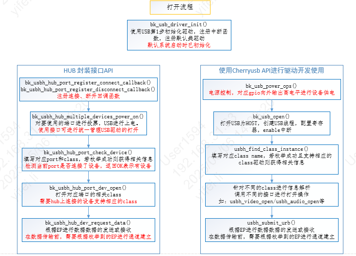
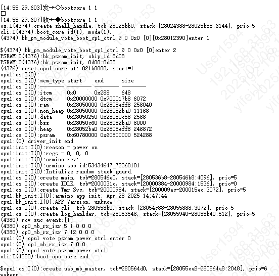
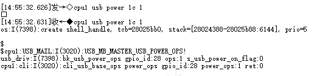
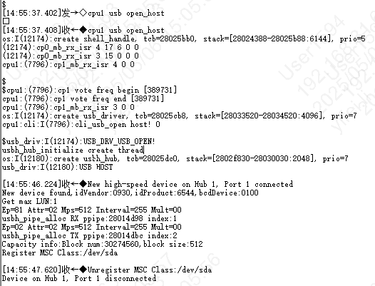
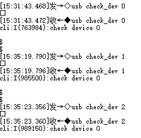
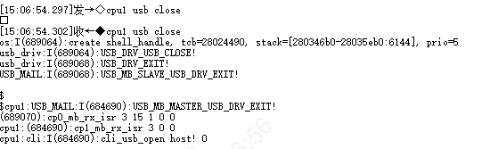
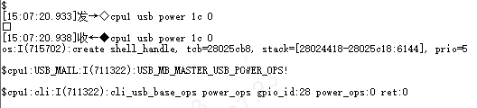

USB
================================================================

:link_to_translation:`en:[English]`

.. toctree::
   :maxdepth: 1

   USB Host UVC+UAC <usb/bk_usbh_uvc_uac>
   USB Host Serial CH340 <usb/bk_usbh_serial_ch340>
   USB Host MSD <usb/bk_usbh_msd>
   USB Device MSC <usb/bk_usbd_msc>

USB 简介
------------------------------------------------------------------------
USB（Universal Serial Bus）是一种通用的总线标准，用于连接主机和外设设备。USB 主机可以通过 USB 接口与 USB 设备连接，实现数据传输、电源供给等功能。

USB IF（USB Implementers Forum）是 USB 标准的制定者，它制定了 USB 标准，包括 USB 1.1、USB 2.0等，定义了 USB 接口的物理层、数据链路层、传输层、会话层、表示层等协议，以及 USB 设备类（Device Class）标准，常见的设备类包括 HID（Human Interface Device，人机接口设备）、MSC（Mass Storage Class，大容量存储设备）、CDC（Communication Device Class，通信设备）、Audio、Video 等。

博通BK7258芯片内置 USB 外设，支持各种各样的 USB 应用，包括 USB 多媒体类应用，USB 通信类应用，USB 存储类应用，USB 人机交互类应用等。

默认支持的驱动包括HUB、 UVC(USB Video Class)、UAC(USB Audio Class),其他类的驱动需要打开相应的宏开关进行编译加载。

USB 相关宏定义
------------------------------------------------------------------------

CONFIG_USB=y  打开USB的总开关宏定义 使能USB的代码功能

CONFIG_USB_VBAT_CONTROL_GPIO_ID=0x1C  默认使用的GPIO是GPIO_28进行USB Vbus电的控制，用户根据自己的实际情况进行配置

CONFIG_CHERRY_USB=y  默认使用的CherryUSB的开源代码，用户可根据实际情况进行版本的更新

CONFIG_USB_HOST   主程序作为HOST 对连接上的设备进行设备枚举

CONFIG_USB_DEVICE 主程序作为DEVICE 连接到HOST被枚举

CONFIG_TASK_USB_PRIO 设置USB Driver处理线程的优先级

CONFIG_USB_HUB_MULTIPLE_DEVICES 在Host模式下，支持HUB的驱动，以及支持HUB 统一接口的操作。注意最多支持1个HUB的连接

CONFIG_USBHOST_HUB_MAX_EHPORTS=4 默认最多支持4个port 接口的HUB操作

CONFIG_USBHOST_HUB_PORT_SUPPORT_MAX_DEVICE=5 默认每个接口支持5种class设备的连接

CONFIG_USB_UVC 支持USB Vidoe Class的HOST驱动

CONFIG_USB_UAC 支持USB Audio Class的HOST驱动

USB 基本使用
------------------------------------------------------------------------

    USB open

USB 测试示例
------------------------------------------------------------------------

注：BK7258 USB 默认运行在CPU1， 测试目标：USB模块开关正常，枚举正常，解析正常，断开/连接等状态记录正常。

作为HOST 识别枚举U盘为例，输入命令和LOG信息如下图所示：

1、默认串口输入 bootcore 1 1 启动CPU1 ，log如下

    CLI Boot CPU1

2、默认串口输入cpu1 usb power 1c 1，log如下

    CLI USB PowerON

3、默认串口输入cpu1 usb open_host，枚举成功log如下

    CLI USB Open Host

4、默认串口输入cpu1 usb close,log如下

    CLI USB Close

5、默认串口输入cpu1 usb power 1c 0,log如下

    CLI USB PowerDown

USB HUB 端口数量和设备枚举信息调整的memory size
------------------------------------------------------------------------

若设备出现超过1024bytes的枚举信息，则需要对默认配置进行调整
使用hub时，需要根据设备情况对port 数据量进行配置

    USB HUB

USB API Status
------------------------------------------------------------------------

+---------------------------------------------+-------------+
| API                                         | BK7258_cp1  |
+=============================================+=============+
| :cpp:func:`bk_usb_driver_init`              | Y           |
+---------------------------------------------+-------------+
| :cpp:func:`bk_usb_driver_deinit`            | Y           |
+---------------------------------------------+-------------+
| :cpp:func:`bk_usb_power_ops`                | Y           |
+---------------------------------------------+-------------+
| :cpp:func:`bk_usb_open`                     | Y           |
+---------------------------------------------+-------------+
| :cpp:func:`bk_usb_close`                    | Y           |
+---------------------------------------------+-------------+
| :cpp:func:`bk_usb_device_set_using_status`  | Y           |
+---------------------------------------------+-------------+
| :cpp:func:`bk_usb_get_device_connect_status`| Y           |
+---------------------------------------------+-------------+
| :cpp:func:`bk_usb_check_device_supported`   | Y           |
+---------------------------------------------+-------------+

USB Port Number
------------------------------------------------------------------------------

+-------------+--------+------------+-----------+
| Capability  | BK7258 | BK7258_cp1 | BK7258_cp2|
+=============+========+============+===========+
| Port Number | 1      | 1          |1          |
+-------------+--------+------------+-----------+

USB Pin and GPIO Map
---------------------------------------------------------------------

+----------+--------+-----------+-----------+
| USB Pin  | BK7258 | BK7258_cp1| BK7258_cp2|
+==========+========+===========+===========+
| USB power| 28     | 28        |28         |
+----------+--------+-----------+-----------+

USB API Reference
---------------------------------------------------------------------------

.. include:: ../../_build/inc/usb.inc

USB API Typedefs
---------------------------------------------------------------------------

.. include:: ../../_build/inc/usb_types.inc

