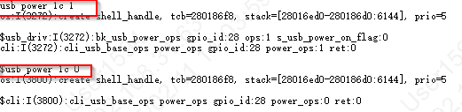
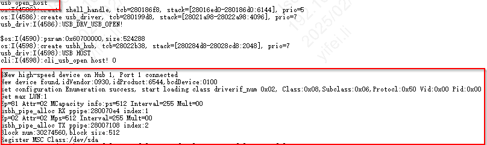
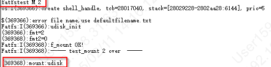
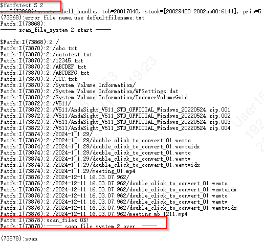
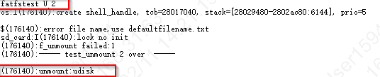
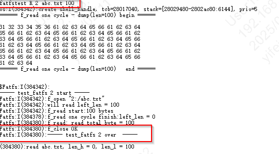
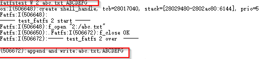

USB Host MSD
================================

:link_to_translation:`en:[English]`

    BK7258的 USB MSD 使用的是FATFS文件系统，支持从 USB 设备读取/写入。由于文件系统默认在CPU0进行编译和使用需要将USB MSD相关宏开关在CPU0的config中打开。

USB MSD的宏定义配置
------------------------------------------------------------------------

CONFIG_USB=y  打开USB的总开关宏定义 使能USB的代码功能

CONFIG_USB_VBAT_CONTROL_GPIO_ID=0x1C  默认使用的GPIO是GPIO_28进行USB Vbus电的控制，用户根据自己的实际情况进行配置

CONFIG_CHERRY_USB=y  默认使用的CherryUSB的开源代码，用户可根据实际情况进行版本的更新

CONFIG_USB_HOST=y    主程序作为HOST 对接口连接的设备进行枚举

CONFIG_TASK_USB_PRIO=2 USB的处理程序的TASK优先级配置为2

CONFIG_USB_MSD=y 打开MSD驱动的编译，能够做到打开USB后自动识别 U盘

MSD 主机驱动CLI测试示例
------------------------------------

注：HOST MSD的使用依赖文件系统。默认文件系统的代码主要在CPU0上运行，且支持SDCARD和FLASH。

对USB的Vbus进行上电/下电操作cli示例：
	输入命令：
	usb power 1c 1 打开USB Vbus供电
	usb power 1c 0 关闭USB Vbus供电

    USB Vbus poweron and powerdown

打开USB对U盘进行枚举：
	输入命令：
	usb open_host

    open USB for enumeration

调用cli_fatfs的测试命令进行U盘的操作:
	输入命令：fatfstest M 2

    Mount Udisk

	输入命令：fatfstest S 2

    Scan Udisk

	输入命令：fatfstest U 2

    Unmount Udisk

	输入命令：fatfstest R 2 abc.txt 100

    Read file

    输入命令：fatfstest W 2 abc.txt ABCDEFG

    Write file

USB MSD
---------------------
    更多详细开发可参考CherryUSB相关文档， https://github.com/cherry-embedded/CherryUSB/blob/master/README_zh.md