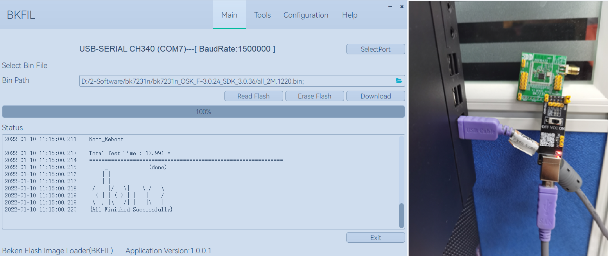
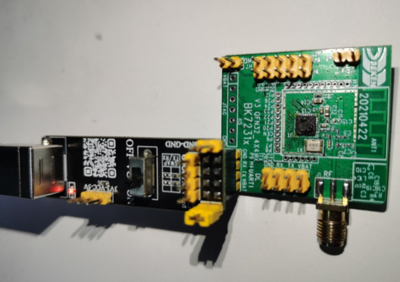
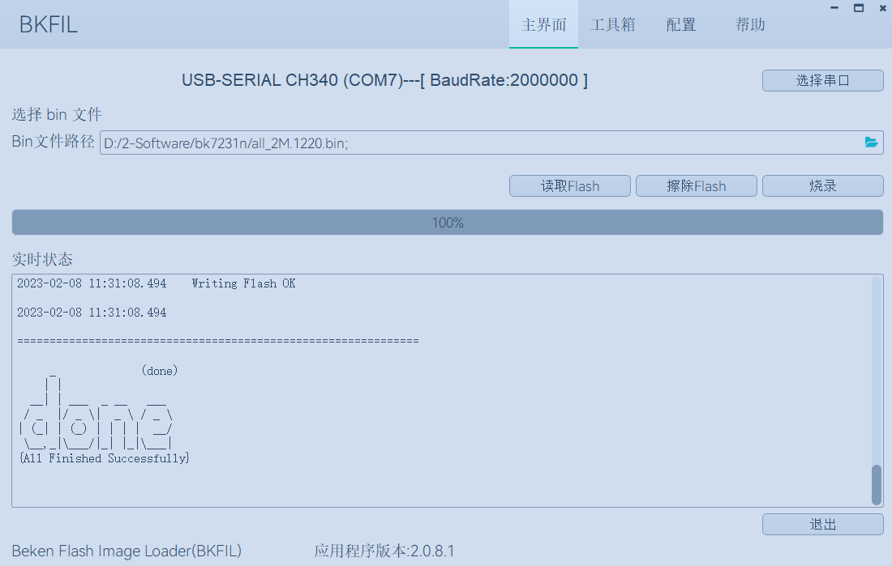
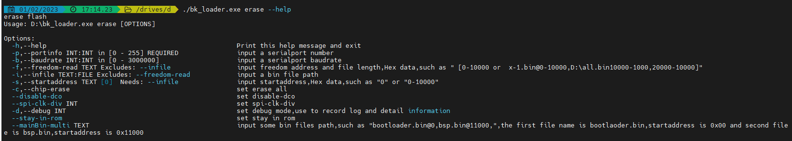
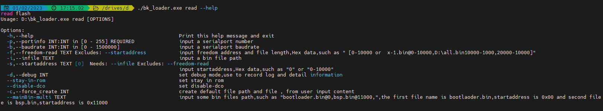

.. _bk_tool_bkfil:

烧录工具 BKFIL
========================

:link_to_translation:`en:[English]`

BKFIL 是 Beken FLASH Image Loader 的简称，是 Armino 官方烧录与配置工具。

准备工作
-------------------

BK72xx 系列芯片烧录时所需的软、硬件资源如下图所示:

 - 硬件设备：

   - 1 x UART 串口线；
   - 1 x 待下载芯片；
   - 1 x PC （操作系统支持Windows7、Windows10），兼容Linux各个版本；
 - 软件设备：

   - 下载程序：BKFIL.exe

硬件介绍
----------------------

串口底板
++++++++++++++++++++++++

在本指南中，我们使用了博通集成 Wi-Fi 芯片及相关模组（如图所示）为 USB 转串口底板，其核心部分为 USB 转UART 芯片。
客户也可以自动准备其他的 USB 转 UART 芯片或底板，用于连接芯片与 PC，进而将固件烧录到设备中。

串口底板:

用户自行准备的串口底板:

待下载准备
+++++++++++++++++++++++

设备连接
****************

FLASH 烧录连接示意图 – BK7231N 系列:

软件介绍
-----------------------

界面简介
+++++++++++++++++++++++

博通集成 BK Flash Image Loader Tool 烧录工具的主界面如下图所示，用户在主界面选择烧录的固件。

功能介绍
**********************

如图上图所示，BK_Flash_Image_Loader_Tool 界面功能主要分为：

 - 串口信息显示
 - 串口选择、波特率选择
 - 固件选择
 - 读取Flash
 - 擦除Flash
 - 烧录固件
 - 实时显示测试信息

Configuration 界面介绍
-------------------------------

常用配置
++++++++++++++++++++++++

.. figure:: picture/bkfil_ui_config_main.png
    :align: center
    :alt: 8                                                                                           
    :figclass: align-center

如上图所示，BKFIL 界面主要分为：

 - Download path config

   - 固件加载路径
   - 选择固件路径
   - 固件下载起始地址，以16 进制格式填写
   - 固件文件长度
   - 固件文件CRC 校验值
 - Customer data

   - Device ID ，芯片中MAC 信息，包含MAC 内容，写入的起始地址，MAC长度，自动滚码，滚码长度；
   - DeviceName，自定义设备名称，包含设备名称，起始地址，设备名称长度；
   - Efuse key 文件路径，包含部分芯片使用的SecureBoot 信息也在其中；
   - 烧录后重启
 - Flash Config

   - 烧录主程序；
   - 全部擦除；
   - 烧录Efuse 信息；
   - 烧录SecureBoot信息；
   - 烧录OTP 信息
   - 烧录DeviceID；
   - 烧录DeviceName；
   - 使能Device ID信息 大端写入模式；

Help 界面介绍
++++++++++++++++++++++++++++

语言和主题配置
******************************

本功能针对用户使用习惯，自定义烧录环境，目前支持切换中英文，以及不同UI主题颜色；

在线升级
******************************

重要功能；

 - 点击 “检查新版本” 或者 “Check New Version”，查找是否存在新版本，根据需求按需选择；
 - 历史版本选择功能，连续点击界面中标签 “最新版本号” 或者 “latest version”，按照图3 – 3 – 2 – 2 中①->②->③ 步骤去执行；

关于界面介绍
******************************

本页展示博通集成公司相关信息。

烧录过程
---------------------------

烧录前配置
++++++++++++++++++++++++

点击工具栏顶部Configuration 按钮，切换到烧录配置界面:

.. figure:: picture/bkfil_flash_select_config.png
    :align: center
    :alt: 8                                                                                           
    :figclass: align-center

点击Browse 按钮，选择需要烧录的固件:

根据烧录/读取/擦除 要求，填写对应的起始地址，默认为 0 ，部分芯片的起始地址为 ：0x11000（bk7231 以及bk7271 安全模式烧录等），
注意需要输入16进制

根据需求，选择相应的 EfuseKey 文件，用于烧录 Efuse 加密信息:

根据需求，勾选 Common Setting 中烧录功能

 - 烧录主程序，默认烧录状态下都是需要勾选此勾选框
 - 全部擦除，主要针对烧录和擦除时，是否启用整片擦除
 - 烧录Efuse 信息，针对当前芯片类型及业务需求，按需勾选
 - 烧录SecureBoot 信息，针对当前芯片类型及业务需求，按需勾选

配置完成后，点击 Main/主界面 按钮，返回主界面进行相关的业务

主界面中会默认提供一组当前插入 PC 中的 USB 设备及默认的波特率，如果不满意，则点击 “SelectPort/选择串口” 按钮，
根据需求精准的选择需要的串口信息，点击 OK 保存设置，如下图所示：

烧录
*****************

1、进入配置界面，填入需要烧录的bin 文件 和对应的烧录地址，并根据自己实际需求填入 Erase ALL、Download Efuse、
SecureBoot、Run After Download、COM及 BaudRate信息，配置界面如下图所示。

2、在主界面中点击Download 开始下载，下载过程中会根据用户配置的信息，烧写对应的bin 文件及Efuse 信息；

3、烧录完成后，工具的界面如下图所示。

擦除
*****************

用户根据需求，选择全擦或者部分擦除；

 - 全擦：整片擦除，根据当前型号的Flash ，擦除固定大小的长度，即整片擦除；
 - 部分擦除：根据用户输入的起始地址，以及bin 文件的长度，来确认擦除起始地址及擦除长度。

如下图所示：

**重要配置：如果用户需要进行处理，可以按照如下配置进行操作**

场景一
$$$$$$$$$$$$$$$

用户需要自定义擦除范围，如从地址0x00开始，擦除长度为0x1000，则如上图中红色框选所示，在StartAddr 列中①处，
空白区域双击，输入擦除的起始地址0，然后在FileLen列中②处，空白区域双击，输入擦除长度1000，然后回车，输入完毕，
然后在③处点击勾选框，则在BinFilePath 列中生成了一个x-1 的字符串，表明创建的一个自定义任务生成完毕；

场景二
$$$$$$$$$$$$$$$

用户需要多段擦除，在场景一的基础上，同理生成多个x-n 的任务即可；根据自身使用需求，按需勾选列表中的勾选框，
勾选则表明要使用此任务进行操作；

读取
*****************

用户根据需求，选择 Wi-Fi 芯片中烧录的 BIN 文件内容；
根据用户输入的起始地址，以及bin 文件的长度，来确认读取Flash的起始地址及读取长度。

如下如图所示：

**重要配置：如果用户需要进行处理，可以按照如下配置进行操作**
此处参考擦除中的参数配置即可；

命令行烧录
--------------------------

命令行使用手册
+++++++++++++++++++++++++++

命令行需要使用 bk_loader.exe 程序； 在命令行窗口，输入”--help”，可以查看所有的命令集，
每条指令均有使用说明，对于非法指令，会自动弹出相应的报错，见下图：

.. figure:: picture/bkfil_manual.png
    :align: center
    :alt: 8                                                                                           
    :figclass: align-center

图中可以看到当前版本号，及 Subcommands 里面三个子功能。

烧录帮助手册:

擦除帮助手册:

读帮助手册:

常用命令行示例
++++++++++++++++++++++++++++

烧录:

 - bk_loader download –p 7 –i all.bin 常规默认值烧录
 - bk_loader download –p 7 –b 2000000 –i all.bin 设置串口波特率为2M，默认为1.5M
 - bk_loader download –p 7 –i all.bin –s 11000 设置起始地址从0x11000 开始烧录
 - bk_loader download –p 7 --mainBin-multi all_2M.1220.bin@0x0-0x1000, all_2M.1220-4k.bin@0x132000-0x1000 多文件烧录，使用--mainBin-multi 参数，按照格式，输入路径名 + @ + “起始地址” + “文件长度”
 - bk_loader–h	其他客户数据写入，请看BKFIL –h ，了解更多信息写入

读取:

 - bk_loader read –p 7 –i all.bin	常规默认值读取，按照起始地址为0，长度为all.bin 的长度进行读取
 - bk_loader read –p 7 –i all.bin –s 0-1000	起始地址为0，长度为0x1000
 - bk_loader read –p 7 –f 10-1000	起始地址为10，长度为0x1000
 - bk_loader read –p 7 –f 10-1000, 1000-1000, 10000-1000	自定义读取，示例中要读取三段内容，分别是：

   - 1：起始地址为0，长度为0x1000；
   - 2：起始地址为0x1000，长度为0x1000；
   - 3：起始地址为0x10000，长度为0x1000；
 - bk_loader read –p 7 –f 
 - all_2M.1220.bin@0x0-0x132000,x-1@0x0-0x1000,x-2@0x2000-0x2000	自定义读取，示例中要读取三段内容，分别是：

   - 1：文件名all_2M.1220.bin，起始地址为0，长度为0x132000；
   - 2：文件名x-1.bin，起始地址为0，长度为0x1000；
   - 3：文件名x-2.bin，起始地址为0x2000，长度为0x2000；

擦除:

 - bk_loader erase –p 7 –i all.bin	常规默认值擦除，按照起始地址为0，长度为all.bin 的长度进行擦除
 - bk_loader erase –p 7 –i all.bin –s 0-1000	起始地址为0，长度为0x1000
 - bk_loader erase –p 7 –f 10-1000	起始地址为10，长度为0x1000
 - bk_loader erase –p 7 –f all_2M.1220.bin@0x0-0x132000,x-1@0x0-0x1000,x-2@0x2000-0x2000	自定义擦除，示例中要擦除三段内容，分别是：

   - 1：文件名all_2M.1220.bin，起始地址为0，长度为0x132000；
   - 2：文件名x-1.bin，起始地址为0，长度为0x1000；
   - 3：文件名x-2.bin，起始地址为0x2000，长度为0x2000；

其他:

 - bk_loader –h	其他功能，请看bk_loader –h ，了解更多

常见错误
----------------------

COM 相关错误
++++++++++++++++++++++++

Q: 打开工具后，在 COM 下拉菜单中找不到对应串口？ 

A: 首先查看设备管理器，确认串口已经安装成功。若没有成功，检查驱动是 否有问题。

Efuse相关错误
++++++++++++++++++++++++

启动烧录后，如果提示：BEKEN_SWDL_LinkCheck timeout，可能该芯片已经做过Efuse，无法再次烧录，此时需要与博通联系获取相应的解决措施；

烧录相关错误
++++++++++++++++++++++++

Q: 烧录过程中出现错误，什么原因？

A: 出现烧录问题，请首先确认：

 - 串口选择正确
 - 波特率符合Uart板的协议要求
 - 固件bin 的文件大小不大于芯片Flash 的大小

命令行参数错误
++++++++++++++++++++++++++++++++

可能原因:

 - 波特率设置错误，当前波特率限制0~3000000；
 - 传入的文件不存在 

博通 Wi-Fi 芯片烧录工具为 zip 压缩文件包，内含可执行文件、子文件夹，如下图所示：
 
 - Doc 文件夹：存放说明文档；
 - BKFIL.exe：烧录工具可执行文件，GUI 工程；
 - bk_loader.exe: 命令行烧录工具；
 - settings.ini ：该文件是动态生成，初始时该文件不存在，只有再使用后才会生成该记忆文件；
