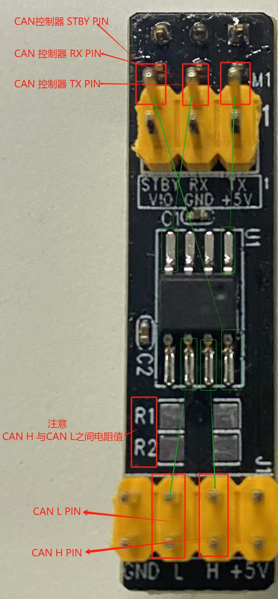
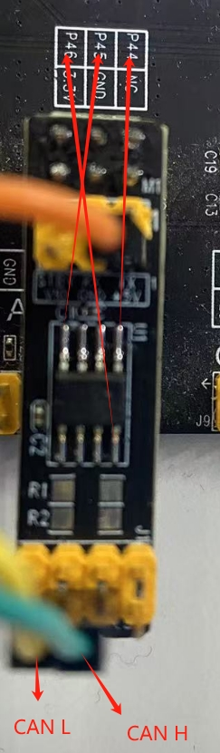
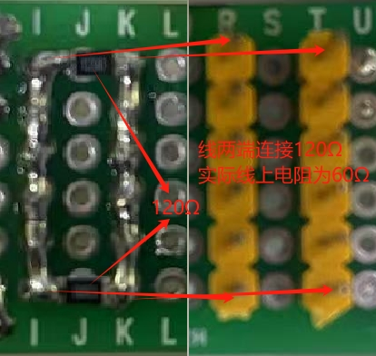
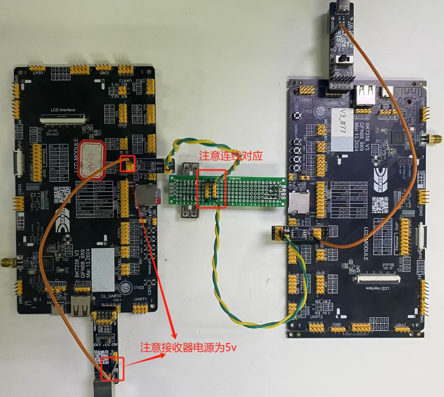
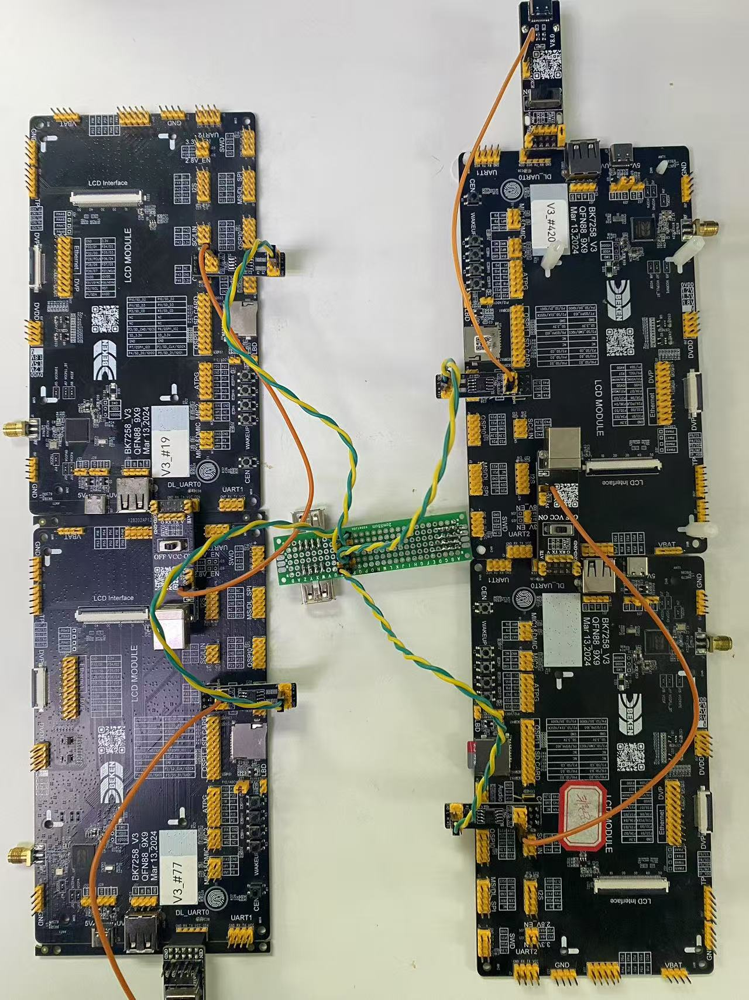
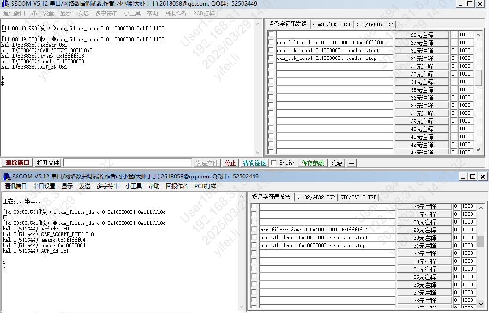
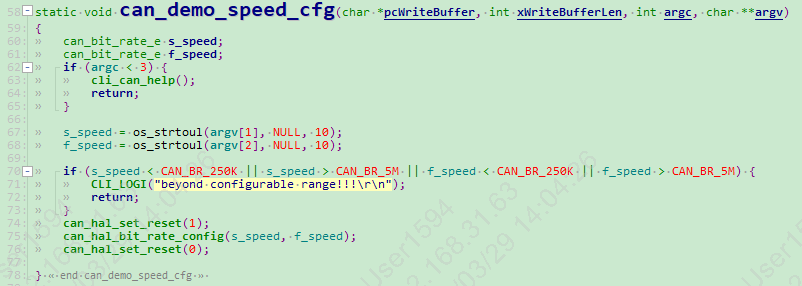
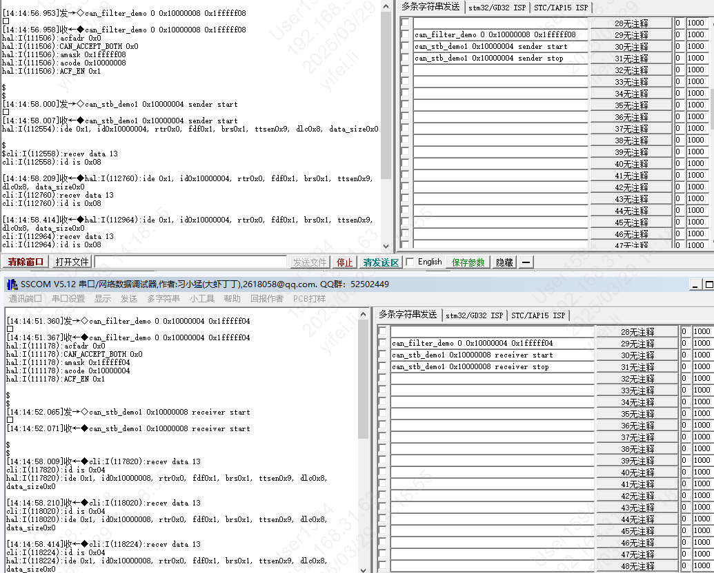
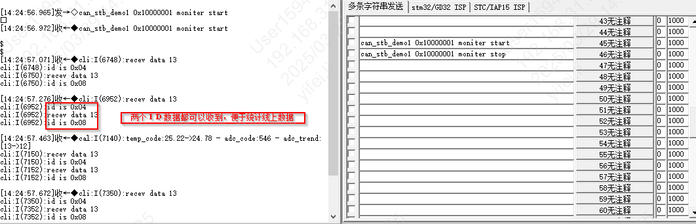
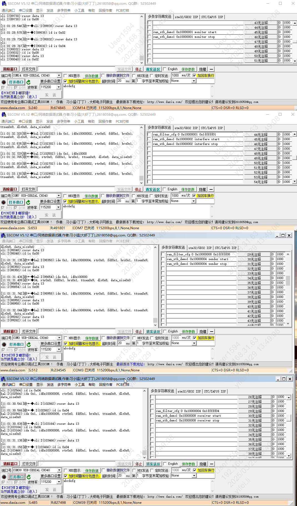

spi
==========================

:link_to_translation:`en:[English]`

1 功能概述
-------------------------------------
模拟实际应用中，多个设备的单一功能，将设备分为：发送者(sender)\接收者(receiver)\监视者(moniter)\干扰者(interfere)
发送者(sender)发送数据，可接收所有数据但只处理接收者(receiver)数据；
接收者(receiver)只接收发送者(sender)数据，再把数据发送出去；
监视者(moniter)监控所有数据，保持BUS正常传输数据；
干扰者(interfere)乱发数据，且不接受任何数据，用于测试过滤器、竞争等。

在执行demo前，可通过指令调整波特率，将所有设备进行波特率调高或降低。

通过设置已经过滤器，将设备设置位只接受特定ID的设备数据。

2 代码路径
--------------------------------------------------------------------------
	demo路径：``middleware\driver\can_demo.c``

3 demo命令简介
--------------------------------------------------------------------------

demo运行依赖的宏配置：

	+--------------------------------------+---------------------------+--------------------------------------------+---------+
	|                 NAME                 |      Description          |                  File                      |  value  |
	+======================================+===========================+============================================+=========+
	|CONFIG_TRNG                           | need to get random data   | ``middleware\soc\bk7258\bk7258.defconfig`` |    y    |
	+--------------------------------------+---------------------------+--------------------------------------------+---------+
	|CONFIG_CLI                            | need cli                  | ``middleware\soc\bk7258\bk7258.defconfig`` |    y    |
	+--------------------------------------+---------------------------+--------------------------------------------+---------+

demo支持的命令如下表：

	+----------------------------------------+------------------------------------------------+----------------------------------------+
	|             Command                    |            Param                               |              Description               |
	+========================================+================================================+========================================+
	|                                        | {aid}:choose standard or extended              |                                        |
	| can_filter_demo [aid] [acode] [amask]  +------------------------------------------------+                                        |
	|                                        | {acode}: no more than 29 bits                  | Configure device ID filter             |
	|                                        +------------------------------------------------+                                        |
	|                                        | {amask}: 1 disable, 0 enable                   |                                        |
	+----------------------------------------+------------------------------------------------+----------------------------------------+
	|                                        | {s_spend}: Slow Speed                          |                                        |
	|  can_speed_demo [s_spend] [f_speed]    +------------------------------------------------+ Dynamically adjust the setting speed   |
	|                                        | {f_speed}: Fast Speed                          |                                        |
	+----------------------------------------+------------------------------------------------+----------------------------------------+
	|   can_stb_demo1                        | {can_id}: device ID                            |                                        |
	|   [can_id]                             +------------------------------------------------+                                        |
	|   [sender|receiver|moniter|interfere]  | {sender|receiver|moniter|interfere}: Identity  | CAN FD  Tested demo using different    |
	|   [start|stop]                         +------------------------------------------------+                                        |
	|                                        | {start|stop}: start or stop                    | identities                             |
	+------------+---------------------------+------------------------------------------------+----------------------------------------+
	|   can_stb_demo2                        | {can_id}: device ID                            |                                        |
	|   [can_id]                             +------------------------------------------------+                                        |
	|   [sender|receiver|moniter|interfere]  | {sender|receiver|moniter|interfere}: Identity  | CAN 20  Tested demo using different    |
	|   [start|stop]                         +------------------------------------------------+                                        |
	|                                        | {start|stop}: start or stop                    | identities                             |
	+------------+---------------------------+------------------------------------------------+----------------------------------------+

CAN 支持的波特率如下：

	CAN_BR_250K,	//81%

	CAN_BR_500K,	//81%

	CAN_BR_800K,	//80%

	CAN_BR_1M,      //81%

	CAN_BR_2M,      //81%

	CAN_BR_4M,      //81%

	CAN_BR_5M,      //77%

4 硬件环境连接介绍
--------------------------------------------------------------------------

使用的CAN Transceiver 为MCP2562FD 对应使用的小板PIN定义如下图所示

    Figure 1. CAN Transceiver

开发板上与接收器连接对应的GPIO：
	+-----------------+-------------------+
	|     GPIO        |      FUNC         |
	+=================+===================+
	| P44             | CAN TX            |
	+-----------------+-------------------+
	| P45             | CAN RX            |
	+-----------------+-------------------+
	| P46             | CAN STBY          |
	+-----------------+-------------------+

BK7258开发板与CAN Transceiver PIN连接如下图所示，注意开发板3.3v 可能影响到vio Transceiver电压

    Figure 2. CAN Transceiver connection board

CAN Transceiver 需要连接到两端120Ω电阻的总线上，线上阻值为60Ω，测试用线如下图所示

    Figure 3. CAN BUS

两块板子进行对发接收环形测试，测试用线如下图所示

    Figure 4. CAN Data transmission test

四块板子进行测试，测试用线如下图所示

    Figure 5. CAN System transmission test

5 演示介绍
-------------------------------------
1、设置过滤器，保证设备只接收该ID的数据，是根据can_filter_demo:
    can_filter_demo 0 0x10000008 0x1fffff08  过滤器设置只接收 ID 0x10000008的设备数据
    can_filter_demo 0 0x10000004 0x1fffff04  过滤器设置只接收 ID 0x10000004的设备数据

输入指令后，log如下图所示

    Figure 6. Filter Configure

2、若要进行动态配置波特率，请参考如下图所示demo

    Figure 7. Dynamically set baud rate

3、 CAN FD示例1，2个设备进行对测，1个设备做发起方，1个设备做应答方

① id_4 先保存64bits 的随机数据到全局变量；
② id_4 将这组随机数据发送到 CAN总线上， 触发发送完成中断后，发送结束；
③ id_8 设备 触发接收中断，在中断中发送msg到 task队列， 读取id_1设备发送过来的数据；
④ id_8 读取到的64bits 数据发送到CAN总线上， 触发发送完成中断后，发送结束；
⑤ id_4 触发中断，在中断中发送msg到 task队列，在task中解析是否数据正确；

测试目标是数据通路正常，没有错误数据

测试命令:
	can_stb_demo1 0x10000004 sender start

	can_stb_demo1 0x10000004 sender stop

	can_stb_demo1 0x10000008 receiver start

	can_stb_demo1 0x10000008 receiver stop

    Figure 8. 2Devices data transmission loop test

传输过程中有数据错误时，出现如下打印

   ::

	cli:I(26642):====CAN DEMO1 FAIL==== send_buf[00]:0x62 receive_buf[05]:0x1f
	cli:I(26642):====CAN DEMO1 FAIL==== send_buf[01]:0x04 receive_buf[06]:0xfd
	cli:I(26642):====CAN DEMO1 FAIL==== send_buf[02]:0x4a receive_buf[07]:0xa7
	cli:I(26642):====CAN DEMO1 FAIL==== send_buf[03]:0x4d receive_buf[08]:0x73
	cli:I(26642):====CAN DEMO1 FAIL==== send_buf[04]:0x57 receive_buf[09]:0x76
	cli:I(26642):====CAN DEMO1 FAIL==== send_buf[05]:0x6c receive_buf[10]:0x99
	cli:I(26642):====CAN DEMO1 FAIL==== send_buf[06]:0x8e receive_buf[11]:0xa5
	cli:I(26642):====CAN DEMO1 FAIL==== send_buf[07]:0x3d receive_buf[12]:0x28

4、 在示例1的基础上增加1个设备作为示例2，共3个设备测试，1个监视器设备，1个设备做发起方，1个设备做应答方
监视器设备只接收数据，并对接收到的数据进行统计，便于确定对发数据的设备接收正常。
测试目标是CAN BUS正常数据收发，与示例1统计到的发送次数和接收次数进行比较，确保数据没有丢失。

测试命令：
	can_stb_demo1 0x10000001 moniter start

	can_stb_demo1 0x10000001 moniter stop

    Figure 9. Demo Moniter

5、 在示例2的基础上增加1个设备作为示例3，共4个设备测试，1个干扰设备，1个监视器设备，1个设备做发起方，1个设备做应答方
干扰器只发送数据，扰乱线上状态，但不会将CAN总线搞坏掉，且干扰器的ID较高。
测试目标是让线上出现竞争的情况，且数据仍能正常传输。

测试命令：
	can_stb_demo1 0x10000002 interfere start

	can_stb_demo1 0x10000002 interfere stop

    Figure 10. CAN mini sys test

6、上述示例1、2、3都是在CAN FD协议下进行的，将命令头改为can_20_demo2，则使用CAN_2.0进行测试。
其他目标一致