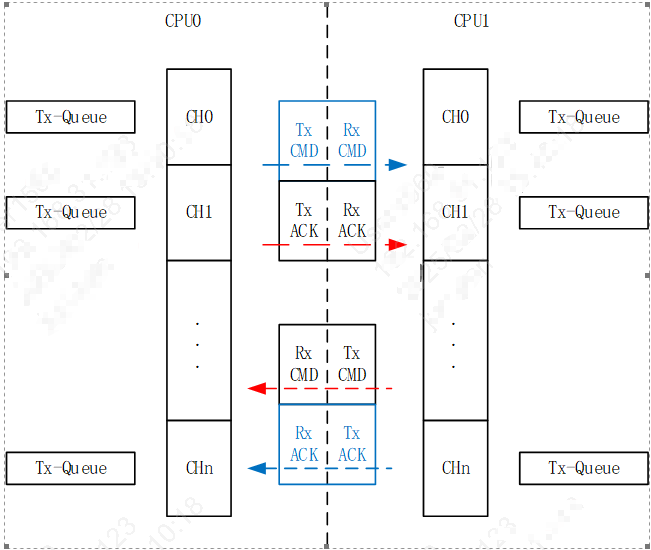

multi-core mailbox
==========================

1 功能概述
-------------------------------------
	Mailbox用作双核通信，根据Mailbox硬件的设计，每个CPU都有两个通路(mail)向对方CPU发送数据。一个通路（mail）被设计成传输数据，另外一个通路设计为传输应答。
	为了满足应用的需求，在有限的物理通道上抽象出了一系列的逻辑通道。从软件的角度看，硬件通道由底层驱动代码管理，对上层无感。
	为应用层提供服务的是逻辑通道，换句话说，应用层只需要调用逻辑通过相关的API，即可实现多核间通过mailbox收发数据。
	逻辑通道号，从0开始连续编号。逻辑通道号也代表优先级，编号的数字越小，优先级越高。

	Figure 1. 逻辑通道示意图

2 代码路径
-------------------------------------
	demo路径：``examples/peripherals/mailbox``

3 API简介
-------------------------------------
	对于上层应用，只需要调用如下的API,即可使用mailbox功能

	具体请参考以下链接：

.. toctree::
	:maxdepth: 1

	    multi-core mailbox API <../../api-reference/system/logic_mailbox>

4 演示介绍
-------------------------------------

    demo程序展示了两个core之间通过调用mailbox逻辑通道实现信息交互。具体的步骤可以概括为以下几步：

 -  调用open接口注册一个逻辑通道 

 -  调用ctrl接口为已注册的逻辑通道注册回调函数，通常有以下几个函调
    
    + MB_CHNL_SET_RX_ISR：接收回调函数
    + MB_CHNL_SET_TX_ISR：发送回调函数
    + MB_CHNL_SET_TX_CMPL_ISR：发送完成回调函数

 -  调用write接口向逻辑通道传入数据

 -  调用read接口从逻辑通道接收数据（适用于轮询的情况）

    
    运行现场如下：

   ::

    app_time:I(156):rtc_ntp_sync_init complete
    APP_MBOX:I(156):open channel: 70 on CPU
    (156):boot_cp1 9 0 0x0 [0][0x28004ae4]E_1
    wakeup
    (156):boot_cp1 9 0 0x0 [0]E_2
    PSRAM:I(158):bk_psram_init, chip_id:8d08
    PSRAM:I(158):bk_psram_init, 8d08-8d08
    (158):reset_cpu1_core at: 021b0000, start=1
    cpu1:os:I(0):
    cpu1:os:I(0):mem_type start    end      size    
    cpu1:os:I(0):-------- -------- -------- --------
    cpu1:os:I(0):itcm     0x20     0x220    512     
    cpu1:os:I(0):dtcm     0x20000000 0x20001794 6036    
    cpu1:os:I(0):ram      0x28050000 0x2808eff8 258040  
    cpu1:os:I(0):non_heap 0x28050000 0x28052c28 11304   
    cpu1:os:I(0):data     0x28050218 0x28050d94 2940    
    cpu1:os:I(0):bss      0x28050da0 0x28052c28 7816    
    cpu1:os:I(0):heap     0x28052c28 0x2808eff8 246736  
    cpu1:os:I(0):psram    0x60780000 0x60800000 524288  
    cpu1:(0):driver_init end
    cpu1:init:I(0):reason - power on
    cpu1:init:I(0):regs - 0, 0, 0
    cpu1:init:I(0):armino rev: 
    cpu1:init:I(0):armino soc id:53434647_72360101
    cpu1:init:I(0):Intialize random stack guard.
    cpu1:bk_init:I(0):armino app init: Feb 28 2025 20:05:33
    cpu1:bk_init:I(0):APP Version: unknow
    (170):cpu0 receive the cpu1 boot success event [1]
    (170):cp0_mb_rx_isr 5 1 0 0 0
    (170):cp0_mb_rx_isr 7 12 0 0 0
    cpu1:(0):cp1 vote psram_P B:0
    cpu1:(2):cp1_mb_rx_isr 7 0 0
    wakeup
    APP_MBOX:I(170):cpu0 recv cpu1 msg seq:[0]- info:[(null)]
    cpu1:(2):cp1 vote psram_P E
    cpu1:APP_MBOX:I(2):open channel: 22 on CPU
    rosc:I(274):rosc calib complete 90 276

    [2025-02-28 20:06:36.991 R]cpu1:APP_MBOX:I(1004):cpu1 recv cpu0 msg seq:[2]- info:[>CPU0 SEND MSG TO CPU1<]
    APP_MBOX:I(1174):cpu0 recv cpu1 msg seq:[0]- info:[CPU1 APP MAILBOX RESPONSE MSG]

    [2025-02-28 20:06:37.486 R]APP_MBOX:I(1674):cpu0 recv cpu1 msg seq:[1]- info:[CPU1 APP MAILBOX RESPONSE MSG]
    cpu1:APP_MBOX:I(1504):cpu1 recv cpu0 msg seq:[3]- info:[|CPU0 ACK CPU1 MSG|]

    [2025-02-28 20:06:37.996 R]cpu1:APP_MBOX:I(2006):cpu1 recv cpu0 msg seq:[4]- info:[>CPU0 SEND MSG TO CPU1<]
    APP_MBOX:I(2176):cpu0 recv cpu1 msg seq:[2]- info:[CPU1 APP MAILBOX RESPONSE MSG]

  