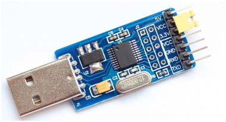
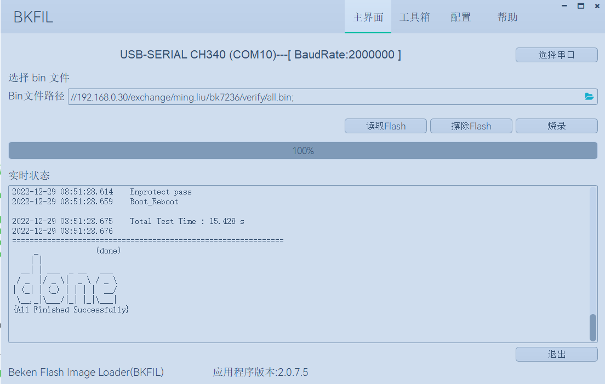

快速入门
=======================

:link_to_translation:`en:[English]`

本文档以 BK7258 开发板为例，通过一个简单的示例项目向您展示:

 - 代码下载；
 - 环境部署及编译；
 - 工程配置；
 - 固件编译与烧录；

准备工作
------------------------

硬件：

 - BK7258 开发板( :ref:`开发板简介 <bk7258>` ， `购买链接 <https://item.taobao.com/item.htm?spm=a1z10.1-c.w4004-25005897050.4.ffd61d55Y0Kdbv&id=795814346530&skuId=5429467124246&addressId=18607518338>`_ )；
 - 串口烧录工具；
 - PC；

Armino SDK 代码下载
------------------------------------

您可从 gitlab 上下载 Armino::

    mkdir -p ~/armino
    cd ~/armino
    git clone https://gitlab.bekencorp.com/armino/bk_idk.git

	
您也可从 github 上下载 Armino::

	mkdir -p ~/armino
	cd ~/armino
	git clone https://github.com/bekencorp/bk_idk.git

 
然后切换到稳定分支Tag节点, 如v2.0.2.1::

    git checkout -B your_branch_name v2.0.2.1

.. warning::

 Windows下通过git clone拉取代码，存在软链接失效及换行符的问题，会导致编译失败，请按照以下方式解决:

 - 软链接失效问题:

   1. 下载代码前先配置git环境变量::
      
        git config --global core.symlinks true

   2. 在管理员权限下执行git clone命令

 - 换行符问题:

   1.下载代码前先配置git环境变量::

        git config --global core.autocrlf false

.. note::

    github代码相对于gitlab有滞后性 。gitlab只针对企业用户开放，请找对应接口人申请。

环境部署及编译
------------------------

我们提供了一种基于Docker容器的环境部署与编译方案，支持在Linux、macOS及Windows系统上高效完成编译工作。
借助Docker容器化技术，您无需手动安装编译所需的各类库文件及工具链，从而显著简化了部署与编译流程。
该方案适用于熟悉Docker环境并了解其基本使用方法的用户，可帮助您快速实现环境的部署与编译。

对于不熟悉Docker技术或因网络条件限制无法使用Docker环境的用户，我们也提供了基于脚本命令的本地编译部署方案。本地部署方案目前仅支持Linux系统下的编译。

.. toctree::
    :maxdepth: 1

        本地部署 <env-manual>
        Docker部署 <env-docker>

.. _WiFi-menuconfig:

配置工程
------------------------------------

- 您可以通过工程配置文件来进行更改默认配置或者针对不同芯片进行差异化配置::

    工程配置文件 Override 芯片配置文件 Override 默认配置
    如： bk7258/config >> bk7258.defconfig >> KConfig
    + 工程配置文件示例：
        projects/app/config/bk7258/config
    + 芯片配置文件示例：
        middleware/soc/bk7258/bk7258.defconfig
    + KConfig 配置文件示例：
        middleware/arch/cm33/Kconfig
        components/bk_cli/Kconfig

- 模块选择CPUx执行
	 
    + 目前BK7258是三核AMP系统架构，CPU0和CPU1,CPU2的软件独立编译，但SDK是一套，所以CPU0和CPU1以及CPU2的部分功能差异需要使用宏区分。
    + 比如TRNG随机数控制器只有一份，使用多核配置时，应用程序需要互斥配置在哪一个系统(CPU0/CPU1/CPU2)中执行。
    + 模块的功能开关CONFIG_TRNG宏默认关闭, 哪个CPU需要, 就在哪个CPU的芯片配置文件上打开。
      假设CPU0需要使用TRNG，而CPU1不需要使用，则bk7258.defconfig中的CONFIG_TRNG=y。
    + 在软件代码中，使用CONFIG_TRNG宏隔离调用。
      示例如下::
         
        #if CONFIG_TRNG             #使用模块功能开关宏隔离代码
        #include "driver/trng.h"
        #endif
        ...
        #if CONFIG_TRNG             #使用模块功能开关宏隔离代码
        bk_rand();
        #endif

新建工程
------------------------------------

默认工程为projects/app，新建工程可参考projects/app工程

烧录代码
------------------------------------

Armino 支持在 Windows/Linux 平台进行固件烧录, 烧录方法参考烧录工具中指导文档。
以Windows 平台为例， Armino 目前支持 UART 烧录。
app工程在编译完成后，在build/app/bk7258目录下生成all-app.bin，使用此bin文件烧录即可。安全工程首次烧录时，需要先烧录bootloader.bin，再烧录all-app.bin。

通过串口烧录
********************

.. note::

    Armino 支持 UART 烧录，推荐使用 CH340 串口工具小板进行下载。

串口烧录工具如下图所示:

    UART

烧录工具（BKFIL）获取：

	https://dl.bekencorp.com/tools/flash/
	在此目录下获取最新版本，如：BEKEN_BKFIL_V2.1.6.0_20231123.zip

BKFIL.exe 界面及相关配置如下图所示：

    BKFIL GUI

选择烧录串口 DL_UART0，点击 ``烧录`` 进行版本烧录, 烧录完成之后掉电重启设备。
如果烧录过程无法获取设备，卡在 ``Getting Bus...`` 时，可以按一下重启键，恢复cpu状态。

点击 :ref:`BKFIL <bk_tool_bkfil>` 进一步了解 Armino 烧录工具。

串口 Log 及 Command Line
------------------------------------

目前 BK7258 平台，串口 Log 及 Cli 命令输入在 DL_UART0(UART0)；可通过 help 命令查看支持命令列表。
