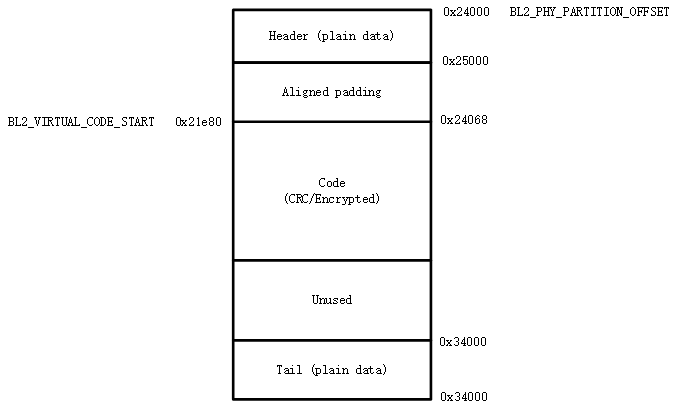

.. _bk_config_partitions:

分区配置
========================

:link_to_translation:`en:[English]`

.. note::

  本节中 `BL1` 特指固化在芯片中的 BootROM，`BL2` 特指 Bootloader，即 mcuboot。

分区表
----------------------------

FLASH 分区表为 CSV 文件，下面为一个配置示例：

+--------------------+------------+---------+----------+-------+--------+
| Name               | Offset     | Size    | Execute  | Read  | Write  |
+====================+============+=========+==========+=======+========+
| primary_bl2        |            | 128k    | TRUE     | TRUE  |        |
+--------------------+------------+---------+----------+-------+--------+
| primary_cpu0_app   |            | 128k    | TRUE     | TRUE  |        |
+--------------------+------------+---------+----------+-------+--------+
| secondary_cpu0_app |            | 128k    | TRUE     | TRUE  |        |
+--------------------+------------+---------+----------+-------+--------+
| sys_rf             | 0x3fe000   | 4k      |          | TRUE  |        |
+--------------------+------------+---------+----------+-------+--------+
| sys_net            |            | 4k      |          | TRUE  |        |
+--------------------+------------+---------+----------+-------+--------+

.. _bk_config_partitions_table:

分区表固定为六列：

 - ``Name`` - 必选项，表示分区名字。

   - **分区名必须唯一**。构建系统会依据分区名字来生成一组宏，只有分区名字唯一才能确保生成宏不会重复定义。
   - **代码分区名格式为 primary_binname 或 secondary_binname**，其中:

     - primary 前缀表示 OTA 升级时对应的主分区（在 XIP 升级时，对应 A 分区）。
     - secondary 前缀表示 OTA 升级时对应的次分区（在 XIP 升级时，对应 B 分区），当 secondary 分区不存在时表示该 BIN 不可升级。
	 - binname 表示分区中放置的二进制文件名字，例如，primary_cpu0_app 分区中放置的二进制文件为 cpu0_app.bin。
   - 保留分区，保留分区为 Armino 已用着特定用途的分区：
   
     - primary_cpu0_app 与 secondary_cpu0_app - 构建 app.bin 时会使用这两个分区生成的宏进行链接。
     - primary_bl2 与 secondary_bl2 - 构建 bl2.bin 时会使用到这两个分区生成的宏进行链接。
     - primary_tfm_s 与 secondary_tfm_s - 构建 tfm_s.bin 时会使用到这两个分区生成的宏进行链接。
     - primary_tfm_ns 与 secondary_tfm_ns - 构建 tfm_ns.bin 时会使用到这两个分区生成的宏进行链接。
     - primary_all 与 secondary_all - 构建系统生成的虚拟分区，用于将多个分区合并成一个分区之后进行整体加签。
     - sys_ps，sys_its, sys_otp_nv - 这三个分区均为 tfm_s.bin 中的特有分区，当 primary_tfm_s 分区存在时，这个三分区必须存在。
     - sys_rf，sys_net - Armino 中特有分区，RF 校准，Wi-Fi/TCPIP 会用到这两个分区。当 primary_cpu0_app 存在时，这两个分区必须存在。
     - bl1_control, primary_manifest, secondary_manifest - 安全启动相关分区。

 - ``Offset`` - 可选项。表示分区在 FLASH 的物理偏移量。
 
   - 未配置 offset 时，``offset`` 取值为上一个分区结束地址。首分区未配置时，``offset`` 为 0。
   - 允许相邻两个分区地址之间存在空洞，但不允许出现重叠。
   - 一般不建议配置 offset，除非要在特定的，不连续的位置放置一个分区时，才需要配置 offset。
   - offset 对齐需求:
   
     - 任何分区必须 4K 对齐。
     - S/NS 交界处相信的两个分区必须 68K 对齐，否则 MPC 配置时会出现一个 S/NS block 横跨两个分区现象。
 - ``Size`` - 必选项。表示分区大小，单位 k/K 表示 Kbytes，m/M 表示 Mbytes，通常建议 4K 对齐。
 - ``Execute`` - 可选项。分区可执行权限，通常代码分区需配置为 TRUE，数据分区配置为 FALSE。不配置时，表示不可执行。
 - ``Read`` - 可选项。分区可读权限，不配置时，表不可读。
 - ``Write`` - 可选项。分区可写权限，不配置时，表不可写。

分区配置
----------------------------

.. _bk_config_partitions_legacyboot:

下载模式分区配置
++++++++++++++++++++++++++++

在下载模式下，最小分区配置表如下：

+--------------------+------------+---------+----------+-------+--------+
| Name               | Offset     | Size    | Execute  | Read  | Write  |
+====================+============+=========+==========+=======+========+
| primary_bl2        |            | 128k    | TRUE     | TRUE  |        |
+--------------------+------------+---------+----------+-------+--------+
| primary_cpu0_app   |            | 1024k   | TRUE     | TRUE  |        |
+--------------------+------------+---------+----------+-------+--------+
| secondary_cpu0_app |            | 1024k   | TRUE     | TRUE  |        |
+--------------------+------------+---------+----------+-------+--------+
| sys_rf             | 0x3fe000   | 4k      |          | TRUE  |        |
+--------------------+------------+---------+----------+-------+--------+
| sys_net            |            | 4k      |          | TRUE  |        |
+--------------------+------------+---------+----------+-------+--------+

其中前三个分区放在 FLASH 首部，后两个分区放在 FLASH 尾部。各分区用途如下：

 - ``primary_bl2`` - Bootloader 分区。
 - ``primary_cpu0_app`` - CPU0 上运行代码分区，即 cpu0_app.bin。
 - ``secondary_cpu0_app`` - OTA 分区，用于升级 cpu0_app.bin。

.. _bk_config_partitions_legacyboot_config:

通常，您可按下述步骤进行配置与扩充：

 - 调整尾部分区偏移 - 依据 FLASH 实际大小调整尾部分区 ``Offset``。例如，如果使用的是 8M FLASH，则 sys_rf 的偏移调整为 0x7fe000。
 - 调整首部各分区大小 - 依据实际生成的二进制大小，调整各分区的 ``Size``。
 - 增加用户分区 - 一般建议在首部与尾部分区之间增加您的分区。

.. _bk_config_partitions_secureboot:

安全启动分区配置
++++++++++++++++++++++++++++

在安全启动模式下，最小分区配置表如下：

+--------------------+------------+---------+----------+-------+--------+
| Name               | Offset     | Size    | Execute  | Read  | Write  |
+====================+============+=========+==========+=======+========+
| bl1_control        |            | 12k     | TRUE     | TRUE  |        |
+--------------------+------------+---------+----------+-------+--------+
| primary_manifest   |            | 4k      |          | TRUE  |        |
+--------------------+------------+---------+----------+-------+--------+
| secondary_manifest |            | 4k      |          | TRUE  |        |
+--------------------+------------+---------+----------+-------+--------+
| primary_bl2        |            | 128k    | TRUE     | TRUE  |        |
+--------------------+------------+---------+----------+-------+--------+
| secondary_bl2      |            | 128k    | TRUE     | TRUE  |        |
+--------------------+------------+---------+----------+-------+--------+
| primary_tfm_s      |            | 512k    | TRUE     | TRUE  |        |
+--------------------+------------+---------+----------+-------+--------+
| primary_cpu0_app   |            | 2304k   | TRUE     | TRUE  |        |
+--------------------+------------+---------+----------+-------+--------+
| secondary_tfm_s    |            | 512k    | TRUE     | TRUE  |        |
+--------------------+------------+---------+----------+-------+--------+
| secondary_cpu0_app |            | 2304k   | TRUE     | TRUE  |        |
+--------------------+------------+---------+----------+-------+--------+
| sys_ps             | 0x7er000   | 32k     |          | TRUE  |        |
+--------------------+------------+---------+----------+-------+--------+
| sys_its            |            | 32k     |          | TRUE  |        |
+--------------------+------------+---------+----------+-------+--------+
| sys_otp_nv         |            | 8k      |          | TRUE  |        |
+--------------------+------------+---------+----------+-------+--------+
| sys_rf             |            | 4k      |          | TRUE  |        |
+--------------------+------------+---------+----------+-------+--------+
| sys_net            |            | 4k      |          | TRUE  |        |
+--------------------+------------+---------+----------+-------+--------+

其中前九个分区放在 FLASH 首部，后五个分区放在 FLASH 尾部。各分区用途如下：

 - ``bl1_control`` - 用于 BL1 控制，包括硬件重启时跳转地址配置，OTP 模拟，BL1 调试等。
 - ``primary_manifest`` - 对 ``primary_bl2`` 的加签信息放在这个分区，系统上电后，如果 ``boot_flag`` 为
   ``primary_bl2``，则 BL1 会依据这个分区的内容对 ``primary_bl2`` 进行验签，验签通过才跳转到 BL2。
 - ``secondary_anifest`` - 对 ``secondary_bl2`` 的加签信息放在这个分区，系统上电后，如果 ``boot_flag`` 为
   ``secondary_bl2`` - 则 BL1 会依据这个分区的内容对 ``secondary_bl2`` 进行验签，验签通过才跳转到 BL2。
 - ``primary_bl2`` - BL2 二进制文件，其加签信息放在 ``primary_manifest``。
 - ``secondary_bl2`` - BL2 二进制文件，其加签信息放在 ``secondary_anifest``。
 - ``primary_tfm_s`` - Primary TFM_S 二进制文件。
 - ``primary_cpu0_app`` - Primary CPU0 APP 二进制文件。
 - ``secondary_tfm_s`` - Secondary TFM_S 二进制文件。
 - ``secondary_cpu0_app`` - Secondary CPU0 APP 二进制文件。
 - ``sys_ps``，``sys_its``, ``sys_otp_nv`` - TFM_S 中安全存储相关的分区。
 - ``sys_rf``，``sys_net`` - Armino RF 校准，Wi-Fi/TCPIP 配置相关分区。

通常，您可按 :ref:`下载模式分区配置与扩充 <bk_config_partitions_legacyboot_config>` 类似的方法配置与扩充安全启动分区。

.. note::

  如果产品中确定不需要支持 BL2 升级，可以去掉 ``secondary_manifest`` 与 ``secondary_bl2``。

用户自定义分区配置
++++++++++++++++++++++++++++

在量产版本中分区配置中，建议您参考 :ref:`下载模式分区配置 <bk_config_partitions_legacyboot>` 与 :ref:`安全启动模式分区配置 <bk_config_partitions_secureboot>`
来配置您的分区表。但在开发阶段，您可能想完全重新定义自己的分区表，例如，不跑 Bootloader，不支持 OTA 等。您可参考本节中的示例来定制化
自己的分区表。

简化分区表
****************************

下载模式下，只跑 cpu0_app.bin:

+--------------------+------------+---------+----------+-------+--------+
| Name               | Offset     | Size    | Execute  | Read  | Write  |
+====================+============+=========+==========+=======+========+
| primary_cpu0_app   |            | 1024k   | TRUE     | TRUE  |        |
+--------------------+------------+---------+----------+-------+--------+
| sys_rf             | 0x3fe000   | 4k      |          | TRUE  |        |
+--------------------+------------+---------+----------+-------+--------+
| sys_net            |            | 4k      |          | TRUE  |        |
+--------------------+------------+---------+----------+-------+--------+

在下载模式下，跑 bl2.bin 与 cpu0_app.bin，但不需要 OTA：

+--------------------+------------+---------+----------+-------+--------+
| Name               | Offset     | Size    | Execute  | Read  | Write  |
+====================+============+=========+==========+=======+========+
| primary_bl2        |            | 128k    | TRUE     | TRUE  |        |
+--------------------+------------+---------+----------+-------+--------+
| primary_cpu0_app   |            | 1024k   | TRUE     | TRUE  |        |
+--------------------+------------+---------+----------+-------+--------+
| sys_rf             | 0x3fe000   | 4k      |          | TRUE  |        |
+--------------------+------------+---------+----------+-------+--------+
| sys_net            |            | 4k      |          | TRUE  |        |
+--------------------+------------+---------+----------+-------+--------+

在安全启动模式下，只跑 cpu0_app.bin：

+--------------------+------------+---------+----------+-------+--------+
| Name               | Offset     | Size    | Execute  | Read  | Write  |
+====================+============+=========+==========+=======+========+
| bl1_control        |            | 12k     | TRUE     | TRUE  |        |
+--------------------+------------+---------+----------+-------+--------+
| primary_manifest   |            | 4k      | TRUE     | TRUE  |        |
+--------------------+------------+---------+----------+-------+--------+
| primary_bl2        |            | 128k    | TRUE     | TRUE  |        |
+--------------------+------------+---------+----------+-------+--------+
| primary_cpu0_app   |            | 2304k   | TRUE     | TRUE  |        |
+--------------------+------------+---------+----------+-------+--------+
| sys_rf             | 0x3fe000   | 4k      |          | TRUE  |        |
+--------------------+------------+---------+----------+-------+--------+
| sys_net            |            | 4k      |          | TRUE  |        |
+--------------------+------------+---------+----------+-------+--------+

运行自己的 BIN
****************************

以下载模式为例，如果您想增加两个可升级的 BIN: test1.bin 与 test2.bin，则分区表配置如下：

+--------------------+------------+---------+----------+-------+--------+
| Name               | Offset     | Size    | Execute  | Read  | Write  |
+====================+============+=========+==========+=======+========+
| primary_bl2        |            | 128k    | TRUE     | TRUE  |        |
+--------------------+------------+---------+----------+-------+--------+
| primary_cpu0_app   |            | 1024k   | TRUE     | TRUE  |        |
+--------------------+------------+---------+----------+-------+--------+
| ``primary_test1``  |            | 32k     | TRUE     | TRUE  |        |
+--------------------+------------+---------+----------+-------+--------+
| ``primary_test2``  |            | 32k     | TRUE     | TRUE  |        |
+--------------------+------------+---------+----------+-------+--------+
| secondary_cpu0_app |            | 1024k   | TRUE     | TRUE  |        |
+--------------------+------------+---------+----------+-------+--------+
| ``secondary_test1``|            | 1024k   | TRUE     | TRUE  |        |
+--------------------+------------+---------+----------+-------+--------+
| ``secondary_test2``|            | 1024k   | TRUE     | TRUE  |        |
+--------------------+------------+---------+----------+-------+--------+
| sys_rf             | 0x3fe000   | 4k      |          | TRUE  |        |
+--------------------+------------+---------+----------+-------+--------+
| sys_net            |            | 4k      |          | TRUE  |        |
+--------------------+------------+---------+----------+-------+--------+

分区生成宏
----------------------------

Armino 构建时，构建系统会依据分区表生成 partitions_gen.h，本节介绍代码生成规则。

数据分区宏生成
+++++++++++++++++++++++++

分区表中分区，均会在 partitions_gen.h 中生成一组宏。对于数据或者系统分区，仅生成分区偏移及大小，
以 ``sys rf` 与 ``sys net`` 为例：

.. code::

  #define CONFIG_SYS_RF_PHY_PARTITION_OFFSET            0x3fe000
  #define CONFIG_SYS_RF_PHY_PARTITION_SIZE              0x1000
  
  #define CONFIG_SYS_NET_PHY_PARTITION_OFFSET           0x3ff000
  #define CONFIG_SYS_NET_PHY_PARTITION_SIZE             0x1000

代码分区
+++++++++++++++++++++++++

包含 BIN 的代码分区除了要生成数据分区中的分区偏移与大小外，还要生成用于构建 BIN 使用的链接地址。
以 primary_bl2 分区为例，partitions_gen.h 中会生成宏如下：

.. code::

 #define CONFIG_PRIMARY_BL2_PHY_PARTITION_OFFSET       0x24000
 #define CONFIG_PRIMARY_BL2_PHY_PARTITION_SIZE         0x10000
 #define CONFIG_PRIMARY_BL2_PHY_CODE_START             0x24068
 #define CONFIG_PRIMARY_BL2_VIRTUAL_PARTITION_SIZE     0xf0e0
 #define CONFIG_PRIMARY_BL2_VIRTUAL_CODE_START         0x21e80
 #define CONFIG_PRIMARY_BL2_VIRTUAL_CODE_SIZE          0xf060

这些宏被用在 bl2.bin 的链接，bl2 及 OTA 源代码中。

BL2 分区图示如下:

生成宏计算方式:

 - ``CONFIG_PRIMARY_BL2_PHY_PARTITION_OFFSET`` - 分区的起始物理地址为 0x24000，由 partitions 定义。
 - ``CONFIG_PRIMARY_BL2_PHY_CODE_START`` - 自动计算生成，为 0x21e80，会加 CRC。
 
   - 偏移 0x24000 处即可放置代码，但需要考虑对齐：

     - CRC 对齐，对齐后物理地址为 ((0x24000 + 33)/34)*34 = 0x24002, 虚拟地址为 0x21e20。
     - CPU 向量对齐，CM33 为 128B 对齐， ((0x21e20 + 127)/128)*128 = 0x21e80，相应的物理地址为: 0x24068。
 - ``CONFIG_PRIMARY_BL2_VIRTUAL_CODE_SIZE`` - 自动计算生成，为 0xf060
 
   - 对齐浪费空间为 0x24068 - 0x24000 = 0x68，剩余: 0x10000 - 0x68 = 0xff98
   - 再减 34B 保护字节: 0xff98 - 34 = 0xff76
   - 转虚拟长度： (0xff76/34)*32 = 0xf060

.. important::

  从上述计算可知，并非整个代码分区都能用来放置代码，因为要考虑 CRC 与 CPU vector 对齐。对于使用 BL2
  进行验签的分区还要去掉头尾各 4K 空间（用于放置加签信息）。如果编译了同来的 bin 大小为 bin_size，
  建议 partition size 至少要配置: (bin_size/32)x34 + hdr_size + tail_size + 128 + 34 + unused_size。 
  其中 unused_size 为预留给未来 bin 增长的空间。在这个基础之后再做 4K 对齐。

